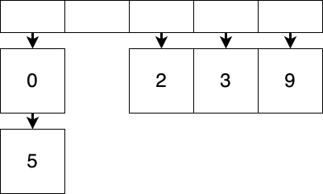
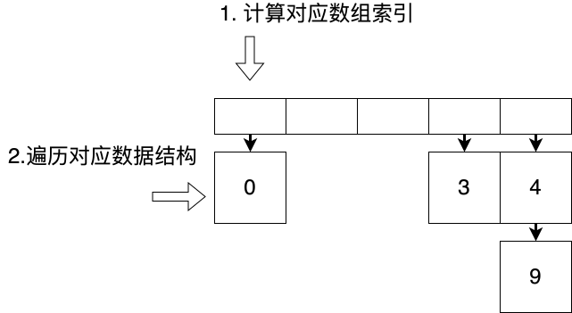
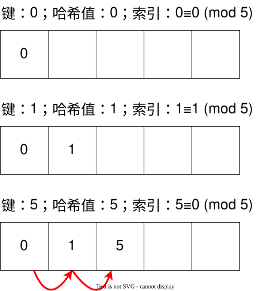
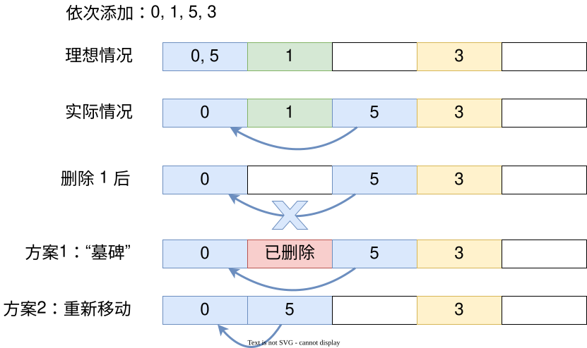
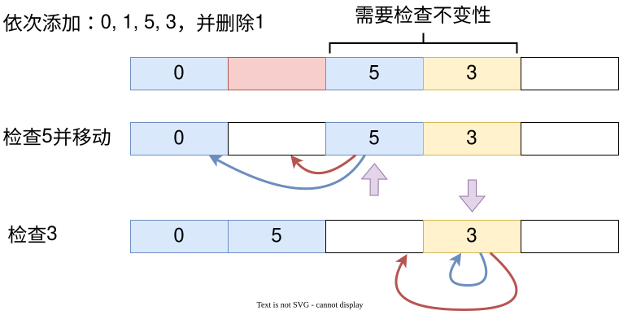
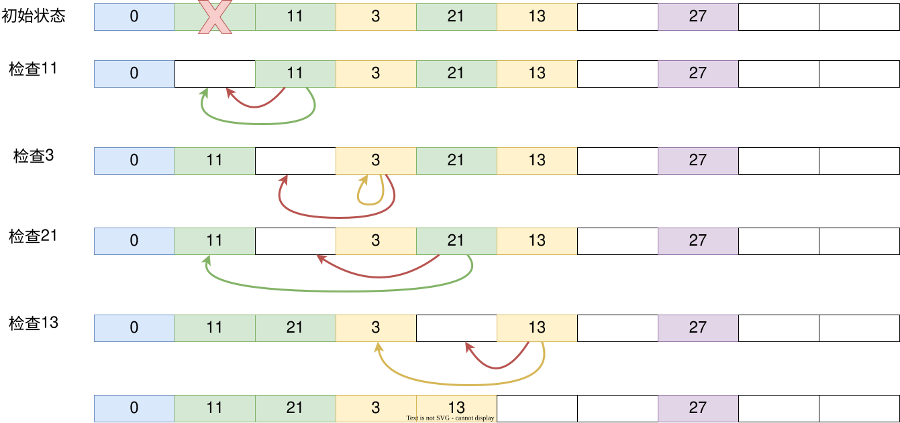

# 现代编程思想

## 哈希表与闭包

### 月兔公开课课程组

<!-- ssml
  大家好，欢迎来到由 IDEA 研究院基础软件中心为大家带来的现代编程思想公开课。
  今天是第十节课，主题是<phoneme alphabet="sapi" ph="ha 1 xi 1">哈希</phoneme>表与闭包。
  <break time="500ms" />
-->

# 回顾

- 表
  - 键值对的集合，其中键不重复
  - 简单实现：二元组列表
    - 添加时向队首添加
    - 查询时从队首遍历
  - 树实现：二叉平衡树
    - 基于第五节课介绍的二叉平衡树，每个节点的数据为键值对
    - 对树操作时比较第一个参数

<!-- ssml
  上节课我们学习了表的概念。
  表是一个键值对的集合，将键映射到值上，其中键不重复。
  同时展示了一个最简单的基于二元组列表的实现。
  这种实现在添加或更新的时候向队首添加新的键值对，查询的时候也从队首开始遍历。
  <break time="300ms" />
  另一种表的实现则是基于我们已经介绍过的二叉平衡树。
  我们只需要基于第五节课介绍的二叉平衡树进行修改，将每个节点存储的数据由一个整数改为键值对即可。
  在对树操作的时候我们比较存储的键值对的第一个参数与我们想要进行操作的键的大小关系即可。
  这节课我们来看另一个实现：<phoneme alphabet="sapi" ph="ha 1 xi 1">哈希</phoneme>表。
  <break time="500ms" />
-->

# 哈希函数

- 哈希函数/散列函数
  - 将任意长度的数据映射到某一固定长度的数据
  - 例如：MD5 算法可以把各种大小、各种格式的文件映射到 128 位的数据上
- 利用月兔的 `Hash` 特征，数据被映射到整数范围内

  ```moonbit
  trait Hash { hash(Self) -> Int }

  test {
    inspect("这是一个非常非常长的字符串".hash(), content="-735211761")
  }
  ```

<!-- ssml
  首先先介绍一下什么是<phoneme alphabet="sapi" ph="ha 1 xi 1">哈希</phoneme>函数。
  <phoneme alphabet="sapi" ph="ha 1 xi 1">哈希</phoneme>函数，也称为散列函数。
  它能够将任意长度的数据映射到某一固定长度的数据。
  举个例子来说，大家可能听说过 MD5 算法，可以把各种大小、各种格式、无穷无尽的文件映射到短短的 128 位的数据上来。
  利用月兔的 <lang xml:lang="en-US">Hash</lang> 特征，数据被映射到整形的范围内。
  例如测试代码块中，左侧这个非常长的字符串，会被映射为右侧的整数。
  <break time="500ms" />
-->

# 哈希表

- 哈希表利用哈希函数，将数据映射到数组索引中
  - 进行快速的添加、查询、修改
  - 因为在现代计算机中，对于数组的随机访问是效率最高的操作

```moonbit
let array : Array[(K, V)] = ...
let key : K = ...
let value : V = ...

// 键 --哈希--> 哈希值 --取模--> 数组索引
let index = key.hash().mod_u(array.length())

array[index] = (key, value)      // 添加或更新
let (k, v) = array[index]        // 查询
```

- 理想情况下，操作均为常数时间 O(1)
  - 相比之下，二叉平衡树操作均为对数时间 O(log n)

<!-- ssml
  <phoneme alphabet="sapi" ph="ha 1 xi 1">哈希</phoneme>表就是利用这样的映射，在将数据映射到<phoneme alphabet="sapi" ph="ha 1 xi 1">哈希</phoneme>值以后，再将<phoneme alphabet="sapi" ph="ha 1 xi 1">哈希</phoneme>值映射到数组索引中，进行快速的添加、查询、修改。
  因为在现代的计算机中，对于数组的随机访问是效率最高的操作。
  在理想情况下，对于<phoneme alphabet="sapi" ph="ha 1 xi 1">哈希</phoneme>表的各类操作均为常数时间，也就是说，操作的时间消耗不随数据量的增大而增大。
  相对而言，二叉平衡树的操作则是对数时间增长。
  中间的代码展示了<phoneme alphabet="sapi" ph="ha 1 xi 1">哈希</phoneme>表的使用。
  假设我们有一个数组，其中装着键值对。
  我们现在要对它进行添加或更新或查询。
  我们首先根据要操作的键 计算出<phoneme alphabet="sapi" ph="ha 1 xi 1">哈希</phoneme>值。
  <phoneme alphabet="sapi" ph="ha 1 xi 1">哈希</phoneme>值的范围是所有整数，因此，之后我们根据这个<phoneme alphabet="sapi" ph="ha 1 xi 1">哈希</phoneme>值取模映射到数组索引上，基于这个索引我们可以进行取值、修改操作。
  当然，正如之前所说，这是一个理想情况，因为实际情况下，会出现<phoneme alphabet="sapi" ph="ha 1 xi 1">哈希</phoneme>冲突。
  <break time="500ms" />
-->

# 哈希冲突

- 根据抽屉原理/鸽巢原理/生日问题
  - 不同数据的哈希可能相同
  - 不同的哈希映射为数组索引时可能相同

- 解决哈希表的冲突
  - 直接寻址（分离链接）：同一索引下用另一数据结构存储
    - 列表
    - 二叉平衡树等
  - 开放寻址
    - 线性探查：当发现冲突后，索引递增，直到查找空位放入
    - 二次探查（索引递增$1^2$ $2^2$ $3^2$）等

<!-- ssml
  相信大家都知道抽屉原理，或者鸽巢原理，或者生日问题。
  不管叫什么，我们都清楚，我们所映射的数据的数量可能大于整数所能表示的范围，而整数所代表的<phoneme alphabet="sapi" ph="ha 1 xi 1">哈希</phoneme>值的范围又可能远大于数组的索引。
  显然，我们不可能直接分配一个 21 亿大小的数组。
  那么在这种情况下，就会出现 多个数据的索引相同 从而产生冲突。
  所以，便有了多个解决方案来协调<phoneme alphabet="sapi" ph="ha 1 xi 1">哈希</phoneme>冲突。
  <break time="300ms" />
  其中一个解决方案是直接寻址，一个数据一定要放到它所计算出来的数组的对应索引的格子中去。
  这种情况下会有多个数据放在一个格子里，怎么想都放不下吧？
  所以，就在同一个索引下定义另一个数据结构，来装所有相同索引的数据。
  这些数据结构可以是列表，也可以是二叉平衡树等，数组于是变成了列表的数组或树的数组。
  <break time="300ms" />
  另一种方案则是不改变数组的类型，也就是说，数组仍然是直接装数据的数组。
  不过，我们遵循一些规则，另寻空位将数据放入数组中。
  例如，线性探查便是从应当放入的位置开始向后查找，将数据放进第一个空位中。
  除此以外，也有二次探查，即每次不是递增，而是增加平方等。这里就不详细介绍。
  那么我们今天分别来看基于列表的直接寻址和基于线性探查的开放寻址。
  <break time="500ms" />
-->

# 哈希表：直接寻址

- 简单来说，就是定义一个列表的数组
- 当发生哈希/索引冲突时，将相同索引的数据装进一个列表中
- 添加数据时：计算哈希值及对应索引，将数据添加到索引对应的列表之中



<!-- ssml
  首先我们从较为简单的直接寻址开始。
  简单来说，就是定义一个列表的数组。
  当数据将要被添加进来，则计算它们的<phoneme alphabet="sapi" ph="ha 1 xi 1">哈希</phoneme>值及对应索引，最后将数据添加到索引对应的列表之中。
  <break time="500ms" />
-->

# 哈希表：直接寻址 - 数据结构

```moonbit
struct Entry[K, V] {
  key : K
  mut value : V  // 允许原地更新值
}

struct Bucket[V] {
  mut val : Option[(V, Bucket[V])]  // None = 空列表, Some = (头元素, 剩余)
}

struct HT_bucket[K, V] {
  mut values : Array[Bucket[Entry[K, V]]]  // 存放列表的数组
  mut length : Int  // 数组长度，动态维护
  mut size : Int    // 键值对数量，动态维护
}
```

<!-- ssml
  在这里，我定义了两个额外的数据结构。
  首先是一个键值对，其中值是可以原地更新的，方便我们进行更新操作。
  之后，定义一个可以原地修改的链表。
  其中的值若为空则相当于空列表，若非空，则相当于列表的头元素以及剩余的列表。
  最后则是我们的<phoneme alphabet="sapi" ph="ha 1 xi 1">哈希</phoneme>表的定义。
  首先是一个存放列表的数组，列表中存放了键值对。
  之后，我们动态维护数组的长度，这个值即为键值对的数量。
  <break time="500ms" />
-->

# 哈希表：直接寻址 - 添加/更新

- 添加/更新操作
  - 添加时，根据键的哈希计算出应当存放的位置
  - 遍历集合查找键
    - 如果找到，修改值
    - 否则，添加键值对
- 删除操作类同



<!-- ssml
  当我们进行添加更新操作的时候，我们根据键的<phoneme alphabet="sapi" ph="ha 1 xi 1">哈希</phoneme>计算出应当存放的位置，之后遍历集合查找键。
  如果找到，那么我们修改对应的值，否则则添加键值对。
  删除操作也是类似的流程，先查找对应的集合，然后再修改集合。
  <break time="500ms" />
-->

# 哈希表：直接寻址 - 添加/更新代码

```moonbit
fn[K : Hash + Eq, V] HT_bucket::put(self : HT_bucket[K, V], key : K, value : V) -> Unit {
  let index = key.hash().mod_u(self.length)  // 计算对应索引
  let mut bucket = self.values[index]        // 找到对应列表
  for { // 遍历列表查找键
    match bucket.val {
      Some((entry, rest)) => {
        if entry.key == key { entry.value = value; break }  // 找到键，更新值
        else { bucket = rest }  // 继续查找
      }
      None => { // 未找到，添加新键值对
        bucket.val = Some(({ key, value }, { val: None }))
        self.size = self.size + 1
        break
      }
    }
  }
  if self.size.to_double() / self.length.to_double() >= 0.75 {
    self.resize() // 根据负载判断是否需要扩容
  }
}
```

<!-- ssml
  这里展示的是添加更新的代码。
  可以看到第二行我们首先计算了键的<phoneme alphabet="sapi" ph="ha 1 xi 1">哈希</phoneme>值。
  为了能够计算这个值，键应当实现<phoneme alphabet="sapi" ph="ha 1 xi 1">哈希</phoneme>特征，如第一行所示。
  之后我们找到对应的数据结构，并且进行遍历。
  这里展示了使用可变数据加上循环的操作。
  用一个死循环，当查找到对应键 或者列表时 进行 break 操作，跳出循环。
  之后的操作就很简单了。
  如果到队尾了都没有找到，那么我们在队尾进行原地更新，添加新的一对数据。
  如果找到了，那么我们更新数据。
  否则，我们将 bucket 替换为剩余的队列，确保循环过程中数据都在变为更小的结构，继续遍历。
  在最后，我们根据当前的负载进行判断，是否要对<phoneme alphabet="sapi" ph="ha 1 xi 1">哈希</phoneme>表进行扩容。
  <break time="500ms" />
-->

# 哈希表：负载与扩容

- 负载：键值对数量与数组长度的比值
  ```moonbit
  load_factor = size / length
  ```

- 为什么需要扩容？
  - 负载上升 → 哈希冲突增加 → 链表变长
  - 操作时间增长，违背了哈希表的设计初衷

- 阈值设定的权衡
  - 阈值过高：链表过长，查找遍历时间增加
  - 阈值过低：频繁扩容，重新分配和重哈希的时间增加
  - 通常设置为 0.75

<!-- ssml
  大家可能会奇怪，为什么用了会不断增长的列表还要进行扩容，这又不是循环数组。
  这里就牵扯到<phoneme alphabet="sapi" ph="ha 1 xi 1">哈希</phoneme>表的负载，也就是<phoneme alphabet="sapi" ph="ha 1 xi 1">哈希</phoneme>表的键值对 数量与数组长度的比值。
  我们可以简单理解，如果负载上升，那么<phoneme alphabet="sapi" ph="ha 1 xi 1">哈希</phoneme>冲突也会不断增加，链表的长度也会不断增长，增查改删的操作时间也会随着变长。
  这就不符合我们最初定义<phoneme alphabet="sapi" ph="ha 1 xi 1">哈希</phoneme>表的初衷，那就是利用数组进行快速操作，追求常数的操作时间。
  <break time="300ms" />
  因此，我们需要设定一个阈值，如果负载超过阈值，我们就重新分配更大的数组，以此来降低链表的长度。
  但是，阈值不宜过高也不宜过低。
  如果阈值过高，那么出现较长链表的可能性就会增大，查找遍历链表的时间会变长，性能会下降。
  如果阈值过低，那么重新分配数组、重新给每一个数据计算<phoneme alphabet="sapi" ph="ha 1 xi 1">哈希</phoneme>放入新数组的时间也会变长。
  <break time="500ms" />
-->

# 哈希表：直接寻址 - 删除

```moonbit
fn[K : Hash + Eq, V] HT_bucket::remove(self : HT_bucket[K, V], key : K) -> Unit {
  let index = key.hash().mod_u(self.length)  // 计算对应索引
  let mut bucket = self.values[index]        // 找到对应列表

  // 遍历列表查找键
  for {
    match bucket.val {
      Some((entry, rest)) => {
        if entry.key == key {
          // 找到键，删除（通过修改指针）
          bucket.val = rest.val
          self.size = self.size - 1
          break
        } else {
          bucket = rest  // 继续查找
        }
      }
      None => break  // 未找到，退出
    }
  }
}
```

- 直接寻址的查找、扩容操作留作练习

<!-- ssml
  接下来我们简单过一下删除操作。
  与添加更新操作类似，我们计算<phoneme alphabet="sapi" ph="ha 1 xi 1">哈希</phoneme>和索引，找到对应数据结构，并进行遍历。
  如果遍历完成，那么我们退出循环。
  否则，我们判断是不是我们要找的数据结构。
  如果是，我们原地进行修改，将当前存储值从列表中抹去，并维护<phoneme alphabet="sapi" ph="ha 1 xi 1">哈希</phoneme>表大小。
  否则，我们继续遍历查找。
  直接寻址的 查找 扩容操作 比较简单，就留给大家作为练习。
  <break time="500ms" />
-->

# 哈希表：开放寻址

- 线性探查：发现哈希冲突后，索引递增，直到查找到空位放入

- 不变式：键值对应当存放的位置与实际位置之间不存在空位
  - 为什么？否则确认键是否存在需遍历整个哈希表
  - 查找时遇到空位即可停止



<!-- ssml
  我们接下来看一下开放寻址的实现。
  回忆一下我们刚才介绍的线性探查。
  如果发生了<phoneme alphabet="sapi" ph="ha 1 xi 1">哈希</phoneme>冲突，我们将索引递增，向后查找，直到找到空位放入。
  例如在下面的示意图中，我们首先插入 0。它的<phoneme alphabet="sapi" ph="ha 1 xi 1">哈希</phoneme>值是 1，因此添加到索引为 0 的位置。
  之后，我们添加 1。它的<phoneme alphabet="sapi" ph="ha 1 xi 1">哈希</phoneme>值是 0，因此添加到索引为 1 的位置。
  最后，我们添加 5。它的<phoneme alphabet="sapi" ph="ha 1 xi 1">哈希</phoneme>值是 5，而 5 超出了索引值的范围，因此我们进行取模操作，获得了 0。
  理论上，它应该被放在索引为 0 的位置，但是这里已经有 0 了。
  于是我们将索引递增，此时已经有 1，于是我们继续递增，直到第一个空位，也就是索引为 2 的位置放入。
  <break time="300ms" />
  需要注意的是，在这种存放模式下，我们需要维护数组的一个性质，那就是，键值对应当存放的位置与实际位置之间不存在空位。
  这是一个约定，否则的话，如果我们想要查找一个键值对，它可能存在于任何位置，确认一个键值对不存在需要遍历整个<phoneme alphabet="sapi" ph="ha 1 xi 1">哈希</phoneme>表，这显然又是不能接受的性能损耗。
  因此我们保证键值对实际位置与应当存放的位置之间没有空位，这样当我们查找的时候找到空位就可以停下。
  <break time="500ms" />
-->

# 哈希表：开放寻址 - 数据结构

```moonbit
struct Entry_open[K, V] {
  key : K
  mut value : V
} derive(Default)

struct HT_open[K, V] {
  mut values : Array[Entry_open[K, V]]  // 存放键值对的数组
  mut occupied : Array[Bool]              // 标记位置是否被占用
  mut length : Int                        // 数组长度，动态维护
  mut size : Int                          // 键值对数量，动态维护
}
```

- 我们采用基于默认值的数组
- 类似上节课展示的循环队列实现
- 基于 `Option` 的实现可自行尝试

<!-- ssml
  对于开放寻址的实现，我们这里选择采用基于默认值的数组，和上节课展示的循环队列的实现类似。
  基于 <lang xml:lang="en-US">Option</lang> 的实现大家可以自行尝试。
  除了存放键值对的数组以外，为了区分当前位置是否为空，我们还有一个布尔值的数组。
  最后，我们同样动态维护数组的长度以及键值对的数量。
  <break time="500ms" />
-->

# 哈希表：开放寻址 - 查找槽位

- 辅助函数：确定键是否存在
  - 如果存在，返回键的索引
  - 如果不存在，返回第一个空位的索引

```moonbit
fn[K : Hash + Eq, V] HT_open::find_slot(self : HT_open[K, V], key : K) -> Int {
  let hash = key.hash()
  let mut i = hash.mod_u(self.length)

  while self.occupied[i] {
    if self.values[i].key == key {
      return i  // 找到键
    } else {
      i = (i + 1).mod_u(self.length)  // 线性探查
    }
  }
  return i  // 找到空位
}
```

<!-- ssml
  在添加更新操作的时候，我们根据<phoneme alphabet="sapi" ph="ha 1 xi 1">哈希</phoneme>值计算出对应的索引值。
  之后，我们查看数组中的该位置，如果被占用，那么我们判断是不是我们要找的键。
  如果是，我们更新值，否则，向后继续查找。
  如果我们找到了空位，那么我们就存放键值对。
  我们在这里默认空位的存在，我们稍后会介绍扩容操作，它保证数组总有空位。
  注意这里的所谓"向后"与循环队列相同，如果超出了数组的长度那么就回到数组的最初。
  <break time="300ms" />
  我们定义一个辅助函数来确定键是否存在。
  如果存在，那么返回键的索引；如果不存在，那么我们返回第一个空位所在的位置。
  <break time="500ms" />
-->

# 哈希表：开放寻址 - 添加/更新

```moonbit
fn[K : Hash + Eq + Default, V : Default] HT_open::put(
  self : HT_open[K, V],
  key : K,
  value : V
) -> Unit {
  let index = self.find_slot(key)
  if self.occupied[index] { // 找到了对应的键，更新值
    self.values[index].value = value
  } else { // 找到了空位，插入新键值对
    self.occupied[index] = true
    self.values[index] = { key, value }
    self.size = self.size + 1
  }
  // 检查是否需要扩容
  if self.size.to_double() / self.length.to_double() >= 0.75 { 
    self.resize()
  }
}
```

<!-- ssml
  基于这个辅助函数，我们定义添加、更新操作。
  我们根据计算出的索引值的位置 是否有值，可以判断索引位置找到了对应的键 还是找到了空位。
  如果找到了对应的键，那我们更新对应的值。
  否则将键值对加入空位，这包括更新位置的占用情况、修改数组中的数据、动态维护<phoneme alphabet="sapi" ph="ha 1 xi 1">哈希</phoneme>表大小。
  最后，我们判断是否需要进行扩容。
  <break time="500ms" />
-->

# 开放寻址：删除的挑战

- 回顾：不变式
  - 键值对应当存放的位置与实际位置之间不存在空位

- 删除操作的问题：直接删除会破坏不变式



<!-- ssml
  添加的操作十分简单。
  相对而言，删除的操作就比较麻烦了。
  不要忘了我们有一个性质需要维护，那就是键值的实际存放位置与应当存放的位置之间不能存在空位。
  如下图所示，我们在添加 0、1、5、3 后删除 1。
  5 在这里就是一个 因为对应的索引 存在元素而不得不向后存放的例子。
  此时 5 到索引 0 之间出现了空位，不变式被破坏，我们无法通过搜索找到 5。
  一种简单的方式是通过定义一种特殊的状态，也就是不仅仅标注一个位置是否被占据，还标注是否被删除，以此确保后续的数据依然可以被正确地查询到。
  另一种方法是对当前被删除的元素直到下个空位之间的元素进行检查，判断是否需要移动使得不变式得到维护。
  我们这里展示最简单的标注做法，也被称为"墓碑"。
  <break time="500ms" />
-->

# 开放寻址：墓碑标记

```moonbit
enum Status {
  Empty
  Deleted    // 墓碑标记
  Occupied
}

struct HT_open_tombstone[K, V] {
  mut values : Array[Entry_open[K, V]]
  mut occupied : Array[Status]  // 改为使用 Status 而非 Bool
  mut length : Int
  mut size : Int
}
```

- 删除时：标记为 Deleted，而不是 Empty
- 插入时：Deleted 位置可以重用
- 查找时：遇到 Deleted 继续查找（视为有元素）；遇到 Empty 停止（确认不存在）

<!-- ssml
  我们定义一个新的状态的枚举类型，包括"空"、"被占据"以及"被删除"，并且将<phoneme alphabet="sapi" ph="ha 1 xi 1">哈希</phoneme>表内的状态也进行对应的修改。
  在插入元素时，Deleted 位置可以被重复使用。
  删除元素时，标记位置为 Deleted 而不是 Empty。
  这样，插入时，可以<phoneme alphabet="sapi" ph="chong 2 yong 4">重用</phoneme> Deleted。
  而查找时，遇到 Deleted 会继续查找，遇到 Empty 则停止。
  <break time="500ms" />
-->

# 开放寻址：墓碑标记

```moonbit
fn[K : Hash + Eq, V] HT_open_tombstone::find_slot(
  self : HT_open_tombstone[K, V],
  key : K,
) -> Int {
  let index = key.hash().mod_u(self.length)
  loop (self.occupied[index], index, -1) { // 第一个空位默认为 -1
    (Empty, i, -1) => i // 找到第一个空位
    (Empty, _i, empty) => empty // 找到空位，返回第一个空位
    (Deleted, i, empty) => {
      let new_i = (i + 1).mod_u(self.length)
      let empty = if empty == -1 { empty } else { i } // 更新空位索引
      continue (self.occupied[new_i], new_i, empty) // 继续查找
    }
    (Occupied, i, _empty) if self.values[i].key == key => i // 键存在
    (Occupied, i, empty) => {
      let new_i = (i + 1).mod_u(self.length)
      continue (self.occupied[new_i], new_i, empty)
    }
  }
}
```

<!-- ssml
  代码实现部分，我们需要修改我们之前的辅助函数的逻辑。
  在第 6 行，第三个循环变量表示空位索引。
  我们将这个循环变量初始化为 负1，只要它是 负1，就说明我们还没有找到空位。
  在查找键或空位的时候，我们需要记录遇到的第一个可以存放的空位，<lang xml:lang="en-US">Empty</lang>；
  或者重新利用被删除元素留下的空位 <lang xml:lang="en-US">Deleted</lang>。
  第 7、8、9 三行，分别匹配了这几种情况。
  要注意，即便找到了 <lang xml:lang="en-US">Deleted</lang> 空位，我们也需要一直向后找，
  直到找到对应的键，或者 <lang xml:lang="en-US">Empty</lang> 空位，才能确定这个键是否存在。
  因此，在第 12 行，我们带着下一个索引值继续查找。
  如果我们找到任何一个空位，就将它置为空位的索引，带到下一轮循环中。
  第 14 行，当找到了键时，从循环中跳出；
  或者，第 7、8 行，确认这个键不存在，并找到空位时，也从循环中跳出。
  <break time="500ms" />
-->

# 开放寻址：墓碑标记

```moonbit
fn[K : Hash + Eq + Default, V : Default] HT_open_tombstone::remove(
  self : HT_open_tombstone[K, V],
  key : K
) -> Unit {
  let index = self.find_slot(key)
  match self.occupied[index] {
    Occupied => {
      self.values[index] = Default::default()
      self.occupied[index] = Deleted  // 标记为已删除
      self.size = self.size - 1
    }
    _ => ()  // 键不存在
  }
}
```

- 注意：多次添加删除后，会有大量 Deleted 标记
- 增加查询路径开销，需要定期重新整理

<!-- ssml
  墓碑标记的删除操作就变得十分简单，只需要根据辅助函数，在返回的格子被占用的情况下，进行重新标记即可。
  需要注意的是，使用这种方案在多次添加删除时，会存在较多"已删除"标记。
  而我们查找元素的访问的路径上也会出现大量额外的开销，增加额外的查询时间。
  因此，我们需要在一段时间后进行重新排列。
  <break time="500ms" />
-->

# 开放寻址：删除后压缩

- 开放寻址的另一种删除实现：删除后压缩
  - 我们通过移动哈希表中的元素来保持不变式（而不是通过标记）
  - 填补被删除元素留下的空位



<!-- ssml
  除了墓碑标记后重新排列，还有另一种方案，也就是在每次删除后进行重新移动，压缩查询路径。
  我们还是以添加 0、1、5、3，并删除 1 为例。
  对于 1 之前的元素，我们可以判断不变式不会发生变化，而 1 之后的元素我们无法确定。
  这些元素既有可能 是原本就应该被分配到这里，也可能 是因为空位被占据 而向后顺延放到了现在的位置上。
  因此需要进行检查。
  我们首先检查 5。
  我们可以看到，5 本来应该被分配在索引 0 的位置。
  为了解决哈希冲突，它被放置在现在的位置上。
  而现在前方的 1 被删除，它与索引 0 之间就产生了空白。
  这就破坏了不变式。
  因此，我们需要将 5 进行移动，提前到 1 原本占据的位置。
  之后我们再对 3 进行检查，因为 3 在没有哈希冲突的情况下就应该存放在这个位置，所以我们对3不进行任何的操作。
  而在3之后，遇到了空位。在空位之后的元素不会受到影响，因此停止我们的检查。
  压缩过程完成。
  <break time="500ms" />
-->

# 哈希表：开放寻址



<!-- ssml
  我们再来看一个例子。
  我们假设一个长度为 10 的数组，因此以n结尾的数字的哈希取模后获得的索引就是n，
  例如0的索引是0，11的索引是1，13的索引是3。
  我们同样删除索引1的数据，重新移动哈希表中的元素。
  我们对于索引1到5的位置进行检查。
  首先是11，在没有哈希冲突的情况下，它应该被存放在索引1的位置。
  现在这个索引成了空位，因此我们将11给挪到空位所在的位置。
  之后，我们检查3.3就在它所应该在的位置，因此我们不对3进行任何操作。
  之后我们检查21。21在没有哈希冲突的情况下，应该被分配在索引1的位置，
  而现在它到索引1之间出现了空位，这个空位是我们挪开11以后留下的。
  因此，我们把21也给向前移动。
  最后我们检查13。
  在没有哈希冲突的情况下，它应该被分配在3的位置，
  现在这两个位置之间出现了移动21后的空位，因此我们也将13向前移动。
  可以看到，移动以后，所有的元素都符合不变式，
  即 在没有哈希冲突情况下的索引 与实际存放位置之间 不存在空位。
  这个算法的具体的实现留给大家作为练习。
-->

# 小结

- 哈希表
  - 哈希函数：将数据映射到固定长度
  - 哈希冲突：不同数据可能有相同的哈希值

- 两种哈希冲突解决方案
  - 直接寻址（分离链接）：使用列表存储冲突的键值对
  - 开放寻址（线性探查）：向后查找空位存储

- 开放寻址的删除操作
  - 墓碑标记
  - 删除后压缩

<!-- ssml
  总结一下，这节课我们介绍了<phoneme alphabet="sapi" ph="ha 1 xi 1">哈希</phoneme>表的基本知识，包括<phoneme alphabet="sapi" ph="ha 1 xi 1">哈希</phoneme>函数和<phoneme alphabet="sapi" ph="ha 1 xi 1">哈希</phoneme>冲突的概念。
  解决<phoneme alphabet="sapi" ph="ha 1 xi 1">哈希</phoneme>冲突有两种常见方案，直接寻址和开放寻址。
  开放寻址方案的删除操作十分复杂，我们还学习了 两种删除操作的实现方法，墓碑标记和删除后压缩。
  以上便是第一部分的内容，下节课我们介绍闭包。
-->
