# 现代编程思想

## 哈希表与闭包

### Hongbo Zhang

# 回顾

- 表
  - 键值对的集合，其中键不重复
  - 简单实现：二元组列表
    - 添加时向队首添加
    - 查询时从队首遍历
  - 树实现：二叉平衡树
    - 基于第五节课介绍的二叉平衡树，每个节点的数据为键值对
    - 对树操作时比较第一个参数

# 哈希表

- 哈希函数/散列函数 Hash function
  - 将任意长度的数据映射到某一固定长度的数据
  - 在月兔的`Hash`接口中，数据被映射到整数范围内
    - `trait Hash { hash(Self) -> Int }`
    - `"这是一个非常非常长的字符串".hash() == -900478401`
- 哈希表
  - 利用哈希函数，将数据映射到数组索引中，进行快速的添加、查询、修改
    ```moonbit test
    let a : Array[(Int, Int)] = Array::make(10, (0, 0)); let key = 10; let value = 200
    let index = key.hash().mod_u(a.length()) // 键值--哈希-->哈希值--取模-->数组索引                     
    a[ index ] = (key, value)     // 添加或更新
    let (key, value) = a[ index ] // 查询
    ```
  - 理想情况下，操作均为常数时间（二叉平衡树操作均为对数时间）

> ```moonbit
> fn Int::mod_u(a : Self, b : Self) -> Self { (a.reinterpret_as_uint() % b.reinterpret_as_uint()).reinterpret_as_int() }
> ```

# 哈希冲突

- 根据抽屉原理/鸽巢原理/生日问题
  - 不同数据的哈希可能相同
  - 不同的哈希映射为数组索引时可能相同

- 解决哈希表的冲突
  - 直接寻址（分离链接）：同一索引下用另一数据结构存储
    - 列表
    - 二叉平衡搜索树等
  - 开放寻址
    - 线性探查：当发现冲突后，索引递增，直到查找空位放入
    - 二次探查（索引递增$1^2$ $2^2$ $3^2$）等

# 哈希表：直接寻址

- 当发生哈希/索引冲突时，将相同索引的数据装进一个数据结构中
  - 例：添加0、5（哈希值分别为0、5）至长度为5的数组中时：
    

# 哈希表：直接寻址

- 哈希表结构

```moonbit unless=bucket,map
struct Entry[K, V] { // 存储键值对
  key : K
  mut value : V // 允许原地修改值
}

struct Bucket[V] { // 存储键值对的集合
  mut val : Option[(V, Bucket[V])] // 允许原地进行增删操作
}

struct HT_bucket[K, V] {
  mut values : Array[Bucket[Entry[K, V]]] // 存放键值对的列表，存放列表的数组
  mut length : Int // 数组长度，动态维护
  mut size : Int // 哈希表键值对数量，动态维护
}
```

# 哈希表：直接寻址

- 添加/更新操作
  - 添加时，根据键的哈希计算出应当存放的位置
  - 遍历集合查找键
    - 如果找到，修改值
    - 否则，添加键值对
- 删除操作类同

  

# 哈希表：直接寻址

- 添加/更新操作

  ```moonbit unless=bucket,map
  fn[K : Hash + Eq, V] HT_bucket::put(map : HT_bucket[K, V], key : K, value : V) -> Unit {
    let index = key.hash().mod_u(map.length) // 计算对应索引
    let mut bucket = map.values[index] // 找到对应数据结构
    while bucket.val is Some((entry, rest)) {
      // 如果找到，则更新值
      if entry.key == key { entry.value = value; break } 
      else { 
        // 否则，将bucket替换为更小的结构，保证循环会终结
        bucket = rest
      }
    } else {
      // 如果没有找到，添加
      bucket.val = Some(({ key, value }, { val: None })); map.size = map.size + 1
    }
    if map.size.to_double() / map.length.to_double() >= 0.75 { // 根据负载重新分配
      map.resize()
    }
  }
  ```

# 哈希表：直接寻址

- 虽然不存在数组用尽的问题，但仍需要扩容重新分配
- 负载：键值对数量与数组长度的比值
  - 当负载上升，哈希/索引冲突变多，链表增长，增查改删操作时间增长
  - 解决方案：当负载超过阈值，重新分配更大的数组
    - 阈值过高：寻址遍历时间变长
    - 阈值过低：扩容分配时间变长

# 哈希表：直接寻址

- 删除操作

```moonbit unless=bucket,map
fn[K : Hash + Eq, V] HT_bucket::remove(map : HT_bucket[K, V], key : K) -> Unit {
  let index = key.hash().mod_u(map.length) // 计算对应索引
  let mut bucket = map.values[index] // 找到对应数据结构
  while bucket.val is Some((entry, rest)) {
    if entry.key == key { // 如果找到，则删除对应结构
      bucket.val = rest.val // { Some(entry, { val }) } -> { val }
      map.size = map.size - 1
      break
    }
    else { // 否则继续遍历
      bucket = rest
    } 
  } 
}
```

# 哈希表：开放寻址

- 线性探查：发现哈希冲突后，索引递增，直到查找到空位放入
  - 不变性：键值对应当存放的位置与实际的位置之间不存在空位
    - 否则确认键是否存在需遍历整个哈希表

  

# 哈希表：开放寻址

- 哈希表结构定义
  - 我们采用基于默认值的数组；基于`Option`的实现可以自行尝试

```moonbit unless=open,open2,map
struct Entry_open[K, V] { // 键值对
  key : K
  mut value : V // 可原地修改值
} derive(Default)
```

```moonbit unless=open
struct HT_open[K, V] {
  mut values : Array[Entry_open[K, V]] // 存放键值对的数组
  mut occupied : Array[Bool] // 存放当前位置是否为空的数组
  mut length : Int // 数组长度，动态维护
  mut size : Int // 哈希表键值对数量，动态维护
}
```

# 哈希表：开放寻址

- 添加/更新操作
  - 添加/更新时，根据键的哈希计算出应当存放的位置
  - 如果该位置被占用
    - 如果是对应的键，则更新对应的值
    - 否则，向后查找
  - 如果找到空位，则存放键值对
- 我们默认空位的存在

# 哈希表：开放寻址

- 辅助函数：查找键是否存在
  - 如果存在，返回键的索引；如果不存在，则返回第一个空位所在位置

```moonbit unless=open
// 从键的哈希值向右查找，返回所查找的键或第一个找到的空位位置的索引
fn[K : Hash + Eq, V] HT_open::find_slot(map : HT_open[K, V], key : K) -> Int {
  let hash = key.hash() // 键的哈希值
  let mut i = hash.mod_u(map.length) // 在无哈希冲突时应当放入的位置
  while map.occupied[i] {
    if map.values[i].key == key { // 如果找到对应的键，则返回其索引
      return i
    } else { i = (i + 1).mod_u(map.length) }
  }
  return i // 否则找到空位为止
}
```

# 哈希表：开放寻址

- 添加/更新操作

```moonbit unless=open
fn[K : Hash+Eq+Default, V : Default] HT_open::put(
  map : HT_open[K, V], key : K, value : V) -> Unit {

  let index = map.find_slot(key) // 利用辅助函数进行查找
  if map.occupied[index] { // 判断是找到了对应键还是找到了空位
    map.values[index].value = value // 找到了对应的键则进行更新
  } else { // 否则将键值对加入空位
    map.occupied[index] = true
    map.values[index] = { key, value }
    map.size = map.size + 1
  }
  // 确认负载是否需要扩容
  if map.size.to_double() / map.length.to_double() >= 0.75 {
    map.resize() // Ht_open::resize(HT_open) -> Unit
  }
}
```

# 哈希表：开放寻址

- 删除操作需考虑不变性：键值对应当存放位置与实际存放位置之间不存在空位
  
- 解决方案
  - 将删除的位置设为“已删除”，在查询的时候视为存在元素；重新移动元素

# 哈希表：开放寻址

- 将删除的位置设为“已删除”

```moonbit unless=open2,map
enum Status {
  Empty
  Deleted // 增加“已删除”标记
  Occupied
}

struct HT_open[K, V] {
  mut values : Array[Entry_open[K, V]]
  mut occupied : Array[Status] // 从布尔值改为状态标记
  mut length : Int
  mut size : Int
}
```

# 哈希表：开放寻址

- 查找键或空位时，记录遇到的第一个可以存放的空位：`Empty`或`Deleted`
  - 依然需要找到`Empty`为止来确定键不存在

```moonbit unless=open2,map
// 从键的哈希值向右查找，返回键或第一个找到的空槽位置的索引
fn[K : Hash + Eq, V] HT_open::find_slot(map : HT_open[K, V], key : K) -> Int {
  let index = key.hash().mod_u(map.length)
  let mut i = index
  let mut empty = -1 // 记录第一个遇到的空位：Empty 或 Deleted
  while !(map.occupied[i] is Empty) {
    if map.values[i].key == key {
      return i
    }
    if map.occupied[i] is Deleted && empty != -1 { // 更新空位
      empty = i
    }
    i = (i + 1).mod_u(map.length)
  }
  return if empty == -1 { i } else { empty } // 返回第一个空位
}
```

# 哈希表：开放寻址

- 删除时，只需要更新标记即可
  ```moonbit unless=open2,map
  fn[K : Hash + Eq + Default, V : Default] HT_open::remove(
    map : HT_open[K, V], key : K) -> Unit {
  
    let index = map.find_slot(key)
    if map.occupied[index] is Occupied {
      map.values[index] = Default::default()
      map.occupied[index] = Deleted
      map.size = map.size - 1
    }
  }
  ```

- 使用已删除标记
  - 多次添加删除后，会存在较多“已删除”标记，增加额外的查询时间
  - 需要一段时间后重新排列

# 哈希表：开放寻址

- 开放寻址的另一种删除实现：删除后压缩
  - 我们通过移动哈希表中的元素来保持不变性（而不是通过标记）
  - 填补被删除元素留下的空位

  

# 哈希表：开放寻址



# 闭包

- 闭包：一个函数及其捆绑的周边环境状态的引用的组合
- 闭包的环境状态
  - 词法环境：与程序的结构对应，在代码定义时决定
  ```moonbit
  test {
    let mut i = 2
    fn debug_i() { println(i) } // 捕获i
    i = 3
    debug_i() // 输出3
    {
      let i = 4 // 此i非彼i
      debug_i() // 输出3
    }
  }
  ```

# 闭包：封装数据

- 我们可以利用闭包封装数据和行为
  - 使用者无法直接获得数据，必须通过提供的函数进行间接操作
  - 可以限制使用者的操作，对参数进行检验等，保证数据合法

```moonbit
fn natural_number_get_and_set()
  -> (() -> Int, (Int) -> Unit) { // (get, set)
  let mut i = 0 // 使用者无法直接读取
  letrec get = fn() -> Int { i }
  and set = fn (new_value: Int) -> Unit { if new_value >= 0 { i = new_value } } // 可以添加对于数据的校验
  (get, set)
}

test {
  let (get, set) = natural_number_get_and_set()
  set(10)
  inspect(get(), content="10")
  set(-100)
  inspect(get(), content="10")
}
```

# 闭包：封装数据

- 我们可以利用闭包+结构体封装表的行为，使用者无需感知真正的数据结构

```moonbit
struct Map[K, V] {
  get : (K) -> Option[V]
  put : (K, V) -> Unit
  remove : (K) -> Unit
  size : () -> Int
}
```

```moonbit unless=incomplete
// 开放地址实现
fn[K : Hash + Eq + Default, V : Default] Map::hash_open_address() -> Map[K, V] { ... }
/// 直接寻址实现
fn[K : Hash + Eq, V] Map::hash_bucket() -> Map[K, V] { ... }
// 简易列表实现或树实现等等...
```

```moonbit unless=map,incomplete
test {
  let map : Map[Int, Int] = Map::hash_bucket() // 仅需替换初始化函数，后续代码无需发生变化
  // let map : Map[Int, Int] = Map::hash_open_address()
  (map.put)(1, 1)
  inspect((map.size)(), content="1")
}
```

# 闭包：封装数据

```moonbit unless=map
fn[K : Hash + Eq, V] Map::hash_bucket() -> Map[K, V] {
  let initial_length = 10
  let load = 0.75
  let map = {
    values: Array::make(initial_length, { val : None }), // 别名问题
    size: 0,
    length: initial_length,
  }
  fn initialize() { ... } // 需要对数组进行挨个初始化
  initialize()

  fn resize() { ... }

  fn get(key : K) -> Option[V] { ... }
  fn put(key : K, value : V) -> Unit { ... }
  fn remove(key : K) -> Unit { ... }
  fn size() -> Int { map.size }

  { get, put, remove, size }
}
```

# 闭包：封装数据

- 我们可以基于结构体进行方法的拓展，方便使用

```moonbit unless=map,incomplete
fn[K, V] Map::is_empty(map : Map[K, V]) -> Bool {
  (map.size)() == 0
}

fn[K, V] Map::contains(map : Map[K, V], key : K) -> Bool {
  match (map.get)(key) {
    Some(_) => true
    None => false
  }
}

test {
  let map : Map[Int, Int] = Map::hash_bucket()
  assert_true(map.is_empty())
  assert_false(map.contains(1))
}
```

# 总结

- 本章节介绍了
  - 哈希表的两种实现
    - 开放寻址
    - 直接寻址
  - 闭包的概念及封装应用
- 推荐阅读
  - 《算法导论》第十一章 或
  - 《算法》第3.4节
