# Modern Programming Ideology: HashMap and Closure

## Review

A map or table is a collection of key-value pairs that bind keys to values, where each key is unique. A simple implementation of a map is a list of tuples, where each tuple is a key-value pair. We add a new key-value pair to the head of the list, and traverse from the head of the list for lookup operations.

Another implementation is based on the balanced binary tree(BBT) we introduced in Lecture 5. We just need to modify the BBT so that each node now stores a key-value pair. In tree operations, we compare the first parameter of the key-value pair with the key we want to operate on. 

## HashMap

### Hash function

First, what is a hash function or hashing? A hash function maps or binds data of arbitrary length to data of fixed length. For example, you may have heard of the MD5 algorithm, which maps files of any size or format to a short 128-bit digest(compressed data representation). 

For the `Hash` interface in MoonBit, data is mapped to values in the range of integers.  For example,  the string "ThisIsAVeryVeryLongString" will be mapped to the integer -321605584.

```moonbit
trait Hash { hash(Self) -> Int }
"ThisIsAVeryVeryLongString".hash() == -321605584
```

### HashMap

HashMaps use this mechanism to efficiently handle data by mapping the data to a hash value, and then the hash value to an array index. This makes adding, looking up, and updating data fast because random access to arrays is the most efficient operation in modern computers. HashMap operations are ideally in constant time, which means the running time does not increase as the data input size grows (independent of the input size). However, operations on balanced binary trees are in logarithmic time. Here's the example pseudocode snippet demonstrating the mapping mechanism in a HashMap:

```moonbit
// For a: Array[(Key, Value)], key: Key, value: Value
let index = key.hash().mod_u(a.length()) // key value--hashing-->hash value--modulo operation-->index in array
a[ index ] = value // add or update data
let value = a[ index ] // look up data
```

Suppose we have an array of key-value pairs and want to add, update, or look up data. We first calculate the hash value based on the key. Since hash values can be any integer, we use modulo to map a hash value to an array index and then look up or update data with the corresponding array index. However, as mentioned earlier, this is the ideal scenario because hash collisions may occur. 

## Hash Collision

According to the [pigeonhole principle](https://en.wikipedia.org/wiki/Pigeonhole_principle) or [birthday problem](https://en.wikipedia.org/wiki/Birthday_problem), the amount of data we map may exceed the range of integers, and the hash value may far exceed the valid array indices. For example, we obviously can't directly allocate an array with 2.1 billion slots, and then collisions will occur where multiple data have the same array index (different pieces of data may have the same hash value, and different hash values may be mapped to the same index in an array). There are several ways to handle hash collisions. 

One approach is **direct addressing**. When data must be stored in the slot corresponding to the array index we calculated, different pieces of data might be stored in the same slot causing issues. So, we use another data structure in each slot to store items hashed to the same index. Possible data structures include lists, balanced binary trees, and the original array turns into an array of lists or trees.

Another approach is **open addressing** which does not change the type of the array, so the array still stores data directly but follows specific rules about finding empty slots to store the data. For example, linear probing can be used to find the next empty slot to store data starting from the original slot, while quadratic probing increments the index by $1^2$, $2^2$, $3^2$ ... to find empty slots. In this lecture, we'll focus on direct addressing with lists and open addressing with linear probing.

## HashMap Based on Direct Addressing

Let's start with direct addressing. When a hash/index collision occurs, store the data of the same index into some data structure like lists. For example, when adding 0 and 5 (with hash values of 0 and 5 respectively) into an array of length 5, both 0 and 5 mod length 5 will be 0 and are added into a list at index 0:



For implementation, we'll define two additional data structures: 1) a key-value pair that enables convenient in-place value updates; and 2) a mutable list where a null value means an empty list, and otherwise the tuples are the head element plus the remaining list. Finally, let's define the HashMap. It contains an array of lists of key-value pairs, and we dynamically maintain the length of the array and the number of key-value pairs.

```moonbit
struct Entry[K, V] { // Struct for key-value pair storage
  key : K
  mut value : V // In-place update enabled
}

struct Bucket[V] { // Collection that can store key-value pairs
  mut val : Option[(V, Bucket[V])] // In-place addition, removal enabled
}

struct HT_bucket[K, V] {
  mut values : Array[Bucket[Entry[K, V]]] // List of key-value pairs, array of lists
  mut length : Int // Length of array dynamically maintained
  mut size : Int // Number of key-value pairs in the HashMap dynamically maintained
}
```

For the add/update operation, we first calculate the position to store the key based on its hash value. Then, we look up if the key already exists by traversing the list. If the key exists, we update the value, and if not we add the key-value pair. Similarly, we check the corresponding list and update it for the remove operation.

The following code demonstrates adding and updating data. We first calculate the hash value of the key at line 2 with the hash interface specified in `K : Hash` at line 1. Then we find and traverse the corresponding data structure. We're using a mutable data structure with an infinite while loop at line 4. We break out of the loop if we find the key already exists or reach the end of the list. If the key is found, we update the data in place. Otherwise, we update the bucket to be the remaining list so the loop terminates. When we reach the end of the list and haven't found the key, we add a new pair of data at the end of the list. At last, we check if it needs resizing based on the current load factor.

```moonbit
fn put[K : Hash + Eq, V](map : HT_bucket[K, V], key : K, value : V) -> Unit {
  let index = key.hash().mod_u(map.length) // Calculate the index
  let mut bucket = map.values[index] // Get the corresponding data structure
  while true {
    match bucket.val {
      None => { // If doesn't exist, add and exit loop
        bucket.val = Some({ key, value }, { val: None })
        map.size = map.size + 1
        break
      }
      Some(entry, rest) => {
        if entry.key == key { // If exists, update the value
          entry.value = value
          break
        } else { // Otherwise, update bucket so the loop terminates
          bucket = rest
  } } } }
  if map.size.to_double() / map.length.to_double() >= load { // Resize according to the load factor
    resize()
  }
}
```

You might wonder why we need to resize as the lists can keep growing. Let's first introduce the concept of load factor: the ratio of the number of key-value pairs to the length of the array. So basically a higher load factor means more collisions, longer linked lists, and slower add, lookup, update, and remove operations. However, we chose to use arrays for efficient operations in constant time. So, we need to set a threshold and reallocate a larger array if the load factor exceeds such threshold to reduce the length of the lists. Nevertheless, if the threshold is too high, it's more likely to have long lists resulting in slower list traversal and reduced performance; and if the threshold is too low, it takes more time to resize the array and reallocate each element by re-calculating the hash values.

Next, let's briefly go over the remove operation. Similar to the add/update operation, we calculate the hash and index, find the corresponding list, and traverse it. We exit the loop once the traversal has finished. During each loop, we check if it's the data we're looking for. If so, we modify the list in place by removing the stored value and updating the HashMap size. Otherwise, we keep traversing. The lookup and resize operations for direct addressing are relatively simple and feel free to try them out as a practice.

```moonbit
fn remove[K : Hash + Eq, V](map : HT_bucket[K, V], key : K) -> Unit {
  let index = key.hash().mod_u(map.length) // Calculate the index
  let mut bucket = map.values[index] // Get the corresponding data 
  while true {
    match bucket.val {
      None => break // Exit after finishing traversal
      Some(entry, rest) => {
        if entry.key == key { // Remove if exists
          bucket.val = rest.val // { Some(entry, { val }) } -> { val }
          map.size = map.size - 1
          break
        }
        else { // Otherwise, continue traversal
          bucket = rest
  } } } } }
```

## HashMap Based on Open Addressing

Let's continue with open addressing. Recall that linear probing is when a hash collision occurs, we keep incrementing the index to find the next empty slot to place the collided key. In the following example, we first add 0 whose hash value is 0 into slot 0. Then, we add 1 whose hash value is 1 into slot 1. Lastly, we add 5 whose hash value is 5, but it exceeds the range of indices and we use modulo to get 0 instead. In theory, we should store 5 in slot 0, but the slot was already taken. Therefore, we increment the index until we find the next empty slot which is slot 2 as slot 1 was also taken. Note that an invariant must be maintained throughout the program: there should be no empty slots between the original slot and the slot where the key-value pair is actually stored. This ensures we won't waste time traversing the whole HashMap to check if some key-value pair already exists or not. Also, since we made sure there's no gap between the slots, we can exit the loop once the next empty slot is found.


To implement open addressing, we will use an array with default values similar to the implementation of a circular queue introduced in the last lecture. Feel free to try and implement it using Option as well. Besides the array to store key-value pairs, we also have an array of boolean values to determine if the current slot is empty. As usual, we dynamically maintain the length of the array and the number of key-value pairs.

```moonbit
struct Entry[K, V] { // Struct for key-value pair storage
  key : K
  mut value : V // In-place update enabled
} derive(Default)

struct HT_open[K, V] {
  mut values : Array[Entry[K, V]] // Array of key-value pairs
  mut occupied : Array[Bool] //  Array denoting whether the current slot is empty
  mut length : Int // Length of array dynamically maintained
  mut size : Int // Number of key-value pairs in the HashMap dynamically maintained
}
```

For the add/update operation, we calculate the index to add/update data based on the hash value of the key. If the slot is not empty, we further check if it's the key we're looking for. If so, we update the value; otherwise, we keep probing backward and store the key-value pair once we find an empty slot. Here, we can assume an empty slot exists as we resize the array when needed. Note that the "backward" traversal here is the same as that in a circular queue. If the index exceeds the length of the array, we go back to the beginning of the array.

We can define a helper method to check if a key already exists. If so, we directly return its index; otherwise we return the index of the next empty slot. 

```moonbit
// Probe to the right of the index of the original hash, return the index of the first empty slot
fn find_slot[K : Hash + Eq, V](map : HT_open[K, V], key : K) -> Int {
  let hash = key.hash() // Hash value of the key
  let mut i = hash.mod_u(map.length) // Index to be stored at if there's no hash collision
  while map.occupied[i] {
    if map.values[i].key == key { // If a key already exists, return its index
      return i
    }
    i = (i + 1).mod_u(map.length)
  }
  return i // Otherwise, return when an empty slot occurs
}
```

We then define the add/update, lookup, and remove operations utilizing this helper function. For the add/update operation, we first determine if the key exists by checking if the slot with the calculated index is empty or not. If the key is found, we update its corresponding value; otherwise, we add the key-value pair into the empty slot and update the occupied status and the size of the HashMap. Lastly, we check if resizing is needed.

```moonbit
fn put[K : Hash + Eq + Default, V : Default](map : HT_open[K, V], key : K, value : V) -> Unit {
  let index = find_slot(map, key) // Use helper method to look up the key
  if map.occupied[index] { // Check for key or empty slot
    map.values[index].value = value // Update if the key already exists
  } else { // Otherwise, add the key-value pair into the empty slot
    map.occupied[index] = true
    map.values[index] = { key, value }
    map.size = map.size + 1
  }
  // Check the load factor to determine if resizing is needed
  if map.size.to_double() / map.length.to_double() >= 0.75 {
    resize(map) // fn resize(map) -> Unit
  }
}
```

The remove operation is more complicated. Recall that we have an invariant to maintain: there should be no empty slots between the original slot and the slot where the key-value pair is actually stored. As shown below, if we add 0, 1, 5, and 3 sequentially and then remove 1, there will be a gap between 0 and the position of 5 which violates the invariant and we won't be able to correctly look up 5. 

A simple solution is to define a special state that marks a slot as "deleted"  to ensure subsequent data can still be reached and found. Another solution is to check if any element from the slot of data removal to the next empty slot needs to move location so as to maintain the invariant. Here we demonstrate the simpler marking method, also known as "tombstone". 


We define a new `Status` enum consisting of `Empty`, `Occupied` and `Deleted`, and update the type of the occupied array from boolean value to Status. 

```moonbit
enum Status {
  Empty
  Deleted // Add the "deleted status
  Occupied
}

struct HT_open[K, V] {
  mut values : Array[Entry[K, V]]
  mut occupied : Array[Status] // Change from boolean to Status
  mut length : Int
  mut size : Int
}
```

Let's also update the helper function so that during key or empty slot lookup, we record the first empty slot that can be denoted by status `Empty` or `Deleted` to reuse the slot after data removal. However, we still need to find the next Empty slot to determine if the key does not exist. We use a simple variable named `empty` to record this. A negative value means we haven't found an empty slot yet, and we update the value to the index of the next empty slot if we find one. It also means we've encountered an empty slot if the loop ends, and then we decide what to return based on the variable `empty`. 

```moonbit
// Probe to the right of the index of the original hash, return the index of the first empty slot
fn find_slot[K : Hash + Eq, V](map : HT_open[K, V], key : K) -> Int {
  let index = key.hash().mod_u(map.length)
  let mut i = index
  let mut empty = -1 // Record the first empty slot occurred: status Empty or Deleted
  while (map.occupied[i] === Empty).not() {
    if map.values[i].key == key {
      return i
    }
    if map.occupied[i] === Deleted && empty != -1 { // Update empty slot
      empty = i
    }
    i = (i + 1).mod_u(map.length)
  }
  return if empty == -1 { i } else { empty } // Return the first empty slot
}
```

The remove operation is simpler, we just need to update the status indicator according to the result of the helper function. It's important to note that with this approach, it'll take extra lookup time/overhead after multiple additions and removals as there will be many `Deleted` slots. Therefore, we need to rearrange the elements afterwards.

```moonbit
fn remove[K : Hash + Eq + Default, V : Default](map : HT_open[K, V], key : K) -> Unit {
  let index = find_slot(map, key)
  if map.occupied[index] === Occupied {
    map.values[index] = default()
    map.occupied[index] = Deleted
    map.size = map.size - 1
  }
}
```

Next, let's introduce another implementation of open addressing: rearrange elements after each removal to compress the lookup path. Suppose we still add 0, 1, 5, 3 sequentially and then remove 1, we can see that the invariant holds for elements before 1, but cannot be sure if it also holds for elements after it. These elements might have been originally stored here or stored here due to the original slot was occupied and this is the next empty slot. Therefore, a check is required. 

First, we check element 5 and notice that 5 should be mapped to index 0, but is stored in the current slot to handle hash collision. Now that element 1 has been removed, the invariant no longer holds as there's an empty slot between indices 0 and 2. To solve this, we need to move element 5 forward to the index previously storing element 1. Then we check element 3 and it's in the slot it should be mapped to, so we do not move it. We encounter an empty slot after element 3. The elements after the empty spot won't be affected, so we stop checking.


Let's look at another example as follows: we have an array of size 10, so a number that ends in *n* will be mapped to index *n* with modulo, like the index for element 0 is 0, for element 11 is 1, for element 13 is 3, etc. We will remove the data at index 1 and rearrange the elements in the HashMap. We check the elements at index 1 to 5 and: 

We find element 11 should be stored at index 1 if there were no hash collision. After removing the data at index 1, we now have an empty slot at index 1 and can move element 11 to it. Then we check element 3 and it's already in the slot it should be mapped to. Next, we check element 21 which should be stored at index 1, but now we see a gap between slot 1 to the actual slot element 21 is stored. This is caused by moving element 11 earlier, so also move element 21 forward. Lastly, we check element 13 which should be stored at index 3. Now there's a gap after moving element 21, so we move element 13 forward as well. 

Now, the invariant holds again: there should be no empty slots between the original slot and the slot where the key-value pair is actually stored. The detailed implementation is left as an exercise and feel free to give it a try!


## Closure

It's time for the last topic in this lecture! What is a closure? A closure is the combination of a function bundled together with references to its surrounding state. Its surrounding state is determined by the lexical environment. For example, in the following code, when we define the function at line 3, the `i` here corresponds to the `i` at line 2. Therefore, when we call `debug_i` later at line 3, it outputs the value of `i` from line 2. Then we update `i` at line 4, and the output will also be updated accordingly. 

However, when we introduce another `i` at line 7, although the variable names are the same, the new variable `i` has nothing to do with our closure, so the output at line 8 will not change. The environment captured by the closure corresponds to the program structure and is determined at code definition, but not runtime.

```moonbit
fn init {
  let mut i = 2
  fn debug_i() { debug(i) } // Capturing i
  i = 3
  debug_i() // Output 3
  {
    let i = 4 // A different i variable
    debug_i() // Output 3
  }
}
```

### Closure: Data Encapsulation

We can use closures to encapsulate data and behavior. Variables defined inside a function cannot be accessed from anywhere outside the function, because it's only in the scope of the function. Let's define two functions that capture the value as return value, enabling users to get and set value as shown at lines 4 and 5. 
Also, we can add data validation in the functions. User operation is unrestricted if we directly define a mutable field in a structure, but now with validation we can filter illegitimate input.
Lastly, we return these two functions. From the results of `get()` we can see that a legitimate input will update the value of the captured variable via the function, while illegitimate input is filtered out.

```moonbit
fn natural_number_get_and_set()
  -> ( () -> Int, (Int) -> Unit) { // (get, set)
  let mut i = 0 // Does not have direct access
  fn get() -> Int { i }
  fn set(new_value: Int) -> Unit { if new_value >= 0 { i = new_value } } // Can add data validation
  (get, set)
}

fn init {
  let (get, set) = natural_number_get_and_set()
  set(10)
  debug(get()) // 10
  set(-100)
  debug(get()) // 10
}
```

We can also use closures with structs to encapsulate the HashMap behavior and define an abstract data structure. We previously showed implementations of open addressing and direct addressing, but this does not matter for users as they have the same effect.
In this case, we can define a struct `Map` that has four functions, which all capture the same HashMap and allow modifications. Then, we provide two functions to construct this struct, offering implementations of both open addressing and direct addressing. As an exercise, think about how we can implement it with a simple list or tree, etc. 
Lastly, let's use this struct. We only need to replace the initialization function, and the rest of the code remains unchanged when using different implementations. 

```moonbit
struct Map[K, V] {
  get : (K) -> Option[V]
  put : (K, V) -> Unit
  remove : (K) -> Unit
  size : () -> Int
}

// Implementation of open addressing
fn Map::hash_open_address[K : Hash + Eq + Default, V : Default]() -> Map[K, V] { ... }
// Implementation of direct addressing
fn Map::hash_bucket[K : Hash + Eq, V]() -> Map[K, V] { ... }
// Implementation with a simple list or tree, etc.

fn init {
  let map : Map[Int, Int] = Map::hash_bucket() // Replace the initialization function only, and keep the subsequent code unchanged
  // let map : Map[Int, Int] = Map::hash_open_address()
  (map.put)(1, 1)
  debug((map.size)())
}
```

Here is the main code snippet. We implement the `map` table inside `hash_bucket`, then capture it in multiple functions, store these functions in a struct, and return it. 

```moonbit
fn Map::hash_bucket[K : Hash + Eq, V]() -> Map[K, V] {
  let initial_length = 10
  let load = 0.75
  let map = {
    values: Array::make(initial_length, { val : None }), // Aliasing
    size: 0,
    length: initial_length,
  }
  fn initialize() { ... } // Initialize the arrays one by one
  initialize()

  fn resize() { ... }

  fn get(key : K) -> Option[V] { ... }
  fn put(key : K, value : V) -> Unit { ... }
  fn remove(key : K) -> Unit { ... }
  fn size() -> Int { map.size }

  { get, put, remove, size }
}
```

Moreover, we can extend and build more methods based on the struct for convenience to use. For example, if the struct provides a function to get the number of key-value pairs, we can additionally determine if the HashMap is empty. If the struct provides a function to get the value, we can use it to determine if the HashMap contains the corresponding key, etc. In this way, we can add the same logic to different implementations at once.

```moonbit
fn Map::is_empty[K, V](map : Map[K, V]) -> Bool {
  (map.size)() == 0
}

fn Map::contains[K, V](map : Map[K, V], key : K) -> Bool {
  match (map.get)(key) {
    Some(_) => true
    None => false
  }
}

fn init {
  let map : Map[Int, Int] = Map::hash_bucket()
  debug(map.is_empty()) // true
  debug(map.contains(1)) // false
}
```

## Summary

We introduced two ways to implement HashMap with direct addressing and open addressing. Meanwhile, we talked about the concept of a closure and how to use it for encapsulation. We recommend reading Chapter 11 of *Introduction to Algorithms* or Section 3.4 of *Algorithms* to better understand the algorithms.


