# Programming with MoonBit: A Modern Approach

## Case Study: Parser

### MoonBit Open Course Team

# Parser

- Case Study Objectives
  - Parse arithmetic expressions involving natural numbers：`"(1+ 5) * 7 / 2"`
  - Convert into a list of tokens:
    `LParen Value(1) Plus Value(5) Multiply Value(7) Divide Value(2)`
  - Convert into an abstract syntax tree (AST):
    `Division(Multiply(Add(Value(1), Value(5)), Value(7)), Value(2))`
  - Compute the final result: 21
- Syntax Analysis/Parsing
  - Analyze the input text and determine its syntactic structure
  - Typically includes **lexical analysis** and **syntax analysis**
  - We'll use **parser combinators** for illustration in this lecture

# Lexical Analysis
- Chopping the input into tokens
  - Input is string/byte stream; and output is token stream
  - Example:`"12 +678"` -> `[ Value(12), Plus, Value(678) ]`
- Typically done by applications of finite state machines
  
  - Usually defined in a DSL and then automatically generates the program
- Lexical rules of arithmetic expressions
  ```abnf
  Number     = %x30 / (%x31-39) *(%x30-39)
  LParen     = "("
  RParen     = ")"
  Plus       = "+"
  Minus      = "-"
  Multiply   = "*"
  Divide     = "/"
  Whitespace = " "
  ```

# Lexical Analysis
- Lexical rules of arithmetic expressions
  ```abnf
  Number = %x30 / (%x31-39) *(%x30-39)
  Plus   = "+"
  ```
- Each line corresponds to a pattern-matching rule:
  - `"xxx"`: Pattern matches a string of content `xxx`
  - `a b`: Pattern matches `a`, if it succeeds, continue to pattern match `b`
  - `a / b`: Pattern matches `a`, if it fails, move on to pattern match `b`
  - `*a`: Pattern matches `a ` zero or more times
  - `%x30`: UTF-encoded character represented by value 30 in hexadecimal (`"0"`) 

# Lexical Analysis

- Lexical rules of arithmetic expressions
  ```abnf
  Number = %x30 / (%x31-39) *(%x30-39)
  Plus   = "+"
  ```
  
- Token Definition
  ```moonbit
  enum Token {
    Value(Int); LParen; RParen; Plus; Minus; Multiply; Divide
  } derive(Debug)
  ```
# Parser Combinator

- Build a combinable parser
  ```moonbit
  // V represents the value obtained after parsing succeeds
  // Lexer[V] == (String) -> Option[(V, String)]
  type Lexer[V] (String) -> Option[(V, String)]

  fn parse[V](self : Lexer[V], str : String) -> Option[(V, String)] {
    (self.0)(str)
  }
  ```
  - We simplify the error message and error location handling using `Result[A, B]`

# Parser Combinator

- The simplest parser
  - Check if the next input character meets the conditions. If so, read and continue.
  ```moonbit
  fn pchar(predicate : (Char) -> Bool) -> Lexer[Char] {
    Lexer(fn(input) {
      if input.length() > 0 && predicate(input[0]) {
        Some((input[0], input.to_bytes().sub_string(2, input.length() * 2 - 2)))
      } else {
        None
  } },) }
  ```
- For example:
  ```moonbit
  fn init {
    debug(pchar(fn{ ch => ch == 'a' }).parse("asdf")) // Some(('a', "sdf"))
    debug(pchar(fn{ 
      'a' => true
       _  => false
    }).parse("sdf")) // None
  }
  ```

# Lexical Analysis

- Token Definition:
  - numbers; left & right parentheses; addition, subtraction, multiplication, and division.
```moonbit no-check
enum Token {
  Value(Int)
  LParen; RParen; Plus; Minus; Multiply; Divide
} derive(Debug)
```

- Parse operators, parentheses, whitespace, etc.

```moonbit expr
let symbol: Lexer[Char] = pchar(fn{  
  '+' | '-' | '*' | '/' | '(' | ')' => true
  _ => false
})
```
```moonbit 
let whitespace : Lexer[Char] = pchar(fn{ ch => ch == ' ' })
```

# Parser Combinator

- If parsing succeeds, convert the result.
```moonbit
fn map[I, O](self : Lexer[I], f : (I) -> O) -> Lexer[O] {
  Lexer(fn(input) {
    // Non-empty value v is in Some(v), empty value None is directly returned
    let (value, rest) = self.parse(input)?
    Some((f(value), rest))
},) }
```
- Parse the operators and parentheses, and map them to corresponding enum values.
```moonbit
let symbol: Lexer[Token] = pchar(fn{  
    '+' | '-' | '*' | '/' | '(' | ')' => true
    _ => false
}).map(fn{
    '+' => Plus;     '-' => Minus
    '*' => Multiply; '/' => Divide
    '(' => LParen;   ')' => RParen
})
```

# Parser Combinator

- Parse `a`, and if it succeeds, parse `b` and return `(a, b)`.
```moonbit
fn and[V1, V2](self : Lexer[V1], parser2 : Lexer[V2]) -> Lexer[(V1, V2)] {
  Lexer(fn(input) {
    let (value, rest) = self.parse(input)?
    let (value2, rest2) = parser2.parse(rest)?
    Some(((value, value2), rest2))
},) }
```

- Parse `a`, and if it fails, parse `b`. 
```moonbit
fn or[Value](self : Lexer[Value], parser2 : Lexer[Value]) -> Lexer[Value] {
  Lexer(fn(input) {
    match self.parse(input) {
      None => parser2.parse(input)
      Some(_) as result => result
} },) }
```

# Parser Combinator

- Repeatedly parse `a` zero or more times until it fails.
```moonbit
fn reverse_list[X](list : List[X]) -> List[X] {
  fn go(acc, xs : List[X]) {
    match xs {
      Nil => acc
      Cons(x, rest) => go((Cons(x, acc) : List[X]), rest)
    } }
  go(Nil, list)
}

fn many[Value](self : Lexer[Value]) -> Lexer[List[Value]] {
  Lexer(fn(input) {
    let mut rest = input
    let mut cumul = List::Nil
    while true {
      match self.parse(rest) {
        None => break
        Some((value, new_rest)) => {
          rest = new_rest
          cumul = Cons(value, cumul) // Parsing succeeds, add the content
    } } }
    Some((reverse_list(cumul), rest)) // ⚠️List is a stack, reverse it for the correct order
},) }
```

# Lexical Analysis

- Analyze integers
```moonbit
fn fold_left_list[A, B](list : List[A], f : (B, A) -> B, b : B) -> B {
  match list {
    Nil => b
    Cons(hd, tl) => fold_left_list(tl, f, f(b, hd))
} }

// Convert characters to integers via encoding
let zero: Lexer[Int] = 
  pchar(fn { ch => ch == '0' }).map(fn { _ => 0 })
let one_to_nine: Lexer[Int] = 
  pchar(fn { ch => ch.to_int() >= 0x31 && ch.to_int() <= 0x39 },).map(fn { ch => ch.to_int() - 0x30 })
let zero_to_nine: Lexer[Int] = 
  pchar(fn { ch => ch.to_int() >= 0x30 && ch.to_int() <= 0x39 },).map(fn { ch => ch.to_int() - 0x30 })

// number = %x30 / (%x31-39) *(%x30-39)  
let value : Lexer[Token] = zero.or(
  one_to_nine.and(zero_to_nine.many()).map( // (Int, List[Int])
    fn { (i, ls) => fold_left_list(ls, fn { i, j => i * 10 + j }, i) },
  ),
).map(Token::Value)
```

# Lexical Analysis

- Analyze the input stream
  - There may exist whitespaces between tokens

  ```moonbit
  let tokens : Lexer[List[Token]] = 
    value.or(symbol).and(whitespace.many())
      .map(fn { (symbols, _) => symbols },) // Ignore whitespaces
      .many()

  fn init {
    debug(tokens.parse("-10123-+-523 103    ( 5) )  "))
  }
  ```

- We successfully split the string into:
  - `-` `10123` `-` `+` `-` `523` `103` `(` `5` `)` `)`
  - However, it does not follow the syntax of arithmetic expressions.

# Syntax Analysis

- Analyze the token stream and determine if it's syntactically valid.
  - Input: Token Stream
  - Output: Abstract Syntax Tree
  ```abnf
  expression = Value / "(" expression ")"
  expression =/ expression "+" expression / expression "-" expression 
  expression =/ expression "*" expression / expression "/" expression
  ```

  

# Syntax Analysis

- Syntax rules:
  ```abnf
  expression = Value / "(" expression ")"
  expression =/ expression "+" expression / expression "-" expression 
  expression =/ expression "*" expression / expression "/" expression
  ```
- Problems: Operator precedence and associativity.
  - Precedence: $\texttt{a} + \texttt{b} \times \texttt{c} \rightarrow \texttt{a} + (\texttt{b} \times \texttt{c})$
  - Associativity: $\texttt{a} + \texttt{b} + \texttt{c} \rightarrow (\texttt{a} + \texttt{b}) + \texttt{c}$
  - The current grammar is ambiguous!

# Syntax Analysis
- Modified syntax rules:
  ```abnf
  atomic     = Value / "(" expression ")"
  combine    = atomic  /    combine "*" atomic  /    combine "/" atomic 
  expression = combine / expression "+" combine / expression "-" combine
  ```

- Note that besides simple combinations, there's also left recursion.
  - Left recursion will cause our parser to enter a loop.
  - The parser will try to match the rule to the left side of the operator without making progress.
  - Further: Bottom-up parsers can handle left-recursive productions.

# Syntax Analysis
- Modified syntax rules:
  ```abnf
  atomic     = Value / "(" expression ")"
  combine    = atomic  *( ("*" / "/") atomic)
  expression = combine *( ("+" / "-") combine)
  ```

- Data Structures:
  ```moonbit
  enum Expression {
    Number(Int)
    Plus(Expression, Expression)
    Minus(Expression, Expression)
    Multiply(Expression, Expression)
    Divide(Expression, Expression)
  }
  ```

# Syntax Parsing

- Define the parser combinator:
  ```moonbit
  type Parser[V] (List[Token]) -> Option[(V, List[Token])]

  fn parse[V](self : Parser[V], tokens : List[Token]) -> Option[(V, List[Token])] {
    (self.0)(tokens)
  }
  ```
- Most combinators are similar to `Lexer[V]`
- Recursive combination: `atomic = Value / "(" expression ")"`
  - Deferring the definition
  - Recursive function

# Recursive Definition

- Deferring the definition
  - Define using reference `Ref[Parser[V]]`: `struct Ref[V] { mut val : V }`
  - Update the content in the reference after defining other parsers.

  ```moonbit
  fn Parser::ref[Value](ref: Ref[Parser[Value]]) -> Parser[Value] {
    Parser(fn(input) {
      ref.val.parse(input)
    })
  }
  ```
  - `ref.val` is retrieved when being used and is updated by then.

# Recursive Definition

- Deferring the definition
  ```moonbit no-check
  fn parser() -> Parser[Expression] {
    // First define an empty reference
    let expression_ref : Ref[Parser[Expression]] = { val : Parser(fn{ _ => None }) }

    // atomic = Value / "(" expression ")"
    let atomic =  // Use the reference for the definition
      (lparen.and(ref(expression_ref)).and(rparen).map(fn { ((_, expr), _) => expr}))
        .or(number)

    // combine = atomic *( ("*" / "/") atomic)
    let combine = atomic.and(multiply.or(divide).and(atomic).many()).map(fn {
      ...
    })
  
    // expression = combine *( ("+" / "-") combine)
    expression_ref.val = combine.and(plus.or(minus).and(combine).many()).map(fn {
      ...
    })
    ref(expression_ref)
  }
  ```

# Recursive Definition

- Recursive function
  - Essentially, a parser is a function.
  - Wrap the mutually recursive functions into a struct after defining them.
  ```moonbit no-check
  fn recursive_parser() -> Parser[Expression] {
    // Define mutually recursive functions
    // atomic = Value / "(" expression ")"
    fn atomic(tokens: List[Token]) -> Option[(Expression, List[Token])] {
      lparen.and(
        Parser(expression) // Reference function
      ).and(rparen).map(fn { ((_, expr), _) => expr})
        .or(number).parse(tokens)
    }
    fn combine(tokens: List[Token]) -> Option[(Expression, List[Token])] { ... }
    fn expression(tokens: List[Token]) -> Option[(Expression, List[Token])] { ... }

    // Return the parser represented by the function
    Parser(expression)
  }
  ```


# Beyond the Syntax Tree: Tagless Final

- Besides generating an abstract syntax tree for parsing, there are other available options to evaluate expressions. 
- Abstract the behavior instead:
  ```moonbit
  trait Expr {
    number(Int) -> Self
    op_add(Self, Self) -> Self
    op_sub(Self, Self) -> Self
    op_mul(Self, Self) -> Self
    op_div(Self, Self) -> Self
  }
  ```
  - Different implementations of the interface mean to interpret the behavior from different perspectives.

# Beyond the Syntax Tree: Tagless Final
- We define the parser using the abstraction of the behavior. 
  ```moonbit no-check
  fn recursive_parser[E : Expr]() -> Parser[E] {
    let number : Parser[E] = ptoken(fn { Value(_) => true; _ => false})
      .map(fn { Value(i) => E::number(i) }) // Use the abstract behavior

    fn atomic(tokens: List[Token]) -> Option[(E, List[Token])] { ... }
    // Convert to a * b * c * ... and a / b / c / ...
    fn combine(tokens: List[Token]) -> Option[(E, List[Token])] { ... }
    // Convert to a + b + c + ... and a - b - c - ...
    fn expression(tokens: List[Token]) -> Option[(E, List[Token])] { ... }

    Parser(expression)
  }
  // Put things together
  fn parse_string[E : Expr](str: String) -> Option[(E, String, List[Token])] {
    let (token_list, rest_string) = tokens.parse(str)?
    let (expr, rest_token) : (E, List[Token]) = recursive_parser().parse(token_list)?
    Some(expr, rest_string, rest_token)
  }
  ```

# Beyond the Syntax Tree: Tagless Final
- We can provide different implementations for different interpretations:
  ```moonbit no-check
  enum Expression { ... } derive(Debug) // Implementation of syntax tree
  type BoxedInt Int derive(Debug) // Implementation of integer
  // Other interface implementation methods omitted
  fn BoxedInt::number(i: Int) -> BoxedInt { BoxedInt(i) }
  fn Expression::number(i: Int) -> Expression { Number(i) }
  // Parse
  debug((parse_string_tagless_final("1 + 1 * (307 + 7) + 5 - (3 - 2)") 
    : Option[(Expression, String, List[Token])])) // Get the syntax tree
  debug((parse_string_tagless_final("1 + 1 * (307 + 7) + 5 - (3 - 2)") 
    : Option[(BoxedInt, String, List[Token])])) // Get the calculation result
  ```

# Summary

- Recap: we presented a parser by introducing
  - the concept of lexical analysis
  - the concept of syntax analysis
  - the definition and implementation of parser combinators
  - the concept and implementation of Tagless Final
- Recommended Readings
- Recommended Exercise

# Summary

- Recap
  - the concept of lexical analysis
  - the concept of syntax analysis
  - the definition and implementation of parser combinators
  - the concept and implementation of Tagless Final
- Recommended Readings:
  - Shunting Yard Algorithm
  - Lectures 1-8 of Stanford CS143, or
  - The first five chapters of *Compilers: Principles, Techniques, and Tools*, or
  - The first three chapters of *Modern Compiler Implementation*
- Recommended Exercise:
  - Implement parser combinators compatible with different streams