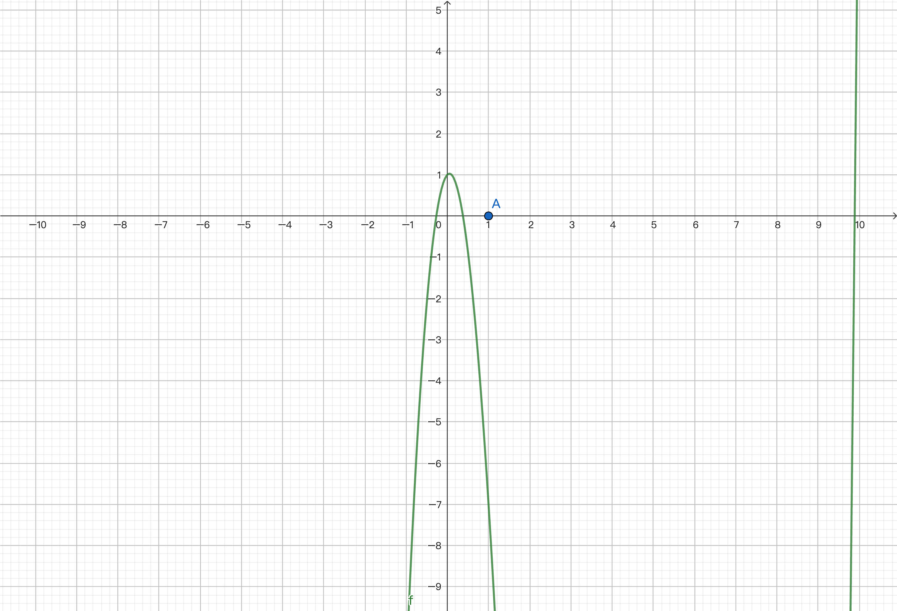

# Programming with MoonBit: A Modern Approach

## Case Study: Automatic Differentiation

### MoonBit Open Course Team

# Differentiation

- Differentiation is applied in the field of machine learning
	- Finding local extrema using gradient descent
	- Solving functions using Newton's method: $x^3 - 10 x^2 + x + 1 = 0$
- Let's look at some simple combination of functions
	- Example: $f(x_0, x_1) = 5{x_0}^2 + {x_1}$
		- $f(10, 100) = 600$
		- $\frac{\partial f}{\partial x_0}(10, 100) = 100$
		- $\frac{\partial f}{\partial x_1}(10, 100) = 1$

# Newton's Method


# Newton's Method

.png)
# Newton's Method

.png)
# Newton's Method

.png)
# Newton's Method

.png)
# Newton's Method

.png)
# Newton's Method

.png)
# Newton's Method

.png)
# Newton's Method

.png)

# Differentiation

- Differentiation is applied in the field of machine learning
	- Finding local extrema using gradient descent
	- Solving functions using Newton's method：$x^3 - 10 x^2 + x + 1 = 0$
- Let's look at the following simple combination of functions
	- Example: $f(x_0, x_1) = 5{x_0}^2 + {x_1}$
		- $f(10, 100) = 600$
		- $\frac{\partial f}{\partial x_0}(10, 100) = 100$
		- $\frac{\partial f}{\partial x_1}(10, 100) = 1$

# Differentiation
- Ways to differentiate a function:
	- Manual differentiation: purely natural calculator
		
		- Drawback: easy to make mistakes with complex expressions
	- Numerical differentiation: $\frac{ \texttt{f}(x + \delta x) - \texttt{f}(x) }{ \delta x }$
		
		- Drawback: computers cannot accurately represent decimals, and the larger the absolute value, the less accurate it is
	- Symbolic differentiation: `Mul(Const(2), Var(1)) -> Const(2)`
		- Drawback: calculations can be complex; possible redundant calculations; hard to directly use native control flow
		```moonbit no-check
		// Need to define additional native operators for the same effect
		fn max[N : Number](x : N, y : N) -> N {
			if x.value() > y.value() { x } else { y }
		}
		```

# Differentiation
- Ways to differentiate a function:
  - Manual differentiation: pure natural calculator
  	- Drawback: easy to make mistakes with complex expressions
  - Numerical differentiation: $\frac{ \texttt{f}(x + \delta x) - \texttt{f}(x) }{ \delta x }$
  	- Drawback: computers cannot accurately represent decimals, and the larger the absolute value, the less accurate it is
  - Symbolic differentiation: `Mul(Const(2), Var(1)) -> Const(2)`
  	- Drawback: calculations can be complex; possible redundant calculations; hard to directly use native control flow
  -  Automatic differentiation: using derivative rules of composite functions, performing differentiation by combining basic operations
  	- Divided into forward and backward differentiation

# Symbolic Differentiation
- We define the semantics for building expressions using symbolic differentiation
	```moonbit
	enum Symbol {
	  Constant(Double)
	  Var(Int)
	  Add(Symbol, Symbol)
	  Mul(Symbol, Symbol)
	} derive(Debug, Show)

	// Define simple constructors and overload operators
	fn Symbol::constant(d : Double) -> Symbol { Constant(d) }
	fn Symbol::var(i : Int) -> Symbol { Var(i) }
	fn Symbol::op_add(f1 : Symbol, f2 : Symbol) -> Symbol { Add(f1, f2) }
	fn Symbol::op_mul(f1 : Symbol, f2 : Symbol) -> Symbol { Mul(f1, f2) }

	// Compute function values
	fn Symbol::compute(self : Symbol, input : Array[Double]) -> Double { 
	  match self {
	    Constant(d) => d
	    Var(i) => input[i] // get value following index
	    Add(f1, f2) => f1.compute(input) + f2.compute(input)
	    Mul(f1, f2) => f1.compute(input) * f2.compute(input)
      } 
	}
	```

# Symbolic Differentiation
- We compute the (partial) derivatives of functions using the derivative rules
	- $\frac{\partial f}{\partial x_i} = 0$ if $f$ is a constant function
	- $\frac{\partial x_i}{\partial x_i} = 1, \frac{\partial x_j}{\partial x_i} = 0, i \neq j$
	- $\frac{\partial (f + g)}{\partial x_i} = \frac{\partial f}{\partial x_i} + \frac{\partial g}{\partial x_i}$
	- $\frac{\partial (f \times g)}{\partial x_i} = \frac{\partial f}{\partial x_i} \times g + f \times \frac{\partial g}{\partial x_i}$
- Implementation in MoonBit
	```moonbit
	fn differentiate(self : Symbol, val : Int) -> Symbol {
	  match self {
        Constant(_) => Constant(0.0)
	    Var(i) => if i == val { Constant(1.0) } else { Constant(0.0) }
	    Add(f1, f2) => f1.differentiate(val) + f2.differentiate(val)
	    Mul(f1, f2) => f1 * f2.differentiate(val) + f1.differentiate(val) * f2
	  }
	}
	```

# Symbolic Differentiation
- Using symbolic differentiation, we first build an abstract syntax tree, then convert it to the corresponding partial derivative, and finally computate
	```moonbit
	fn example() -> Symbol {
	  Symbol::constant(5.0) * Symbol::var(0) * Symbol::var(0) + Symbol::var(1)
	}

	test "Symbolic differentiation" {
	  let input : Array[Double] = [10.0, 100.0]
	  let symbol : Symbol = example() // Abstract syntax tree of the function
	  @assertion.assert_eq(symbol.compute(input), 600.0)?
	  // Expression of df/dx
	  inspect(symbol.differentiate(0), 
	  content="Add(Add(Mul(Mul(Constant(5.0), Var(0)), Constant(1.0)), Mul(Add(Mul(Constant(5.0), Constant(1.0)), Mul(Constant(0.0), Var(0))), Var(0))), Constant(0.0))")?
	  @assertion.assert_eq(symbol.differentiate(0).compute(input), 100.0)?
	}
	```
- Here, `diff_0` is:
	```moonbit
	let diff_0: Symbol = 
	  (Symbol::Constant(5.0) * Var(0)) * Constant(1.0) + 
	  (Symbol::Constant(5.0) * Constant(1.0) + Symbol::Constant(0.0) * Var(0)) * Var(0) + 
	  Constant(0.0)
	```

# Symbolic Differentiation

- We can simplify during construction
	```moonbit
	fn Symbol::op_add_simplified(f1 : Symbol, f2 : Symbol) -> Symbol {
	  match (f1, f2) {
	    (Constant(0.0), a) => a
        (Constant(a), Constant(b)) => Constant(a + b)
        (a, Constant(_) as const) => const + a
        (Mul(n, Var(x1)), Mul(m, Var(x2))) =>
          if x1 == x2 {
            Mul(m + n, Var(x1))
          } else {
            Add(f1, f2)
          }
        _ => Add(f1, f2)
    } }
  ```

# Symbolic Differentiation

- We can simplify during construction
	```moonbit
	fn Symbol::op_mul_simplified(f1 : Symbol, f2 : Symbol) -> Symbol {
	  match (f1, f2) {
	    (Constant(0.0), _) => Constant(0.0) // 0 * a = 0
	    (Constant(1.0), a) => a             // 1 * a = 1
	    (Constant(a), Constant(b)) => Constant(a * b)
	    (a, Constant(_) as const) => const * a
	    _ => Mul(f1, f2)
    } }
  ```
- Simplification result
    ```moonbit
    let diff_0_simplified : Symbol = Mul(Constant(5.0), Var(0))
    ```

# Automatic Differentiation

- Define the operations we want to implement through an interface
  ```moonbit
  trait Number  {
	constant(Double) -> Self
	op_add(Self, Self) -> Self
	op_mul(Self, Self) -> Self
	value(Self) -> Double // Get the value of the current computation
  }
  ```
- Use the native control flow of the language to dynamically generate computation graphs
  ```moonbit
  fn max[N : Number](x : N, y : N) -> N {
    if x.value() > y.value() { x } else { y }
  }

  fn relu[N : Number](x : N) -> N {
	max(x, N::constant(0.0))
  }
  ```

# Forward Differentiation

- Use the derivative rules to directly calculate derivatives, and simultaneously calculate $f(a)$ and $\frac{\partial f}{\partial x_i}(a)$
	- Simply put: calculating $(fg)' = f' \times g + f \times g'$ requires calculating $f$ and $f'$ simultaneously
	- Technical term: Dual Number in Linear Algebra
	```moonbit
	struct Forward {
	  value : Double      // Current node value f
	  derivative : Double // Current node derivative f'
	} derive(Debug, Show)

	fn Forward::constant(d : Double) -> Forward { { value: d, derivative: 0.0 } }
	fn Forward::value(f : Forward) -> Double { f.value }

	// determine if to differentiate the current variable
	fn Forward::var(d : Double, diff : Bool) -> Forward {
	  { value : d, derivative : if diff { 1.0 } else { 0.0 } }
	}
	```

# Forward Differentiation

- Use the derivative rules to directly calculate derivatives
	```moonbit
	fn Forward::op_add(f : Forward, g : Forward) -> Forward { {
	  value : f.value + g.value,
	  derivative : f.derivative + g.derivative // f' + g'
	} }

	fn Forward::op_mul(f : Forward, g : Forward) -> Forward { {
	  value : f.value * g.value,
	  derivative : f.value * g.derivative + g.value * f.derivative // f * g' + g * f'
	} }
	```

# Forward Differentiation

- Calculate the derivative for each input parameter individually; suitable for cases where there are more output parameters than input parameters
  ```moonbit
  test "Forward differentiation" {
	// Forward differentiation with abstraction
	inspect(relu(Forward::var(10.0, true)), content="{value: 10.0, derivative: 1.0}")? 
    inspect(relu(Forward::var(-10.0, true)), content="{value: 0.0, derivative: 0.0}")?
	// f(x, y) = x * y => df/dy(10, 100)
	inspect(Forward::var(10.0, false) * Forward::var(100.0, true), ~content="{value: 1000.0, derivative: 10.0}")?
  }
  ```

# Case Study: Newton's Method to Approximate Zeros

- $f = x^3 - 10 x^2 + x + 1$
	```moonbit
	fn example_newton[N : Number](x : N) -> N {
	  x * x * x + N::constant(-10.0) * x * x + x + N::constant(1.0)
	}
	```

# Case Study: Newton's Method to Approximate Zeros

- Iterate through the loop
	- $x_{n+1} = x_n - \frac{f(x_n)}{f'(x_n)}$
	```moonbit
	test "Newton's method" {
	  fn abs(d : Double) -> Double { if d >= 0.0 { d } else { -d } }
	  (loop Forward::var(1.0, true) { // initial value
	    x => {
	      let { value, derivative } = example_newton(x)
	      if abs(value / derivative) < 1.0e-9 {
	        break x.value // end the loop and have x.value as the value of the loop body
	      }
	      continue Forward::var(x.value - value / derivative, true)
	    }
	  } |> @assertion.assert_eq(0.37851665401644224))?
	}
	```

# Backward Differentiation

- Use the chain rule
	- Given $w = f(x, y, z, \cdots), x = x(t), y = y(t), z = z(t), \cdots$
	$\frac{\partial w}{\partial t} = \frac{\partial w}{\partial x} \frac{\partial x}{\partial t} + \frac{\partial w}{\partial y} \frac{\partial y}{\partial t} + \frac{\partial w}{\partial z} \frac{\partial z}{\partial t} + \cdots$
	- Example: $f(x_0, x_1) = {x_0} ^ 2 x_1$
		- Decomposition: $f = g h, g(x_0, x_1) = {x_0} ^ 2, h(x_0, x_1) = x_1$
		- Differentiation: $\frac{\partial f}{\partial g} = h = x_1, \frac{\partial g}{\partial x_0} = 2x_0, \frac{\partial f}{\partial h} = g = {x_0}^2, \frac{\partial h}{\partial x_0} = 0$
		- Combination: $\frac{\partial f}{\partial x_0} = \frac{\partial f}{\partial g} \frac{\partial g}{\partial x_0} + \frac{\partial f}{\partial h} \frac{\partial h}{\partial x_0} = x_1 \times 2x_0 + {x_0}^2 \times 0 = 2 x_0 x_1$
- Starting from $\frac{\partial f}{\partial f}$, calculate the partial derivatives of intermediate variables$\frac{\partial f}{\partial g_i}$, until reaching the derivatives of input parameters$\frac{\partial g_i}{\partial x_i}$
  - Able to simultaneously calculate the partial derivative of each input; suitable for cases where there are more input parameters than output parameters

# Backward Differentiation

- Forward computation is needed, followed by backward computation of derivatives

	```moonbit
	struct Backward {
	  value : Double              // Current node value
	  backward : (Double) -> Unit // Update the partial derivative of the current path
	} derive(Debug, Show)

	fn Backward::var(value : Double, diff : Ref[Double]) -> Backward {
	  // Update the partial derivative along a computation path df / dvi * dvi / dx
	  { value, backward: fn { d => diff.val = diff.val + d } } 
	}

	fn Backward::constant(d : Double) -> Backward {
	  { value: d, backward: fn { _ => () } }
	}

	fn Backward::backward(b : Backward, d : Double) -> Unit { (b.backward)(d) }

	fn Backward::value(backward : Backward) -> Double { backward.value }
	```

# Backward Differentiation
- Forward computation is needed, followed by backward computation of derivatives
	- $f = g + h, \frac{\partial f}{\partial g} = 1, \frac{\partial f}{\partial h} = 1$
	- $f = g \times h, \frac{\partial f}{\partial g} = h, \frac{\partial f}{\partial h} = g$
	- Through$f, g$：$\frac{\partial y}{\partial x} = \frac{\partial y}{\partial f} \frac{\partial f}{\partial g} \frac{\partial g}{\partial x}$, where $\frac{\partial y}{\partial f}$ corresponds to `diff`

```moonbit
fn Backward::op_add(g : Backward, h : Backward) -> Backward {
  {
    value: g.value + h.value,
    backward: fn(diff) { g.backward(diff * 1.0); h.backward(diff * 1.0) },
  }
}

fn Backward::op_mul(g : Backward, h : Backward) -> Backward {
  {
    value: g.value * h.value,
    backward: fn(diff) { g.backward(diff * h.value); h.backward(diff * g.value) },
  }
}
```

# Backward Differentiation

```moonbit
test "Backward differentiation" {
  let diff_x = Ref::{ val: 0.0 } // Store the derivative of x
  let diff_y = Ref::{ val: 0.0 } // Store the derivative of y
  let x = Backward::var(10.0, diff_x)
  let y = Backward::var(100.0, diff_y)
  (x * y).backward(1.0) // df / df = 1
  inspect(diff_x, content="{val: 100.0}")?
  inspect(diff_y, content="{val: 10.0}")?
}
```

# Summary

- In this lecture, we introduce the concept of automatic differentiation
	- presenting symbolic differentiation 
	- presenting forward and backward differentiation
- Recommended Readings
	- *3Blue1Brown* series on deep learning (gradient descent, backpropagation algorithms)

