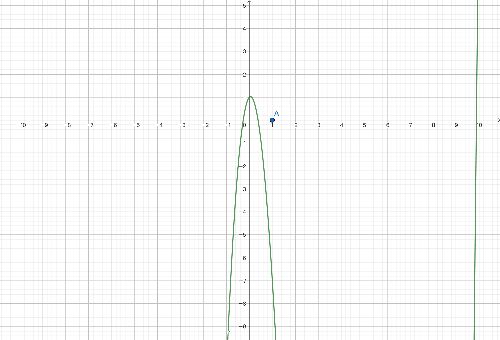
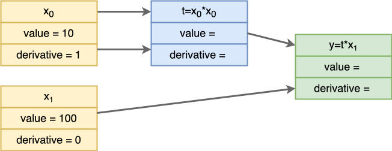
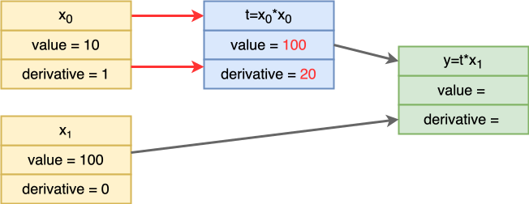
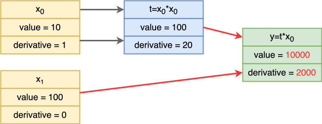
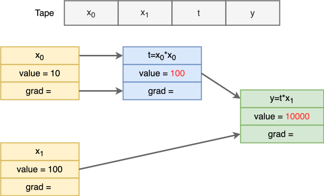
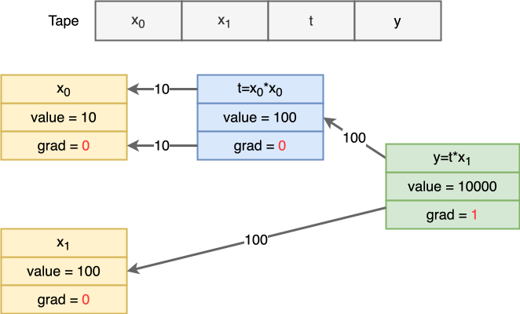
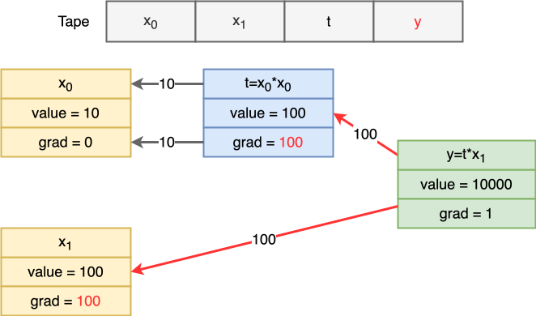
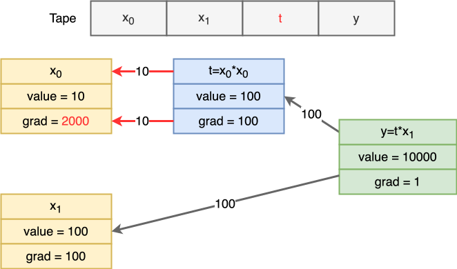

# 现代编程思想

## 案例：自动微分

### 月兔公开课课程组

<!-- ssml
  大家好，欢迎来到由<lang xml:lang="en-US">IDEA</lang>研究院基础软件中心为大家带来的现代编程思想公开课。
  今天我们学习自动微分。我们专注于程序设计，因此，我会避开一些复杂的数学概念。
  但微积分的基础知识还是必须的。不了解的同学可以先行阅读一些微积分教材，比如同济大学的高等数学。
  <break time="500ms" />
-->

# 微分

- 微分被应用于机器学习领域
	- 利用梯度下降求局部极值
	- 牛顿迭代法求函数解：$x^3 - 10 x^2 + x + 1 = 0$
- 我们今天研究简单的函数组合
	- 例：$f(x_0, x_1) = 5{x_0}^2 + {x_1}$
		- $f(10, 100) = 600$
		- $\frac{\partial f}{\partial x_0}(10, 100) = 100$
		- $\frac{\partial f}{\partial x_1}(10, 100) = 1$

<!-- ssml
  微分在机器学习中非常重要，例如梯度下降会用到微分来寻找局部最小值。
  很多同学也更熟悉牛顿迭代法：用导数信息来逐步逼近函数的零点。
  今天我们主要研究由加法和乘法组成的简单函数组合，并计算它们的偏微分。
  比如，5乘以 x0 的平方 加上 x1 这个函数。
  这个函数在 x0 等于 10，x1 等于 100 的位置，值为 600.
  函数对于 x0 的偏导数在这个位置，是 100.
  而函数对于 x1 的偏导数在这个位置，是 1.
  下面我们用牛顿迭代法复习微分的应用，我们需要求解 x 的立方 减去10x的平方 加上 x 加 1 等于 0 这个方程。
  <break time="500ms" />
-->

# 牛顿迭代法


<!-- ssml
  先画出函数曲线，并选一个初始值，比如x等于1，对应数轴上的点a。
  <break time="300ms" />
-->

# 牛顿迭代法
.png)

<!-- ssml
  把点a的横坐标代入函数，
  <break time="300ms" />
-->
# 牛顿迭代法
.png)

<!-- ssml
  得到曲线上对应的点B。
  <break time="300ms" />
-->
# 牛顿迭代法
.png)

<!-- ssml
  在点B处求导。
  导数对应这一点切线的斜率。
  利用导数值画出经过点B的切线。
  <break time="300ms" />
-->
# 牛顿迭代法
.png)

<!-- ssml
  切线与 x 轴的交点给出新的近似值点C。
  <break time="300ms" />
-->
# 牛顿迭代法
.png)

<!-- ssml
  用新的近似值C再次回到曲线上。
  <break time="300ms" />
-->
# 牛顿迭代法
.png)

<!-- ssml
  得到新的点D。
  <break time="300ms" />
-->
# 牛顿迭代法
.png)

<!-- ssml
  在点D处重复求导数并作切线。
  再次取切线与x轴交点，得到更接近零点的横坐标。
  <break time="300ms" />
-->
# 牛顿迭代法
.png)

<!-- ssml
  继续迭代，点会一步步逼近真正的零点。
  当迭代收敛后，我们就得到零点的近似解。稍后我们会给出代码实现。
  <break time="500ms" />
-->

# 微分

- 函数微分的几种方式
	- 手动微分：纯天然计算器
		- 缺点：对于复杂表达式容易出错
	- 数值微分：$\frac{ \texttt{f}(x + \delta x) - \texttt{f}(x) }{ \delta x }$
		- 缺点：计算机无法精准表达小数，且绝对值越大，越不精准
	- 符号微分：`Mul(Const(2), Var(0)) -> Const(2)`
		- 缺点：计算结果可能复杂；可能重复计算；难以直接利用语言原生控制流
		- 例如无法简单地写出这样的函数：
      ```moonbit
      fn[N : Number] max(x : N, y : N) -> N { if x < y { y } else { x } }
      ```
	- 自动微分：利用复合函数求导法则、由基本运算组合进行微分
		- 分为前向微分和后向微分

<!-- ssml
  函数微分有几种方式。一种是手动微分，一张纸，一支笔，纯天然计算器。
  缺点是，对于复杂的表达式容易出错，而且需要人力，无法一天24小时自动进行。
  另一种方式是进行数值微分，也就是对于想要微分的点，加一个小量，计算差值后除以小量。
  这个问题在于，计算机无法精准表达小数，而且绝对值越大越不精准，以及我们无法完全求解无穷级数。
  第三种是符号微分，也就是将函数转换为一棵表达式树，再对表达式树进行操作求出对应的导数。
  符号微分得到的结果同样是一个表达式树，也就是一个函数，这个函数可以反复使用。
  例如，这里的常数2乘以x，就会被求导为常数2。
  符号微分的问题在于，计算的结果不一定能化简足够，可能会有重复计算。
  另外，就是无法利用原生的控制流。
  我们只能利用预先定义好的几种运算来构造表达式树，而无法用一般的程序来构造。
  这种情况下，我们无法使用编程语言中的条件判断和循环等。
  如果想要定义如下方的更大值函数，那么不得不单独定义一个算子，而不能简单地对当前值进行判断。
  最后则是自动微分。
  自动微分利用复合函数的求导法则，由基本运算组合进行计算与微分，这也符合模块化的思想。
  自动微分分为前向微分和后向微分。我们之后将会逐一介绍。
  <break time="500ms" />
-->

# 符号微分

- 我们以符号微分定义表达式构建的一种语义

  ```moonbit
  enum Symbol {
    Constant(Double)
    Var(Int) // x0, x1, x2, ...
    Add(Symbol, Symbol)
    Mul(Symbol, Symbol)
  } derive(Show)

  // 定义简单构造器，并重载运算符
  fn Symbol::constant(d : Double) -> Symbol { Constant(d) }
  fn Symbol::variable(i : Int) -> Symbol { Var(i) }
  impl Add for Symbol with add(f1, f2) { Add(f1, f2) }
  impl Mul for Symbol with mul(f1, f2) { Mul(f1, f2) }

  // 计算函数值
  fn Symbol::compute(f : Symbol, input : Array[Double]) -> Double { 
    ... 
  }
	```

<!-- ssml
  我们先看符号微分。用枚举类型表示表达式：常数、变量、加法和乘法。
  变量可以用下标编号，x0 x1。
  为了写起来更自然，我们再提供构造器，以及加号和乘号。
  这样就可以像写普通表达式一样构建语法树。
  最后，我们还需要一个函数<lang xml:lang="en-US">compute</lang>用来计算函数的值，输入是一个函数的表达式树 和所有变量数值的数组。
  具体的实现我们略过。
  <break time="500ms" />
-->

# 符号微分

- 利用函数求导法则，我们计算函数的（偏）导数
	- $\frac{\partial f}{\partial x_i} = 0$ 如果 $f$ 为常值函数
	- $\frac{\partial x_i}{\partial x_i} = 1, \frac{\partial x_j}{\partial x_i} = 0, i \neq j$
	- $\frac{\partial (f + g)}{\partial x_i} = \frac{\partial f}{\partial x_i} + \frac{\partial g}{\partial x_i}$
	- $\frac{\partial (f \times g)}{\partial x_i} = \frac{\partial f}{\partial x_i} \times g + f \times \frac{\partial g}{\partial x_i}$
- 月兔实现：
  ```moonbit
  fn Symbol::differentiate(self : Symbol, val : Int) -> Symbol {
    match self {
      Constant(_) => Constant(0.0)
      Var(i) => if i == val { Constant(1.0) } else { Constant(0.0) }
      Add(f1, f2) => f1.differentiate(val) + f2.differentiate(val)
      Mul(f1, f2) => f1 * f2.differentiate(val) + f1.differentiate(val) * f2
    }
  }
  ```

<!-- ssml
  有了表达式树，我们就可以按 求导法则 对它做模式匹配。
  常数的导数是0；变量对自己求偏微分是1，对其他变量是0；
  加法的导数是两边导数相加；
  乘法的导数则是按公式展开，每个函数的导数乘另一个函数，然后结果相加。
  对应的代码实现非常简单，直接使用模式匹配即可。
  因为我们要做偏微分，所以还需要一个参数来说明对哪个变量求导。
  判断逻辑在第四行。
  <break time="500ms" />
-->

# 符号微分

- 例子：$y = 5 x_0^2 + x_1$，$\frac{\partial y}{\partial x_0} = 10 x_0$，$\frac{\partial y}{\partial x_0}(10, 100) = 100$
```moonbit
fn example() -> Symbol {
  Constant(5.0) * Variable(0) * Variable(0) + Variable(1)
}
test {
  let func = example()                    // 函数的抽象语法树
  let diff_0_func = func.differentiate(0) // 对x_0的偏微分
  inspect(diff_0_func.compute([10.0, 100.0]), content="100")
}
```

- 需要化简：$\frac{\partial y}{\partial x_0} = ((0 \times x_0 + 5 \times 1) \times x_0 + (5 \times x_0) \times 1) + 0$

<!-- ssml
  我们用符号表达式来构造例子中的函数，并对它求导得到新的表达式。
  因为我们重载了运算符，所以可以直接使用乘号和加号用来构造表达式树，非常自然。
  我们直接在这个函数上调用 <lang xml:lang="en-US">differentiate</lang> 函数对 x0 进行微分，得到偏导数。
  然后，我们构造了一组输入，x0 等于 10，x1 等于 100.
  最终计算得到偏导数为100.
  
  符号微分有一个问题，我们求导得到的函数表达式树往往非常冗长，包含很多不必要的内容。
  我们可以构造一个化简过程 来化简表达式树。
  <break time="500ms" />
-->

# 符号微分

- 微分的结果：$((0 \times x_0 + 5 \times 1) \times x_0 + (5 \times x_0) \times 1) + 0$ 
- 我们可以在构造期间进行化简

  ```moonbit
  impl Add for Symbol with add(f1 : Symbol, f2 : Symbol) -> Symbol {
    match (f1, f2) {
      (Constant(0.0), a) => a                       // 0 + a = a
      (Constant(a), Constant(b)) => Constant(a + b) // 常数直接计算
      (a, Constant(_) as c) => c + a                
      (Mul(n, Var(x1)), Mul(m, Var(x2))) if x1 == x2 => 
         Mul(m + n, Var(x1)) // n * x + m * x = (m + n) * x
      _ => Add(f1, f2)
    } 
  }
  ```

<!-- ssml
  最简单的化简过程，就是在构造期间进行化简。
  比如对于加法：0加a等于a；
  两个常数相加可以直接算出结果；
  还可以把常数统一放到一侧，减少规则的重复。
  这样做可以显著缩短符号微分得到的表达式。
  以及运用乘法分配率，把原本包含三个运算符的表达式 化简为 只包含两个运算符的表达式。
  <break time="500ms" />
-->

# 符号微分

- 我们可以在构造期间进行化简

  ```moonbit
  impl Mul for Symbol with mul(f1 : Symbol, f2 : Symbol) -> Symbol {
    match (f1, f2) {
      (Constant(0.0), _) => Constant(0.0) // 0 * a = 0
      (Constant(1.0), a) => a             // 1 * a = 1
      (Constant(a), Constant(b)) => Constant(a * b)
      (a, Constant(_) as c) => c * a
      _ => Mul(f1, f2)
    } 
  }
  ```

- 化简效果
  $((0 \times x_0 + 5 \times 1) \times x_0 + (5 \times x_0) \times 1) + 0 \equiv 10 \times x_0$ 

<!-- ssml
  类似地，对乘法也可以化简。
  0乘任何数都是0，
  1乘任何数是它本身，
  两个常数相乘可以直接计算。
  经过这些化简后，我们会得到更精简、更可计算的结果。例如，刚刚得到的结果就可以直接化简为10乘x零。
  当然真实系统里还会有更多、更复杂的化简策略。
  <break time="500ms" />
-->

# 自动微分

- 链式法则：如果 $y = f(g(x))$，那么 $\frac{\partial y}{\partial x}(x_0) = \frac{\partial{f}}{\partial g}(g(x_0)) \times \frac{\partial{g}}{\partial x}(x_0)$
- 如果 $y=t_1(t_2(...(t_k(x))))$， 那么 $\frac{\partial y}{\partial x} = \frac{\partial y}{\partial t_1} \frac{\partial t_1}{\partial t_2} \dotsc \frac{\partial t_{k-1}}{\partial t_k} \frac{\partial t_k}{\partial x}$
- 多变量链式法则：如果 $y = f(t_1, \dotsc, t_n)$，其中每个 $t_i$ 都是 $x$ 的函数，
  那么 $\frac{\partial y}{\partial x} = \frac{\partial y}{\partial t_1}\frac{\partial t_1}{\partial x} + \dotsc + \frac{\partial y}{\partial t_n}\frac{\partial t_n}{\partial x}$
- 例如，$y = x_0^2 \times x_1$，
  $\frac{\partial y}{\partial x_0} = \frac{\partial y}{\partial x_0^2} \times \frac{\partial x_0^2}{\partial x_0} + \frac{\partial y}{\partial x_1} \frac{\partial x_1}{\partial x_0} = x_1 \times 2 x_0 + x_0^2 \times 0 = 2 x_0 x_1$

<!-- ssml
  接下来我们介绍自动微分。
  自动微分的原理是链式法则。我们刚刚在讲述符号微分时，其实已经用到了这个规则，现在我们详细介绍一下。
  如果 y 是 x 的函数，这个函数可以用复合函数来表达，比如是 f 和 g 的复合，那么，y 对 x 的导数就等于 f 对 g 的导数 乘 g 对 x 的导数。
  也就是说，复合函数的微分，等于各自微分的复合。
  这样，当 f 的表达式过于复杂时，我们可以定义一些中间计算节点，比如 t1 到 t k，
  然后各自计算导数，最后全部相乘，就得到了 f 对于 x 的导数。
  链式法则可以推广到多变量。当 y 是 t1 到 tn 的函数，而每个 t 都是 x 的函数。
  那么 y 对 x 的导数 就等于 y 通过每个中间变量对 x 求得导数后，将所有结果线性相加。
  例如，函数 y 等于 x0 的平方 乘 x1，
  要计算 y 对于 x0 的偏导数，我们可以先计算 y 对于 x0 平方的偏导数，以及 x0 平方对于 x0 的偏导数，再将两者相乘。另一方面，计算 y 对于 x1 的偏导数以及 x1 对 x0 的偏导数，相乘，然后结果相加。
  得到两倍的 x0 乘 x1。
  <break time="500ms" />
-->

# 前向微分

- 利用求导法则直接计算微分，同时计算$f(a)$与$\frac{\partial f}{\partial x_i}(a)$
	- 简单理解：计算$(f \times g)' = f' \times g + f \times g'$需要同时计算$f$与$f'$
- 对偶数（Dual Numbers）
  ```moonbit
  struct Dual {
    value : Double      // 当前节点值   f
    derivative : Double // 当前节点导数 f'
  }
  fn Dual::constant(d : Double) -> Dual { 
    { value: d, derivative: 0.0 } 
  }
  fn Dual::new(d : Double, diff : Bool) -> Dual {
    { value: d, derivative: if diff { 1.0 } else { 0.0 } }
  }
	```

<!-- ssml
  先看前向微分。它会在计算每个中间值的同时，携带并更新导数信息，也就是同时计算<lang xml:lang="en-US">f</lang>(a)和<lang xml:lang="en-US">f</lang>对x的导数在 a 处的值。
  直观上，这是因为 求乘法导数时 需要两边的当前值。
  我们可以用一个结构体保存当前值和当前导数，并用一个标记来指定当前变量是否是我们要求导的那个变量。
  这个结构通常叫作对偶数。
  生成一个对偶数时，我们除了为它提供值，还要注意，这个对偶数是否是我们要求导的变量。如果是，那么它的导数值需要初始化为1，因为 x 对 x 求导结果为1.
  <break time="500ms" />
-->

# 前向微分

- 原理：$(f + g)' = f' + g', (f \times g)' = f' \times g + f \times g'$
- 通过加法和乘法构造新的对偶数
  ```moonbit 
  impl Add for Dual with add(f : Dual, g : Dual) -> Dual {
    { 
      value: f.value + g.value, 
      derivative: f.derivative + g.derivative, // f' + g'
    }
  }

  impl Mul for Dual with mul(f : Dual, g : Dual) -> Dual {
    {
      value: f.value * g.value,
      derivative: f.value * g.derivative + g.value * f.derivative, 
      // f * g' + g * f'
    }
  }
  ```

<!-- ssml
  前向微分构造计算节点的原理 和符号微分是类似的。
  例如对于加法和乘法，其导数的计算方式也是依照同样的公式。
  每当构造一个新的对偶数时，我们需要同时提供对偶数的 <lang xml:lang="en-US">value</lang> 和 <lang xml:lang="en-US">derivative</lang>。
  两个对偶数相加，导数就是两个对偶数的导数部分求和。
  两个对偶数相乘，导数是两个对偶数的值分别乘对方的导数，然后求和。
  <break time="500ms" />
-->

# 前向微分

- 例：$f(x_0, x_1) = {x_0}^2 \times x_1$，求$\frac{\partial f}{\partial x_0}$（$x_0=10, x_1=100$）



<!-- ssml
  让我们看看例子。
  我们要计算微分的函数是 x0 的平方乘 x1. 
  我们要求它对于 x0 的偏导数，在 x0 等于10，x1 等于 100 这个位置的值。
  前向微分中，每个对偶数都是计算图中的一个节点。
  每个节点都同时携带当前值<lang xml:lang="en-US">value</lang>和导数<lang xml:lang="en-US">derivative</lang>，并按照运算规则从输入一路向前传播。
  当我们要对某个变量求导时，把它的<lang xml:lang="en-US">derivative</lang>初始化为1，其他输入初始化为0。
  最终输出节点里就同时得到函数值和对该变量的导数。
  <break time="500ms" />
-->

# 前向微分

- 例：$f(x_0, x_1) = {x_0}^2 \times x_1$，求$\frac{\partial f}{\partial x_0}$（$x_0=10, x_1=100$）
- 第一步，令 $t = x_0^2$



- 求出 $t = 100, \frac{\partial t}{\partial x_0}=20$

<!-- ssml
  第一步，计算 x0 的平方这个节点的值<lang xml:lang="en-US">value</lang>和导数<lang xml:lang="en-US">derivative</lang>。
  值就是两个 x0 的值相乘，10 乘 10 等于 100；
  导数的计算方法，是第一个节点的值 乘第二个节点的导数，加上第二个节点的值 乘第一个节点的导数，因此是 10 加 10 等于 20.
  <break time="500ms" />
-->

# 前向微分

- 例：$f(x_0, x_1) = {x_0}^2 \times x_1$，求$\frac{\partial f}{\partial x_0}$（$x_0=10, x_1=100$）
- 第二步，令 $y = t \times x_1$



- 求出 $y = 10000, \frac{\partial y}{\partial x_0}=2000$

<!-- ssml
  第二步，和第一步类似。
  最终结果的值，为 100 乘 100 等于 10000.
  导数则是 100 乘 0 加 20 乘 100 也就是2000。
  至此，我们就得到了最终结果，f 对 x0 的偏导数在 x0 等于 10、x1 等于 100 这个位置，为2000。
  <break time="500ms" />
-->

# 前向微分案例：牛顿迭代法求零点

- $f = x^3 - 10 x^2 + x + 1$
  
  ```moonbit
  fn example_newton(x : Dual) -> Dual {
    x * x * x + Dual::constant(-10.0) * x * x + x + Dual::constant(1.0)
  }
	```

<!-- ssml
  下面我们用一个例子展示如何用前向微分配合牛顿迭代法求零点。
  先用接口来定义函数<lang xml:lang="en-US">f</lang>等于x的三次方减10倍x的平方加x加1，
  <break time="500ms" />
-->

# 前向微分案例：牛顿迭代法求零点

- 通过循环进行迭代
	- $x_{n+1} = x_n - \frac{f(x_n)}{f'(x_n)}$
  ```moonbit
  test {
    let mut x = 1.0 // 迭代起点
    while true {
      let { value, derivative } = example_newton(Variable(x, true))
      if (value / derivative).abs() < 1.0e-9 {
        break // 精度足够，终止循环
      }
      x -= value / derivative
    } 
    inspect(x, content="0.37851665401644224")
    inspect(example_newton(x), content="-4.604427950027912e-11")
  }
  ```

<!-- ssml
  接着写一个循环做牛顿迭代：从初始值x等于1开始。
  在第四行，我们每一轮都计算<lang xml:lang="en-US">f</lang>在这个点的值和导数。
  这个值和导数的比值，就是牛顿迭代法的步长。
  每一轮都让 x 减去一个步长，已获得离零点更接近的x值。
  如果步长足够小，说明已经达到了需要的精度，我们就退出循环。此时 x 的值已经非常接近零点。
  我们可以验算一下，此时 f x 的值非常接近零。
  <break time="500ms" />
--> 

# 后向微分 

- 前向微分：
  - 从输入开始，将微分结果逐步向前传递到每个输出
  - 对于每个输入 $x_i$ 求导都要重新完整地计算一遍
  - 适用于输入少，输出多
- 后向微分：
  - 从输出开始，将微分结果逐步向后传递给每个输入
  - 一次计算出 $y$ 对于所有 $x_i$ 的导数
  - 适用于输入多，输出少

<!-- ssml
  最后我们来看后向微分。
  在前向微分中，我们从输入逐步计算出中间节点的对偶数，然后得到输出。
  对于每个输入，求导都需要完整地计算一遍计算图，推出所有输出值对于该输入值的微分。
  这种做法在输出很多，输入很少时很高效。
  后向微分正相反，会从输出开始，将微分结果逐步向后传递给每一个输入。
  在现实场景中，比如神经网络，往往是多个输入，一个输出。
  因此 后向微分刚好适用于这个场景。
  <break time="500ms" />
-->

# 后向微分

- 原理回顾：多变量链式法则 $\frac{\partial y}{\partial x} = \frac{\partial y}{\partial t_1}\frac{\partial t_1}{\partial x} + \dotsc + \frac{\partial y}{\partial t_n}\frac{\partial t_n}{\partial x}$
- 使用 `Node` 表示计算节点；`Edge` 表示节点之间的连接
- 需前向计算值，再后向传播导数

  ```moonbit
  struct Node {
    v : Double            // 节点的值 v
    mut grad : Double     // 输出对于该节点的导数 dy/dv
    parents : Array[Edge] // 指向父节点的边
  }

  type Var = Int
  struct Edge {
    parent : Var          // 父节点索引
    w : Double            // 权重
  }
  ```

<!-- ssml
  后向微分的原理是多变量链式法则。最终输出对于某个输入的偏导数，
  等于该输出通过每一条路径 通过单变量链式法则计算得到的偏导数 的累加。
  在计算图中，每个中间变量就是一个节点。
  我们用 Node 类型来表示计算的节点。
  在 Node 中，包含一个字段 v 代表该节点的值，一个可变字段表示 输出对于该节点的导数，以及一个字段指向所有的父节点。
  我们用整数表示节点的索引。
  由于指向父节点的边还需要一个权重，因此我们又定义了 edge 类型用来表示边。
  要计算输出对于某个输入的偏导数，我们需要和之前一样先计算所有节点的值，然后在从输出开始向后推出所有的导数。
  <break time="500ms" />
-->

# 后向微分

- 使用 `Tape` 记录节点计算顺序
 
  ```moonbit 
  struct Tape {
    nodes : Array[Node]
  } derive(Show)

  fn Tape::new() -> Tape {
    { nodes: [] }
  }

  fn Tape::push(self : Tape, v : Double, parents : Array[Edge]) -> Var {
    let id = self.nodes.length()
    self.nodes.push({ v, grad: 0.0, parents })
    id
  }

  fn Tape::input(self : Tape, v : Double) -> Var { self.push(v, []) }
  ```

<!-- ssml
  既然要从前向后计算导数，我们需要规定计算的顺序。
  一种常用的顺序是通过一个叫作 Tape 的数据结构，记录前向构造计算图的顺序，然后再反过来，就是合理的后向计算导数的顺序。
  Tape 就像一条磁带，数据正向录进去后，通过倒带就可以反向读取。
  Tape 有一个 push 方法用来存储计算节点，参数是一个值和它的所有边。
  该方法将节点插入到 Tape 尾部，将导数初始化为0，然后返回节点在 tape 中的索引。
  对于没有父节点的节点，我们定义 input 方法直接插入到尾部。
  <break time="500ms" />
-->

# 后向微分

- 使用 `Tape` 计算加法和乘法
 
  ```moonbit 
  fn Tape::add(self : Tape, a : Var, b : Var) -> Var {
    let va = self.val(a)
    let vb = self.val(b)
    // d(a+b)/da = 1, d(a+b)/db = 1
    self.push(va + vb, [{ parent: a, w: 1.0 }, { parent: b, w: 1.0 }])
  }

  fn Tape::mul(self : Tape, a : Var, b : Var) -> Var {
    let va = self.val(a)
    let vb = self.val(b)
    // d(a*b)/da = b, d(a*b)/db = a
    self.push(va * vb, [{ parent: a, w: vb }, { parent: b, w: va }])
  }
  ```

<!-- ssml
  使用 Tape 计算加法和乘法的原理和之前也一样。
  不同之处在于，我们此时只计算值，而将后续计算导数所需要的信息存放在边，然后把值和边一同插入 tape 的尾部。
  以加法为例，在使用 push 方法的时候，我们为两条指向父节点的边 都设置了权重1，
  这是因为加法结果对于两个加数的偏导数分别都是1. 
  相应的，对于乘法，指向父节点 A 的权重是 B 节点的值，而指向 B 的权重是 A 的值。
  正因如此，我们需要在计算导数之前，先计算出所有节点的值。
  <break time="500ms" />
-->

# 后向微分

- 从后向前计算导数（梯度）
 
  ```moonbit 
  fn Tape::backward(self : Tape, out : Var) -> Unit {
    self.nodes[out].grad = 1.0
    // 逆序遍历：把每个节点的导数分发给它的父节点
    for i = self.nodes.length() - 1; i >= 0; i = i - 1 {
      let g = self.nodes[i].grad
      for e in self.nodes[i].parents {
        self.nodes[e.parent].grad += g * e.w
      }
    }
  }
  ```

<!-- ssml
  最重要的一步，是从后向前计算导数。
  然后将输出节点的导数置为1，因为它相对于自己的导数为1.
  接下来，从后向前，遍历每一个节点，将它们自己的导数乘上权重后，累加到各个父节点。
  这一步对应着多变量链式法则的累加规则。
  <break time="500ms" />
-->

# 后向微分

- 例：$f(x_0, x_1) = {x_0}^2 \times x_1$（$x_0=10, x_1=100$）
- 第一步：前向计算值



<!-- ssml
  我们仍然沿用刚刚的例子。
  在计算导数之前，先构造计算图，同时得到 tape。
  然后，向前计算所有节点的值。
  <break time="500ms" />
-->

# 后向微分

- 例：$f(x_0, x_1) = {x_0}^2 \times x_1$（$x_0=10, x_1=100$）
- 第二步：设输出的导数为1，其它导数清零



<!-- ssml
  第二步，我们将输出节点的导数设置为1，其它节点的导数设置为0.
  在图中，每条边的方向被反转，意味着我们将要基于这些边计算导数。
  每条边的权重已经被标注。
  <break time="500ms" />
-->

# 后向微分

- 例：$f(x_0, x_1) = {x_0}^2 \times x_1$（$x_0=10, x_1=100$）
- 第三步：从后向前计算导数



<!-- ssml
  第三步，沿着 tape 从后向前计算导数。
  第一个要处理的节点就是输出节点 y。
  沿着两条边，t 节点和 x1 节点的导数增加各自边的权重。
  <break time="500ms" />
-->

# 后向微分

- 例：$f(x_0, x_1) = {x_0}^2 \times x_1$（$x_0=10, x_1=100$）
- 第三步：从后向前计算导数



<!-- ssml
  重复上一个过程，t 节点的两个父节点都是 x0 节点。因此，x0 节点累加两次 1000.
  由于 x1 和 x0 没有父节点，它们的遍历过程可以跳过。
  至此，计算已经结束。
  我们可以看到，y 对于 x0 的导数就是两千，对于 x1 的导数是 100.
  <break time="500ms" />
-->

# 后向微分案例：牛顿迭代法求零点

- $f = x^3 - 10 x^2 + x + 1$

  ```moonbit 
  fn example_newton_bw(t : Tape, x : Var) -> Var {
    let t1 = t.mul(t.mul(x, x), x)
    let t2 = t.mul(t.input(-10.0), t.mul(x, x))
    t.add(t.add(t.add(t1, t2), x), t.input(1.0))
  }
  ```

<!-- ssml
  我们依旧使用牛顿迭代法作为例子。
  对于原先的函数，后向微分这一套系统由于多了一个 tape 参数，定义函数更加复杂。
  不过原理上是一样的。
  <break time="500ms" />
-->

# 后向微分案例：牛顿迭代法求零点
  
- 利用循环进行迭代：$x_{n+1} = x_n - \frac{f(x_n)}{f'(x_n)}$

  ```moonbit
  test "Newton's method 牛顿迭代法案例" {
    let mut x = 1.0
    while true {
      let tape = Tape::new()
      let x_var = tape.input(x)
      let y = example_newton_bw(tape, x_var)
      tape.backward(y)
      if (tape.val(y) / tape.grad(x_var)).abs() < 1.0e-9 {
        break
      }
      x -= tape.val(y) / tape.grad(x_var) // update x 更新 x
    }
    inspect(x, content=(0.37851665401644224))
  }
  ```

<!-- ssml
  迭代过程也和前向微分类似，不同之处在于第七行，我们需要手动调用 backward 函数 来执行 后向微分计算过程。
  最终的结果也和前向微分计算的结果完全相同。
  <break time="500ms" />
-->

# 总结

- 本章节介绍了自动微分的概念
	- 展示了符号微分
	- 展示了前向微分与后向微分
- 拓展阅读
	- 3Blue1Brown：深度学习系列（梯度下降法、后向传播算法）

<!-- ssml
  总结一下，本节课介绍了自动微分的概念。我们先展示了符号微分，再展示了自动微分的两种实现：前向微分和后向微分。感兴趣的同学可以参考<lang xml:lang="en-US">three Blue one Brown</lang>的深度学习系列，了解梯度下降和后向传播，并尝试自己手写一个小型神经网络。感谢大家收看。
  <break time="500ms" />
-->
