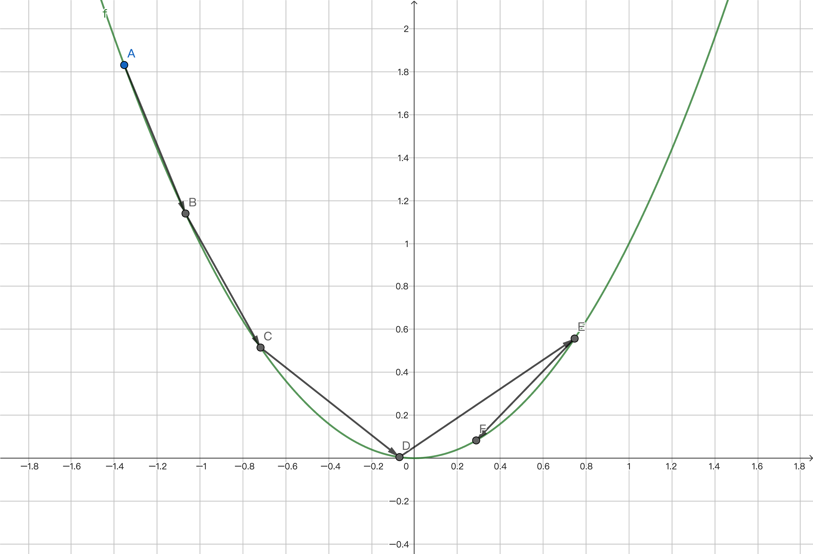

# Programming with MoonBit: A Modern Approach

## Case Study: Neural Network

### MoonBit Open Course Team

---

# Dataset: Iris

- The Iris dataset is the "Hello World" of machine learning
  - It was released in 1936
  - It has 3 classes with 50 samples each, representing different iris plant types
  - Each sample consists of 4 features:
    - sepal length, sepal width, petal length & petal width
- Task
  - To build and train a neural network to classify the type of an iris plant based on its features, achieving an accuracy rate of over 95%

---

# Neural Networks

<div class="columns">
<div>

- Neural networks are a subtype of machine learning
  - They simulate the neural structure of the human brain
  - A single neuron typically has
    - multiple inputs
    - one output
  - Neurons activate when they reach a certain threshold
  - A neural network is usually divided into multiple layers

</div>
<div>


</div>
</div>

---

# The Structure of a Neural Network

<div class="columns">
<div>

- A typical neural network consists of
  - Input layer: receives the inputs
  - Output layer: outputs the results
  - Hidden layers: layers between the input and output layers
- The structure of a neural network includes
  - Number of hidden layers, neurons
  - How the layers/neurons are connected
  - Activation function of neurons
  - ...

</div>
<div>


</div>
</div>

---

# A Sample Neural Network for Iris

<div class="columns">
<div>

- Input: The value for each feature
- Output: The likelihood of belonging to each type
- Number of samples: 150
- Network architecture: Feedforward neural network
  - Input layer: 4 nodes
  - Output layer: 3 nodes
  - Hidden layer: 1 layer with 4 nodes
  - Fully connected: Each neuron is connected to all neurons in the previous layer

</div>
<div>


</div>
</div>

---

# Neurons

<div class="columns">
<div>

- $f = w_0 x_0 + w_1 x_1 + \cdots + w_n x_n + c$
  - $w_i$, $c$: trainable parameters
  - $x_i$: inputs
- Activation function
  - Hidden layer: Rectified Linear Unit (ReLU)
    - Neurons are not activated when the computed value is less than zero
    - $f(x) = \begin{cases}x & \text{if } x \ge 0 \\0 & \text{if } x < 0\end{cases}$
  - Output layer: Softmax
    - Organizes the outputs into a probability distribution with a total sum of 1
    - $f(x_m) = e^{x_m} / \sum_{i=1}^N e^{x_i}$

</div>
<div>


</div>
</div>

---

# Implementation

- Basic operations
  ```moonbit
  trait Base {
      constant(Double) -> Self
      value(Self) -> Double
      op_add(Self, Self) -> Self
      op_neg(Self) -> Self
      op_mul(Self, Self) -> Self
      op_div(Self, Self) -> Self
      exp(Self) -> Self // for computing softmax
  }
  ```

---

# Implementation

- Activation function
	```moonbit
	fn reLU[T : Base](t : T) -> T {
	  if t.value() < 0.0 { T::constant(0.0) } else { t }
	}

	fn softmax[T : Base](inputs : Array[T]) -> Array[T] {
	  let n = inputs.length()
	  let outputs : Array[T] = Array::make(n, T::constant(0.0))
	  let mut sum = T::constant(0.0)
	  for i = 0; i < n; i = i + 1 {
	    sum = sum + inputs[i].exp()
	  }
	  for i = 0; i < n; i = i + 1 {
	    outputs[i] = inputs[i].exp() / sum
	  }
	  outputs
	}
	```

---

# Implementation

- Input layer -> Hidden layer
	```moonbit
	fn input2hidden[T : Base](inputs: Array[Double], param: Array[Array[T]]) -> Array[T] {
	  let outputs : Array[T] = Array::make(param.length(), T::constant(0.0))
	  for output = 0; output < param.length(); output = output + 1 { // 4 outputs
	    for input = 0; input < inputs.length(); input = input + 1 { // 4 inputs
	      outputs[output] = outputs[output] + T::constant(inputs[input]) * param[output][input]
	    }
	    outputs[output] = outputs[output] + param[output][inputs.length()] |> reLU // constant
	  }
	  outputs
	}
	```

---

# Implementation

- Hidden layer -> Output layer
	```moonbit
	fn hidden2output[T : Base](inputs: Array[T], param: Array[Array[T]]) -> Array[T] {
	  let outputs : Array[T] = Array::make(param.length(), T::constant(0.0))
	  for output = 0; output < param.length(); output = output + 1 { // 3 outputs
	    for input = 0; input < inputs.length(); input = input + 1 { // 4 inputs
	      outputs[output] = outputs[output] + inputs[input] * param[output][input]
	    }
	    outputs[output] = outputs[output] + param[output][inputs.length()] // constant
	  }
	  outputs |> softmax
	}
	```

---

# Training

- Cost function
  - Evaluates the "distance" between the current result and the expected result
  - Cross-entropy is a typical choice
- Gradient descent
  - Gradient determines the direction of parameter adjustment
- Learning rate
  - Learning rate determines the magnitude of parameter adjustment
  - We choose exponential decay

---

# Cost Function

- Multi-class cross-entropy: $I(x_j) = -\ln(p(x_j))$
  - $x_j$: event
  - $p(x_j)$: the probability of $x_j$ happening
- Cost function:
  ```moonbit
	trait Log {
	  log(Self) -> Self // for computing cross-entropy
	}
	fn cross_entropy[T : Base + Log](inputs: Array[T], expected: Int) -> Double {
	  -inputs[expected].log().value()
	}
	```

---

# Gradient Descent

- Backpropagation: Compute the gradients with backward differentiation and adjust the parameters accordingly
  - Accumulate the partial derivatives
  ```moonbit
	fn Backward::param(param: Array[Array[Double]], diff: Array[Array[Double]], 
		i: Int, j: Int) -> Backward {
	  { value: param[i][j], backward: fn { d => diff[i][j] = diff[i][j] + d} }
	}
	```
  - Compute the cost and perform backward differentiation accordingly
  ```moonbit
	fn diff(inputs: Array[Double], expected: Int,
	   param_hidden: Array[Array[Backward]], param_output: Array[Array[Backward]]) {
	  let result = inputs
	    |> input2hidden(param_hidden)
	    |> hidden2output(param_output)
	    |> cross_entropy(expected)
	  result.backward(1.0)
	}
  ```

---

# Gradient Descent

- Adjust parameters based on the gradients
  ```moonbit
	fn update(params: Array[Array[Double]], diff: Array[Array[Double]], step: Double) {
	  for i = 0; i < params.length(); i = i + 1 {
	    for j = 0; j < params[i].length(); j = j + 1 {
	      params[i][j] = params[i][j] - step * diff[i][j]
	    }
	  }
	}
	```

---

# Learning Rate

<div class="columns">
<div>

- An inappropriate learning rate can cause worse performance, or even failure to converge to the optimal result
- Exponential decay learning rate: $f(x) = a\mathrm{e}^{-bx}$, where $a$ and $b$ are constants and $x$ is the number of training epochs

</div>
<div>



</div>
</div>

---

# Training Set vs Testing Set

- Randomly divide the dataset into two parts:
  - Training set: To train the parameters
  - Testing set: To evaluate how well a trained model performs on unseen data
- If the amount of data is small, we typically perform full batch training
  - Each epoch consists of one iteration, in which all the training samples are used
  - If there is a large amount of data, we may perform mini batch training instead

---

# Summary

- This chapter introduces the basics of neural networks:
  - The structure of a neural network
  - The training process of a neural network
- References:
  - [What is a neural network](https://www.ibm.com/topics/neural-networks)