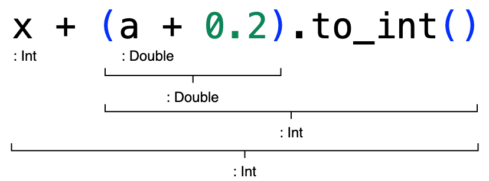
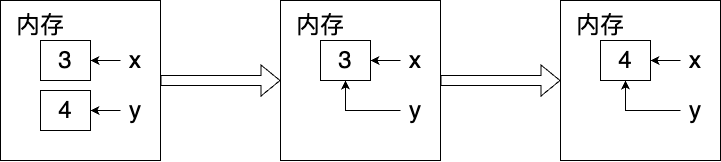
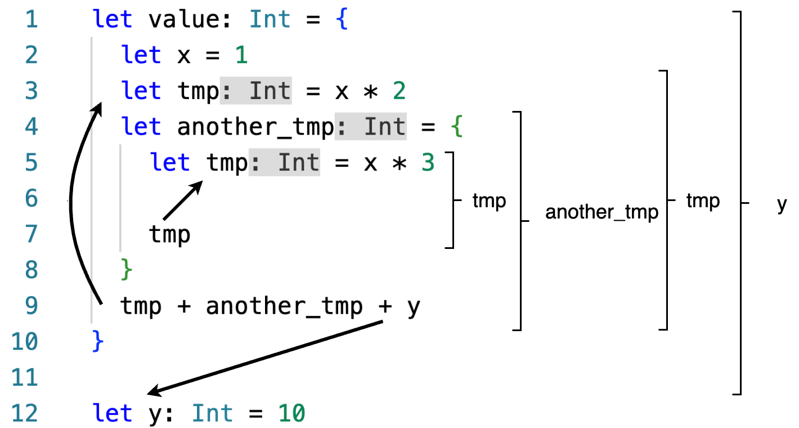
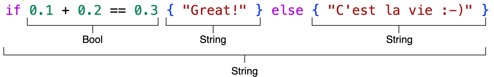

# Modern Programming Ideology

## Development Environments & Expressions

### MoonBit Open Course Team

---

# MoonBit

- A modern, statically-typed, **multi-paradigm** programming language
with newbie-friendly lightweight syntax.
- Website: [moonbitlang.com](https://www.moonbitlang.com/)

---

# Development Environments

---

# MoonBit Development Environments

- **Tools**
    - **VS Code extensions**: language server, package-level build tool...
    - **Command-line tools**: project-level build, project testing, dependencies management...
- **Environments**
    - **Browser-based** (without command-line tools)
    - **Cloud-native**:
        - [Coding](https://coding.net/)
        - [Gitpod](https://www.gitpod.io/)
        - [GitHub.dev](https://github.dev/)
        - ...
    - **Local**

---

# Browser-Based Environment

- Visit [try.moonbitlang.com](https://try.moonbitlang.com), or click the "Try" tab on our [Website](https://moonbitlang.com).
- The environment offers the following features:
    - File creation and execution
    - Code sharing
- Sample programs are provided for beginners to learn MoonBit.

---

# Cloud-Native Environment (Coding)

- On-demand development environments based on remote servers
- Provided by cloud-native development environment providers, e.g., Coding.
- Create or clone a repo, launch the environment, and then install the "MoonBit Language" extension.
- (Advanced) Install the [command-line tools](https://www.moonbitlang.com/download/) or clone the [cloud-native development template](https://github.com/peter-jerry-ye/moonbit-template), and refer to the [_MoonBit's Build System Tutorial_](https://www.moonbitlang.com/docs/build-system-tutorial/) for further guidance.

---

# Local Environment

- Install [VS Code](https://code.visualstudio.com/) or [VS Codium](https://vscodium.com/), and then install the "MoonBit Language" extension.
- (Advanced) Install the [command-line tools](https://www.moonbitlang.com/download/) (cross-platform) and refer to the [_MoonBit's Build System Tutorial_](https://www.moonbitlang.com/docs/build-system-tutorial/) for further guidance.

---

# MoonBit Expressions

---

# A Typical MoonBit Program

```moonbit
// top-level function definition
fn num_water_bottles(num_bottles: Int, num_exchange: Int) -> Int {
  // local function definition
  fn consume(num_bottles, num_drunk) {
    // conditional expression
    if num_bottles >= num_exchange {
      // variable binding
      let num_bottles = num_bottles - num_exchange + 1
      let num_drunk = num_drunk + num_exchange
      // function application
      consume(num_bottles, num_drunk)
    } else {
      num_bottles + num_drunk
    }
  }
  consume(num_bottles, 0)
}

// test block
test {
  // statements
  @assertion.assert_eq(num_water_bottles(9, 3), 13)?
  @assertion.assert_eq(num_water_bottles(15, 4), 19)?
}
```

---

# Expression-Oriented Programming

- To write correct programs, we need to understand how programs are computed. Thus, we need to establish a **computational model** to comprehend the process.
- MoonBit programs employ an **expression-oriented** approach.
  - Expression-oriented programming: _What is what?_
    - MoonBit programs consist of **expressions** that represent a value.
  - Imperative programming: _What to do?_
    - Programs are composed of **statements** that may modify the states.
      - Create a variable named `x`
      - Assign `5` to `x`
      - Let `y` point to `x`

---

# Types, Values, and Expressions

| Type | Value | Operation | Expression |
|-----|------|----------|-----------|
|`Int`|`-1` `0` `1` `2`|`+` `-` `*` `/`|`5` `(3 + y * x)`|
|`Double`|`0.12` `3.1415`|`+` `-` `*` `/`|`3.0 * (4.0 * a)`|
|`String`|`"hello"` `"Moonbit"`|`+`|`"Hello, " + "MoonBit"`|
|`Bool`|`true` `false`|`&&` `\|\|` `not()`|`not(b1) \|\| b2`|

- A **type** corresponds to a set of **values**.
- An **expression** consists of value-based **operations** and can be reduced to a value.
- Expressions can be nested using parentheses.

---

# Static and Dynamic Type Systems

- Static Type System: Type checking is done **before** the program runs.
- Dynamic Type System: Type checking is done **while** the program runs.

MoonBit has a static type system: the compiler performs type checking before runtime.

---

# Static Types

- Each **identifier** is associated with a unique type.
- The colon `:` is used to associate an identifier with its type.
    - `x: Int`
    - `a: Double`
    - `s: String`
- Each MoonBit **expression** has a unique type determined by its sub-expressions.
  

---

# Static Type Checking

- The compiler uses **type inference** before runtime to ensure correct type usage.
- Our development tools can detect type errors and show real-time suggestions during development.
  
  The error in the image is caused by directly adding a string and a number.

---

# MoonBit Basic Data Types

- Boolean values
- Integers
- Floating-point numbers
- Characters and strings
- Tuples
- ...

---

# Boolean Values

- In MoonBit, the type for Boolean values is `Bool`.
- Boolean values can only have two possible values: `true` and `false`.
- Operations:
  - NOT: true becomes false, false becomes true <span style="float:right;">`not(true) == false`</span>
  - AND: both must be true to be true <span style="float:right;">`true && false == false`</span>
  - OR: both must be false to be false <span style="float:right;">`true || false == true`</span>
- Quiz: How to define XOR (true if only one is true) using OR, AND, and NOT?

---

# Integers

- In MoonBit, there are two integer types, each with a different range:
  - Integer `Int`: ranging from $-2^{31}$ to $2^{31}-1$
  - Long integer `Int64`: ranging from $-2^{63}$ to $2^{63}-1$
- When dividing two integers, the result is still an integer, representing the quotient:
  - Dividend ÷ Divisor = **Quotient** ... Remainder
- Performing operations on integers that exceed the range will result in an **overflow**:
  - 2147483647 + 1 results in -2147483648
- Integers can only perform arithmetic operations with integers, and long integers can only perform arithmetic operations with long integers.
  - Long integers need to be marked with `L`: `2147483648L`, `-2147483649L`
  - Conversion between `Int` and `Int64`: `(100).to_int64()`, `100L.to_int()`
- Quiz: How to get the average of two positive `Int` values? Be cautious of overflow!

---

# Floating-Point Numbers

- Computers can only represent finite decimals of floating-point numbers and approximate their values. Thus, [`0.1 + 0.2 != 0.3`](https://try.moonbitlang.com/#02ce0b43).
  - Internally, they are represented as $b \times 2^e$ where the significand $b$ and the exponent $e$ are both integers.
- In MoonBit, the floating-point type is double-precision: `Double`
  - It cannot be mixed with `Int` in calculations: `1 + 2.0` will result in an error.
  - Conversion from `Int` to `Double`: `(1).to_double() == 1.0`
  - Conversion from `Double` to `Int`: `(-1.2).to_int() == -1`
- Quiz: How to compare `0.1 + 0.2` with `0.3` using `Int` and `Double` conversions?

---

# Characters and Strings

- In MoonBit, the character type is `Char`, and the string type is `String`.
    - Characters are represented with single quotes: `'a'`
    - Strings are represented with double quotes: `"Hello!"`
- Characters have different encoding schemes.
    - ASCII (American Standard Code for Information Interchange): Ranges from 0 to 127, supporting Latin alphabet, Arabic numerals, and common symbols.
        - For example, 'A' to 'Z' corresponds to 65 to 90.
    - Unicode: Supports characters from various languages, including Chinese characters and emoji. It is compatible with ASCII and has different variants like UTF-8 and UTF-16.
        - For example, "月" and "兔" correspond to 26376 and 20820, respectively.
    - Converting an `Int` to a `Char`: `Char::from_int(65) == 'A'`.

---

# Tuples

- Tuples allow us to combine data of different types with a fixed length.
  - `("Bob", 3): (String, Int)`
  - `(2023, 10, 24): (Int, Int, Int)`
- We can access the data by using zero-based indexing.
  - `(2023, 10, 24).0 == 2023`
  - `(2023, 10, 24).1 == 10`

---

# Unit

- A type which has only one value.
  - `(): Unit`
- It enables the treatment of statements as expressions.
  - In MoonBit, all statements evaluate to `()`.

---

# Other Data Types

- MoonBit has a rich type system.
  - Functions
    - `op_add: (Int, Int) -> Int`
  - Unit type (representing no value)
    - `(): Unit`
  - Lists
    - `List.Cons(1, Nil): List<Int>`
  - ...
- We will see more about these types and custom data structures in future lessons.

---

# Expression Evaluation

---

# Reduction vs Execution

- MoonBit expressions can be seen as a way of representing **values**.
- Its evaluation can be seen as a series of **computations** or **reductions**.
- In contrast, imperative programming can be seen as executing a series of **actions** or **commands**, where each command modifies the state of the machine.
    - Create pointers `x` and `y` and allocate memory, set `x` to 3, set `y` to 4.
    - Set `y` to point to `x`.
    - Increment `x`.
    - ...
    


---

# Expression Reduction

- $3 \Rightarrow 3$ (the reduction result of a value is itself)
- $3 + 4 \Rightarrow 7$
- $2 * (4 + 5) \Rightarrow 18$
- $\mathtt{num\_water\_bottles}(9, 3) \Rightarrow 13$

We denote the reduction of an $\texttt{<expression>}$ to a $\texttt{<value>}$ as:
- $\texttt{<expression>} \Rightarrow \texttt{<value>}$

---

# Step-by-Step Computation

We break down the process of decomposition $\Rightarrow$ reduction into **step-by-step** computation, denoted as $\mapsto$.

For example:
$$\begin{align}
    & (2 + 3) * (5 - 2) \\
    \mapsto & 5 * (5 - 2) && \text{because $2 + 3 \mapsto 5$}\\
    \mapsto & 5 * 3 && \text{because $5 - 2 \mapsto 3$} \\
    \mapsto & 15 && \text{because $5 * 3 \mapsto 15$}
\end{align}$$

Therefore, $(2 + 3) * (5 - 2) \Rightarrow 15$.

---

# Variable Binding

`let <identifier> : <type> = <expression>`
- Variable binding assigns an **identifier** to a value represented by an expression.
- Type declaration is often optional as the compiler can infer it based on the expression's type.
  - `let x = 10`
  - `let y = "String"`
- Rebinding an identifier will **shadow** the previous value, instead of modifying it.

---

# Expression Blocks

```
{
  Variable bindings
  Variable bindings
  ……
  Expression
}
```

The type/value of an expression block is the type/value of the last expression.

```moonbit
// Top-level (global) refers to functions or identifiers defined outside all expression blocks in a file.
let top_level_identifier = 10
fn top_level_function() -> Unit {
  // Local refers to functions or identifiers defined inside an expression block.
  fn local_function() { 
    let local_identifier = 1 // Local variable binding.
    local_identifier // Value of the expression block.
  }
}
```

---

# Scope

Scope refers to the extent or range in which a definition or value binding is valid.
- Global (entire file)
- Local (from definition to the end of the enclosing expression block)



Top-level definitions have a global scope, while local definitions have a local scope. Local definitions will **shadow** previous definitions.

---

# Expression Reduction under Variable Binding

- Reduce the expression on the right-hand side of the variable binding.
- **Replace** occurrences of identifiers with their reduction results.
- Omit the variable binding part.
- Reduce the remaining expressions.

```moonbit
let value: Int = {
  let x = 1
  let tmp = x * 2
  let another_tmp = {
    let tmp = x * 3

    tmp
  }
  tmp + another_tmp + y
}

let y: Int = 10
```

---

# Expression Reduction under Variable Binding

- Reduce the expression on the right-hand side of the variable binding.
- **Replace** occurrences of identifiers with their reduction results.
- Omit the variable binding part.
- Reduce the remaining expressions.

```moonbit no-check
let value: Int = {
  let x = 1
  let tmp = 1 * 2 // Replace x
  let another_tmp = {
    let tmp = 1 * 3 // Replace x

    tmp
  }
  tmp + another_tmp + 10 // Replace y
}

let y: Int = 10
```

---

# Expression Reduction under Variable Binding

- Reduce the expression on the right-hand side of the variable binding.
- **Replace** occurrences of identifiers with their reduction results.
- Omit the variable binding part.
- Reduce the remaining expressions.

```moonbit no-check
let value: Int = {
  // Omit the variable binding of x
  let tmp = 2 // Reduce the expression on the right-hand side
  let another_tmp = {
    let tmp = 3 // Reduce the expression on the right-hand side

    tmp
  }
  tmp + another_tmp + 10
}

// Omit the variable binding of y
```

---

# Expression Reduction under Variable Binding

- Reduce the expression on the right-hand side of the variable binding.
- **Replace** occurrences of identifiers with their reduction results.
- Omit the variable binding part.
- Reduce the remaining expressions.

```moonbit no-check
let value: Int = {

  let tmp = 2
  let another_tmp = {
    let tmp = 3

    3 // Replace tmp
  }
  tmp + another_tmp + 10
}
```

---

# Expression Reduction under Variable Binding

- Reduce the expression on the right-hand side of the variable binding.
- **Replace** occurrences of identifiers with their reduction results.
- Omit the variable binding part.
- Reduce the remaining expressions.

```moonbit no-check
let value: Int = {

  let tmp = 2
  let another_tmp = 3 // Reduce the expression on the right-hand side
  tmp + another_tmp + 10
}
```

---

# Expression Reduction under Variable Binding

- Reduce the expression on the right-hand side of the variable binding.
- **Replace** occurrences of identifiers with their reduction results.
- Omit the variable binding part.
- Reduce the remaining expressions.

```moonbit no-check
let value: Int = {

  let tmp = 2
  let another_tmp = 3 // Reduce the expression on the right-hand side
  2 + 3 + 10 // Replace tmp and another_tmp
}
```

---

# Expression Reduction under Variable Binding

- Reduce the expression on the right-hand side of the variable binding.
- **Replace** occurrences of identifiers with their reduction results.
- Omit the variable binding part.
- Reduce the remaining expressions.

```moonbit no-check
let value: Int = 15
```

---

# Conditional Expression

```
if condition
  expression block｜if condition is true
else
  expression block｜if condition is false
```

In MoonBit, conditional expressions are also **expressions** and can be used within other expressions.

- `( if 1 < 100 { 1 } else { 0 } ) * 10`
- `( if x > y { "x" } else { "y" } ) + " is bigger"`
- `if 0.1 + 0.2 == 0.3 { "Great!" } else { "C'est la vie :-)" }`

---

# Conditional Expression Types

`if condition expression block else expression block`

The expression blocks in the branches must have the same type, and the type of the entire conditional expression is determined by on the type of the expression blocks in the branches. The type of the condition must be a Boolean.



---

# Conditional Expression Reduction

The value of a conditional expression depends on the reduction result of the condition being true or false.

For example:
$$\begin{align}
    & \texttt{if 1 < 100 \{ 1 \} else \{ 0 \} * 10} \\
    \mapsto & \texttt{if true \{ 1 \} else \{ 0 \} * 10} \\
    \mapsto & \texttt{1 * 10} \\
    \mapsto & \texttt{10}
\end{align}$$

If the true branch ends with a statement, the false branch can be omitted.
- Implicitly, there is a hidden false branch returning `()`.
- Therefore, the two branches still have the same type, i.e., `Unit`.

---

# Summary

In this module, we learned:

- How to set up the MoonBit development environment
  - Browser-based environment
  - Cloud-native environment
  - Local environment
- MoonBit basic data types
  - Boolean values
  - Integers and floating-point numbers
  - Characters and strings
  - Tuples
- How to view MoonBit programs in terms of expressions and values, and understand the execution of MoonBit programs by reduction.