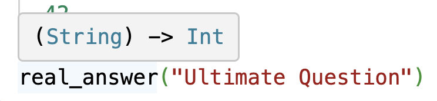

# 现代编程思想

## 函数, 列表与递归

### 月兔公开课课程组

<!--
```moonbit
let pi = 3.1415

fn put(map: @map.Map[Int, Int64], num: Int, result: Int64) -> @map.Map[Int, Int64] {
  map.insert(num, result)
}

fn get(map: @map.Map[Int, Int64], num: Int) -> Option[Int64] {
  map.lookup(num)
}

fn make() -> @map.Map[Int, Int64] {
  @map.empty()
}

```
-->

---

# 基本数据类型：函数

---

# 函数

- 在数学上，描述对应关系的一种特殊集合
  - 对于特定的输入，总是有特定的输出
- 在计算机中，对相同运算的抽象，避免大量重复定义
  - 计算半径为1的圆的面积：`3.1415 * 1 * 1`
  - 计算半径为2的圆的面积：`3.1415 * 2 * 2`
  - 计算半径为3的圆的面积：`3.1415 * 3 * 3`
  - ……
  - `fn 面积(半径: Double) -> Double { 3.1415 * 半径 * 半径 }`

---

# 函数

- 计算半径为1、2、3的圆的面积：
```moonbit expr
let surface_r_1: Double = { let r = 1.0; pi * r * r }
let surface_r_2: Double = { let r = 2.0; pi * r * r }
let surface_r_3: Double = { let r = 3.0; pi * r * r }
let result = (surface_r_1, surface_r_2, surface_r_3)
```

- 使用函数后

```moonbit expr
fn area(radius: Double) -> Double { pi * radius * radius }
let result = (area(1.0), area(2.0), area(3.0))
```

---

# 顶层函数的定义

```
fn <函数名> (<参数名>: <类型>, <参数名>: <类型>, ...) -> <类型> <表达式块>
```

定义的函数接口让其他使用者无需关注内部实现

```moonbit expr
fn one () -> Int {
  1
}

fn add_char(ch: Char, str: String) -> String { 
  ch.to_string() + str 
}
```

---

# 函数的应用与计算

- 当函数定义后，可以通过`<函数名>(<表达式>, <表达式>……)`的方式**应用**函数
  - `one()`
  - `add_char('m', "oonbit")`
  - 应用函数时，表达式与函数定义时的参数数量应当相同，且类型一一对应
    这是错误的：`add_char("oonbit", 'm')`
- 计算应用函数的表达式时
  - **从左到右**计算定义了参数的表达式的值
  - 替换函数内部参数
  - 简化表达式

---

# 函数的应用与计算

```moonbit expr
fn add_char(ch: Char, str: String) -> String { 
  ch.to_string() + str 
}

let moonbit: String = add_char(Char::from_int(109), "oonbit")
```

&nbsp;     `add_char(Char::from_int(109), "oonbit")`
$\mapsto$ `add_char('m', "oonbit")`            因为`Char::from_int(109)` $\mapsto$ `'m'`
$\mapsto$ `'m'.to_string() + "oonbit"`     替换表达式块中的标识符
$\mapsto$ `"m" + "oonbit"`                                 因为`m.to_string()` $\mapsto$ `"m"`
$\mapsto$ `"moonbit"`                                             因为`"m" + "oonbit"` $\mapsto$ `"moonbit"`

---

# 部分函数

函数定义域有的时候是输入类型的子集，因此可能会有对于输入未定义输出的情况

```moonbit expr
let ch: Char = Char::from_int(-1) // 不合理输入：-1在统一码中不对应任何字符
let nan: Int = 1 / 0 // 不被允许的操作：运行时出错并终止
```

对于这种函数，我们称为**部分函数**（Partial Function）；相对的，函数对类型的每个值定义了输出的，我们称为**完全函数**（Total Function）

为了避免程序运行时因不被允许的操作中止，也为了区分对应合理与不合理输入的输出，我们使用`Option[T]`这一数据结构

---

# Option的定义

`Option[T]`分为两种情况：
- 无值：`None`
- 有值：`Some(value: T)`

例如，我们可以用`Option`定义一个整数除法的完全函数
```moonbit expr
fn div(a: Int, b: Int) -> Option[Int] {
  if b == 0 { None } else { Some(a / b) }
}
```
`[T]`代表`Option`是一个泛型类型，包含的数值类型为类型参数`T`，如
  - `Option[Int]`：可能有的值类型为整数

我们将在稍后看到如何获得`Some`中的值

---

# 局部函数的定义

局部函数定义大多数时候可以省略参数类型和返回类型，亦可以省略名称（匿名函数）

```moonbit expr
let answer: () -> Int = fn () {
  fn real_answer(i) {
    42
  }
  real_answer("Ultimate Question")
}

let x: Int = answer() // 42
```



函数在月兔中是“一等公民”：可以将函数作为参数、返回值，亦可以绑定或存储函数
我们将在后续课程中深入学习

---

# 函数的类型

`(<参数类型>, <参数类型>, <参数类型>, ...) -> <返回值类型>`

- `() -> Int`
- `(Int, String, Char) -> Int`
- `((Int, Int, Int)) -> (Int, Int, Int)` 接受一个元组并返回一个元组

---

# 数据类型：列表

---

# 列表：一个数据的序列

- 我们有时会收到一些数据，具备以下特征：
    - 数据是有序的
    - 数据是可以重复的
    - 数据的数量是不定的
- 举例来说
    - 一句话中的文字：[ `'一'` `'句'` `'话'` `'中'` `'的'` `'文'` `'字'` ]
    - DNA序列：[`G` `A` `T` `T` `A` `C` `A`]
    - ……

--- 

# 列表的接口

我们定义一个单向不可变列表

以整数的列表为例（暂名之`IntList`），它应当定义如下操作：
- 构造
  - `nil : () -> IntList`&nbsp;                                   返回一个空列表
  - `cons : (Int, IntList) -> IntList`&nbsp;　向列表添加一项
- 解构
  - `head_opt : IntList -> Option[Int]`&nbsp;&nbsp;&nbsp;获得第一项
  - `tail : IntList -> IntList`&nbsp;&nbsp;&nbsp;　　　　获得除第一项以外的项

---

# 列表的接口

测试案例

```moonbit no-check
let empty_list: IntList = nil()
@assertion.assert_eq(head_opt(empty_list), None)?
@assertion.assert_eq(tail(empty_list), empty_list)?

let list1: IntList = cons(1, empty_list)
@assertion.assert_eq(head_opt(list1), Some(1))?
@assertion.assert_eq(tail(list1), empty_list)?

let list2: IntList = cons(2, list1)
@assertion.assert_eq(head_opt(list2), Some(2))?
@assertion.assert_eq(tail(list2), list1)?
```

---

# 月兔中的列表

- 在月兔标准库中，列表的定义为
```moonbit
enum List[T] {
  Nil // 一个空列表
  // 或
  Cons(T, List[T]) // 一个类型为T的值以及元素类型为T的子列表
}
```
- 列表的定义是归纳的（数学归纳法的归纳）
  - 定义了最简单的情况：`Nil`
  - 定义归纳的情况：`Cons`


---

# 列表样例

- 以下是列表
    - `let int_list: List[Int] = Cons(1, Cons(2, Cons(3, Nil)))`
    - `let char_list: List[Char] = Cons('一', Cons('句', Cons('话', Nil)))`
- 以下不是列表
    - `Cons(1, Cons(true, Cons(3, Nil)))`
      因为混杂不同类型的数据
    - `Cons(1, 2)`
      因为`2`不是列表
    - `Cons(1, Cons(Nil, Nil))`
      因为混杂不同类型的数据

---

# 列表类型

列表亦是泛型类型：`List[<类型>]`

- 整型的列表类型为`List[Int]`
- 字符串的列表类型为`List[String]`
- 浮点数的列表类型为`List[Double]`

---

# 模式匹配

我们可以通过模式匹配来分情况查看列表的内部结构

```
match <表达式> {
  <模式1> => <表达式>
  <模式2> => <表达式>
}
```

模式可以用数据的构造方式定义。模式中定义了标识符，其作用域为对应表达式

```moonbit
fn head_opt(list: List[Int]) -> Option[Int] {
  match list {
    Nil              => Option::None
    Cons(head, tail) => Option::Some(head)
  }
}
```

---

# 模式匹配结果的化简

- 简化待匹配的表达式
- 从上到下依次匹配模式
- 匹配成功后，根据模式定义替换表达式中的标识符
- 简化表达式

```moonbit expr
fn head_opt(list: List[Int]) -> Option[Int] {
  match list {
    Nil              => Option::None
    Cons(head, tail) => Option::Some(head)
  }
}

let first_elem: Option[Int] = head_opt(Cons(1, Cons(2, Nil)))
```

--- 
# 模式匹配结果的化简

```moonbit expr
head_opt(Cons(1, Cons(2, Nil)))
```
$\mapsto$ （替换函数内的标识符）
```moonbit expr
match List::Cons(1, Cons(2, Nil)) { 
  Nil              => Option::None
  Cons(head, tail) => Option::Some(head)
}
```
$\mapsto$ `Some(1)`（匹配并根据模式定义替换表达式中的标识符）

上面一步可以理解为：
```moonbit expr
{
  let head = 1
  let tail = List::Cons(2, Nil)
  Option::Some(head)
}
```

---

# 模式匹配Option

同样地，我们也可以用模式匹配查看`Option`的结构来获得值

```moonbit
fn get_or_else(option_int: Option[Int64], default: Int64) -> Int64 {
  match option_int {
    None        => default
    Some(value) => value
  }
}
```

模式匹配中，亦可以省略部分情况（如确认存在值），来构造部分函数
```moonbit expr
fn get(option_int: Option[Int64]) -> Int64 {
  match option_int { // 编辑器会警告我们有模式尚未被匹配
    Some(value) => value
    // 若option_int为None则会程序出错中止
  }
}
```

---

# 算法：递归

---

# 递归的例子

- **G**NU is **N**ot **U**nix
- **W**ine **I**s **N**ot an **E**mulator
- 斐波那契数列的计算（第一项为1，第二项为1，之后第n项为前两项之和）
- 山里有个庙，庙里有个老和尚和小和尚，一天，老和尚给小和尚讲故事：
  - “山里有个庙，庙里有个老和尚和小和尚，一天，老和尚给小和尚讲故事：
    - ‘山里有个庙，庙里有个老和尚和小和尚，一天，老和尚给小和尚讲故事…’”

---

# 递归

- 递归是将问题分解为与原问题相似的、**规模更小**的问题来求解
  - 递归应当有**边界条件**
  - 在函数的定义中，直接或间接地使用函数自身

```moonbit
fn fib(n: Int) -> Int {
  if n == 1 || n == 2 { 1 } else { fib (n-1) + fib (n-2) }
}
```

```moonbit
fn even(n: Int) -> Bool {
  n != 1 && (n == 0 || odd(n - 1))
}
fn odd(n: Int) -> Bool {
  n != 0 && (n == 1 || even(n - 1))
}
```

---

# 在列表上的递归

列表是递归定义的，因此适合用递归函数与模式匹配一起定义列表的操作函数

> 一个列表可以为
> - `List::Nil`：一个空列表
> 或
> - `List::Cons(head, tail)`：一个值`head`以及一个**列表`tail`**

```moonbit 
fn length(list: List[Int]) -> Int {
  match list {
    Nil => 0
    Cons(_, tl) => 1 + length(tl)
  }
}
```

---

# 递归的计算

```moonbit expr
let n = length(Cons(1, Cons(2, Nil)))

fn length(list: List[Int]) -> Int {
  match list {
    Nil => 0
    Cons(_, tl) => 1 + length(tl)
  }
}
```

---

# 递归的计算
```moonbit expr
length(List::Cons(1, Cons(2, Nil)))
```
$\mapsto$ 替换为函数定义
```moonbit expr
match List::Cons(1, Cons(2, Nil)) {
  Nil => 0
  Cons(_, tl) => 1 + length(tl) // tl = Cons(2, Nil)
}
```
$\mapsto$ 模式匹配并替换标识符
```moonbit expr
1 + length(List::Cons(2, Nil))
```
$\mapsto$ 再次调用函数
```moonbit no-check
1 + match List::Cons(2, Nil) { ... }
```

---

# 递归的计算
```moonbit expr
1 + match List::Cons(2, Nil) {
  Nil => 0
  Cons(_, tl) => 1 + length(tl) // tl = Nil
}
```
$\mapsto$ 模式匹配并替换标识符
```moonbit expr
1 + 1 + length(Nil)
```
...
$\mapsto$ `1 + 1 + 0` $\mapsto$ `2`

---

# 结构化递归

对基于递归定义的数据结构
- 定义对基础数据结构的计算
- 定义对递归数据结构的计算

```moonbit expr
fn length(list: List[Int]) -> Int {
  match list {
    Nil => 0                      // 终结情形
    Cons(_, tl) => 1 + length(tl) // 递归情形
  }
}
```

每一次递归，我们都对原数据的子结构进行递归，且我们定义了终结情形，因此我们可以保证程序终结

通常我们可以用数学归纳法证明结构化递归定义的函数是正确的

---

# 数学归纳法：以子列表长度为例

- 命题：对于任意列表`a`，令列表`a`长度为$l_1$，子列表`tail(a)`长度为$l_2$，则总有$l_1 \geq l_2$

```moonbit 
fn tail(list: List[Int]) -> List[Int] {
  match list {
    Nil => Nil
    Cons(_, tail) => tail
  }
}
```
- 证明：对`a`分类讨论
  - 若`a`为空（`Nil`），则子列表`tail(a) == a`，两者长度均为0，命题成立
  - 若`a`为非空（`Cons(head, tail)`），则子列表`tail(Cons(head, tail)) == tail`，可知$l_1 = l_2 + 1 > l_2$，命题成立
  - 由数学归纳法，原命题成立

---

# 算法：动态规划

---

# 斐波那契数列的计算方式

1， 1， 2， 3， 5， 8， 13， 21， ……

不同的斐波那契数列的计算方式带来的不同性能差别（`num` > 40）

```moonbit expr
// 002_fib.mbt，try.moonbitlang.cn
fn fib(num: Int) -> Int {
  if num == 1 || num == 2 { 1 } else { fib(num - 1) + fib(num - 2) }
}

fn fib2(num : Int) -> Int {
  fn aux(n, acc1, acc2) {
    match n {
      0 => acc1
      1 => acc2
      _ => aux(n - 1, acc2, acc1 + acc2)
    }
  }
  aux(num, 0, 1)
}
```

---

# 简单的斐波那契数列的计算方式

```moonbit expr
fn fib(num: Int) -> Int64 {
  if num == 1 || num == 2 { 1L } else { fib(num - 1) + fib(num - 2) }
}
```


我们观察到了大量的重复计算

---

# 动态规划

- 将问题分解为与原问题相似的、规模更小的问题来求解
- 适用于子问题
  - 有重叠子问题：动态规划对每个子问题求解一次，将其保存，避免重复运算
  - 有最优子结构：局部最优解可以决定全局最优解
- 动态规划分为自顶向下和自底向上
  - 自顶向下：针对每个子问题，如果已求解，直接使用缓存结果；否则求解并缓存
  - 自底向上：先解决子问题，再从子问题的解构建更大的子问题的解

---

# 动态规划：以斐波那契数列为例

求解斐波那契数列符合使用动态规划的条件

- 有最优子结构：`fib(n)`的值可以被用来计算`fib(n + 1)`和`fib(n + 2)`的值
- 有重叠子结构：`fib(n + 1)`与`fib(n + 2)`的求解均需要子问题`fib(n)`的值


---

# 自顶向下：以斐波那契数列为例

- 我们需要一个数据结构，平均存取速度应当与当前存储数据量大小无关
- 以求解斐波那契数列为例，我们假设的`IntMap`应有如下接口：

```moonbit no-check
fn empty() -> IntMap                                     // 创建数据结构
fn insert(map: IntMap, num: Int, value: Int64) -> IntMap // 存储数据，只执行一次
fn lookup(map: IntMap, num: Int) -> Option[Int64]        // 提取数据
```

- 符合条件的数据结构有很多，我们的样例代码以`@map.Map[Int, Int64]`为例
  - 我们无需关注它的具体实现。我们可以用`@vec.Vector[Option[Int64]]`替代

---

# 自顶向下：以斐波那契数列为例

- 我们每次计算时先查看当前数据结构中是否存有结果
  - 若有，则直接使用
  - 若无，并将结果添加至数据结构中

```moonbit expr
fn fib1(num: Int) -> Int64 {
  fn aux(num: Int, map: @map.Map[Int, Int64]) -> (Int64, @map.Map[Int, Int64]) {
    match get(map, num) {
      Some(result) => (result, map)
      None => {
        let (result_1, map_1) = aux(num - 1, map)
        let (result_2, map_2) = aux(num - 2, map_1)
        (result_1 + result_2, put(map_2, num, result_1 + result_2))
      }
    }
  }
  let map = put(put(make(), 1, 1L), 2, 1L)
  aux(num, map).0
}
```
---

# 可变变量

注意到`map: AVLMap[Int, Int64]`被不断传递。为了简化写法，月兔提供可变变量

```moonbit expr
fn fib1_mut(num: Int) -> Int64 {
  let mut map = put(put(make(), 1, 1L), 2, 1L) // 通过let mut声明可变变量
  fn aux(num: Int) -> Int64 {
    match get(map, num) {
      Some(result) => result
      None => {
        let result_1 = aux(num - 1)
        let result_2 = aux(num - 2)
        // 通过 <变量> = <值> 修改绑定的值
        map = put(map, num, result_1 + result_2) 
        result_1 + result_2
      }
    }
  }
  aux(num)
}
```

---

# 自底向上：以斐波那契数列为例

- 我们从第一项出发，逐个计算之后的值，并将当前项的计算结果存入数据结构

```moonbit expr
fn fib2(num: Int) -> Int64 {
  fn aux(n: Int, map: @map.Map[Int, Int64]) -> Int64 {
    let result = get_or_else(get(map, n - 1), 1L) + 
      get_or_else(get(map, n - 2), 1L)
    if n == num { result } 
    else { aux(n + 1, put(map, n, result)) }
  }
  let map = put(put(make(), 0, 0L), 1, 1L)
  aux(1, map)
}
```

---

# 自底向上：以斐波那契数列为例

- 注意到，我们每次只需保存当前项的前两个值，因此我们可以舍弃数据结构，直接通过递归参数传递

```moonbit expr
fn fib2(num : Int) -> Int64 {
  fn aux(n: Int, acc1: Int64, acc2: Int64) -> Int64 {
    match n {
      0 => acc1
      _ => aux(n - 1, acc2, acc1 + acc2)
    }
  }
  aux(num, 0L, 1L)
}
```


---

# 总结

- 本章节我们学习了
  - 基础数据类型：函数的定义与运算
  - 数据结构：列表的定义与模式匹配
  - 算法：递归的含义与运算，以及动态规划
- 拓展阅读
  - *Software Foundations* 前三章 或
  - *Programming Language Foundations in Agda* 前三章
  - 《算法导论》第十四章
