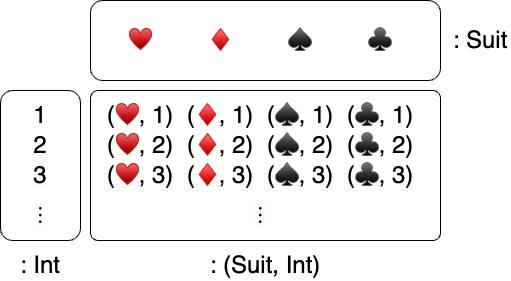
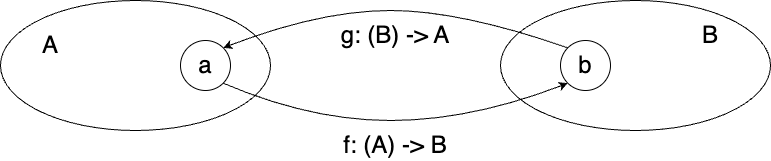
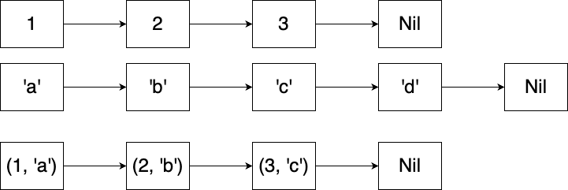

# Modern Programming Ideology

## Tuples, Structures, and Enumerated Types

### MoonBit Open Course Team

# Basic Data Types: Tuples and Structures

# Review: Tuples

- Tuples: **fixed**-length collection of **different** types
    - Definition: `(<expr>, <expr>, ...)`
    - Type: `(<expr type>, <expr type>, ...)`
    - Example:
        - Identity: `("Bob", 2023, 10, 24): (String, Int, Int, Int)`
    - Access:
        - `<tuple>.<index>`: `(2023, 10, 24).0 == 2023`

# Cartesian Product

- An element of a tuple type is an ordered element tuple of each component type
    - Cartesian product of sets, a.k.a. product types
    - Example: all suits of playing cards: { ♥️ ♦️ ♠️ ♣️ } $\times \{ n \in \mathbb{N} | 1 \leq n \leq 52 \}$



# Structures

- It is hard to understand what data a tuple represents
  - `(String, Int)`: a person's name and age? name and phone number? address and postal code?
- Structures allow us to give **names**
  - `struct PersonalInfo { name: String; age: Int }`
  - `struct ContactInfo { name: String; telephone: Int }`
  - `struct AddressInfo { address: String; postal: Int }`
  With names, we can understand the data and the meaning of each field

# Structure Definition

- The definition of a structure: 
  `struct <structure name> { <field name>: <type> ; ... }`
    - e.g. `struct PersonalInfo { name: String; age: Int}`
- The definition of the value of a structure: `{ <field name>: <value> , ... }`
    - e.g. `let info: PersonalInfo = { name: "Moonbit", age: 1, }`
    - The definition does not care about the order: 
      e.g. `{ age: 1, name: "Moonbit", }`
- When two definitions have the same field names and types, to distinguish them, add a type declaration at the end:
    - `struct A { val: Int }`
    - `struct B { val: Int }`
    - `let x = ( { val : 1, } : A )`

# Structure Access and Update

- Access to the fields of a structure: `<structure>.<field>`
  
```moonbit no-check
let old_info: PersonalInfo = { name: "Moonbit", age: 1, }
let a: Int = old_info.age // 1
```

- To update the original structure, we can reuse the original part:
  
```moonbit no-check
let new_info = { .. old_info, age: 2, }
let other_info = { .. old_info, name: "Hello", }
```

# Relationship between Tuples and Structures

- Structures are **isomorphic** to tuples of the same type
    - There is a one-to-one mapping between sets `A` and `B`
    - There is a pair of mappings `f: (A) -> B` and `g: (B) -> A` such that
        - `g(f(a)) == a`
        - `f(g(b)) == b`
- Example: `struct PersonalInfo { name: String; age: Int }` is **isomorphic** to `(String, Int)`

```moonbit no-check
fn f(info: PersonalInfo) -> (String, Int) { (info.name, info.age) }
fn g(pair: (String, Int)) -> PersonalInfo { { name: pair.0, age: pair.1, }}
```



# Relationship between Tuples and Structures

- Tuples are **structural**: as long as the structure is the same (field types correspond one by one), they are type compatible
  
```moonbit no-check
fn accept(tuple: (Int, String)) -> Bool {
  true
}
let accepted: Bool = accept((1, "Yes"))
``` 

- Structures are **nominal**: only when the type names are the same are they type compatible

```moonbit no-check
struct A { val : Int ; other: Int }
struct B { val : Int ; other: Int }
fn accept(a: A) -> Bool {
  true
}
let not_accepted: Bool = accept(({ val : 1, other : 2 }: B)) // DO NOT COMPILE
let accepted: Bool = accept(({other: 2, val: 1}: A))
```

# Pattern Matching

- We can use pattern matching to eliminate tuples and structures

```moonbit no-check
fn head_opt(list: List[Int]) -> Option[Int] {
  match list {
    Nil => None
    Cons(head, tail) => Some(head)
  }
}
```

```moonbit no-check
fn get_or_else(option_int: Option[Int], default: Int) -> Int {
  match option_int {
    None => default
    Some(value) => value
  }
}
```

# Pattern Matching

- Match **values** (booleans, numbers, characters, strings) or **constructors**

```moonbit no-check
fn is_zero(i: Int) -> Bool {
  match i {
    0 => true
    1 | 2 | 3 => false
    _ => false
  }
}
```

- Constructors can be **nested patterns** or **identifiers** to bind corresponding structures

```moonbit no-check
fn contains_zero(l: List[Int]) -> Bool {
  match l {
    Nil => false
    Cons(0, _) => true
    Cons(_, tl) => contains_zero(tl)
  }
}
```

# Pattern Matching for Tuples and Structures

- Pattern matching for tuples requires one-to-one correspondence

```moonbit no-check
fn first(pair: (Int, Int)) -> Int {
  match pair {
    (first, second) => first
  }
}
```

- Pattern matching for structures can match partial fields; you can use the original field name as the identifier

```moonbit no-check
fn baby_name(info: PersonalInfo) -> Option[String] {
  match info {
    { age: 0, .. } => None
    { name, age } => Some(name)
  }
}
```

# Zipping 

Function `zip` combines two lists into a new list of pairs like a zipper. The length of the resulting list is the minimum of the lengths of the input lists.

```moonbit no-check
fn zip(l1: List[Int], l2: List[Char]) -> List[(Int ,Char)] {
  match (l1, l2) {
    (Cons(hd, tl), Cons(hd2, tl2)) => Cons((hd, hd2), zip(tl, tl2))
    _ => Nil
  }
}
```



# Zipping 

Note that the order of pattern matching is from top to bottom

```moonbit no-check
fn zip(l1: List[Int], l2: List[Char]) -> List[(Int ,Char)] {
  match (l1, l2) {
    _ => Nil
    // This line will cause a compiler warning for unreachable code
    (Cons(hd, tl), Cons(hd2, tl2)) => Cons((hd, hd2), zip(tl, tl2))
  }
}
```

# Pattern Matching in Local Definitions

We can also use pattern matching in **local** definitions

- `let <pattern> = <expression>`

The value of the expression is bound to the identifier defined according to the pattern:

- `let (first, second) = (1, 2) // first == 1, second == 2`
- `let Cons(1, x) = List::Cons(1, Nil) // x == Nil`
- `let Cons(2, x) = List::Cons(1, Nil) // Runtime panic.` 

# Enumerated Types

# Union of Different Cases 

- How to define the set of Monday to Sunday?
- How to define the set of coin toss results?
- How to define the set of results representing integer arithmetic operations?

# Enumerated Types

To represent different cases of data structures, we use enumerated types

```moonbit no-check
enum DaysOfWeek {
  Monday; Tuesday; Wednesday; Thursday; Friday; Saturday; Sunday
}
```
  
```moonbit no-check
enum Coin {
  Head
  Tail
}
```

# Definition and Construction of Enumerated Types

```moonbit no-check
enum DaysOfWeek {
  Monday; Tuesday; Wednesday; Thursday; Friday; Saturday; Sunday
}
```

- Every variant is a contructor
```moonbit no-check
let monday: DaysOfWeek = Monday
let tuesday: DaysOfWeek = Tuesday 
```

- Variant names can be ambiguous. We use `<type>::` to disambiguate

```moonbit no-check
enum Repeat1 { A; B }
enum Repeat2 { A; B }
let x: Repeat1 = Repeat1::A  
```

# The Meaning 

- Enumerated types can distinguish themselves from existing types and abstract better

```moonbit no-check
fn tomorrow(today: Int) -> Int
fn tomorrow(today: DaysOfWeek) -> DaysOfWeek
let tuesday = 1 * 2 // Is this Tuesday?
``` 

- Preventing the representation of irrational data

```moonbit no-check
struct UserId { email: Option[String]; telephone: Option[Int] }
enum UserId {
  Email(String)
  Telephone(Int)
}
```

# Enumerated Types

- Carrying data in variants

```moonbit no-check
enum Option[T] {
    Some(T)
    None
}
```

```moonbit no-check
enum ComputeResult {
    Success(Int)
    Overflow
    DivideByZero
}
```

- Enumerated types correspond to distinguishable unions, also known as sum types
  - $\textit{Option}(T) = \textit{Some}(T) \sqcup \{ \textit{None} \}$

# Algebraic Data Types

# Algebraic Data Types

We call tuples, structures, enumerated types, etc. algebraic data types, which have algebraic structure
- Equivalence: isomorphism
- Multiplication: product type
- Addition: sum type
- Unit element of addition: `enum Nothing {}`
- Unit element of multiplication: `(): Unit`
  
# Algebraic Data Types

- $1 \times n = n$
    - For any type `T`, `(T, Unit)` is isomorphic to `T`
    ```moonbit no-check
    fn f[T](t: T) -> (T, Unit) { (t, ()) }
    fn g[T](pair: (T, Unit)) -> T { pair.0 }
    ```
- $0 + n = n$
    - For any type `T`, `enum PlusZero[T] { CaseT(T); CaseZero(Nothing) }` is isomorphic to `T`
    ```moonbit no-check
    fn f[T](t: PlusZero) -> T {
      match t {
        CaseT(t) => t
        CaseZero(_) => abort("Impossible case, no such value.")
      }
    }

    fn g[T](t: T) -> PlusZero { CaseT(t) }
    ```

# Algebraic Data Types

- `enum Coins { Head; Tail }`
  - $\texttt{Coins} = 1 + 1 = 2$
- `enum DaysOfWeek { Monday; Tuesday; ...; }`
  - $\texttt{DaysOfWeek} = 1 + 1 + 1 + 1 + 1 + 1 + 1 = 7$
- Definition of `List` (`List[Int]` as an example)：
$$
\begin{array}{r@{}l}
\texttt{enum} \ \ \texttt{List} & = \texttt{Nil} + \texttt{Int} \times \texttt{List} \\  
& = \texttt{1} + \texttt{Int} \times \texttt{List} \\
& = \texttt{1} + \texttt{Int} \times (\texttt{1} + \texttt{Int} \times \texttt{List} ) \\
& = \texttt{1} + \texttt{Int} \times \texttt{1} + \texttt{Int} \times \texttt{Int} \times \texttt{List} \\
& = \texttt{1} + \texttt{Int} + \texttt{Int} \times \texttt{Int} + \texttt{Int} * \texttt{Int} \times \texttt{Int} + ...
\end{array}
$$

# Summary

- This chapter introduces many custom data types in MoonBit, including
    - Tuples
    - Structures
    - Enumerated types
    - The concept of algebraic data types
- Recommended reading
    - *Category Theory for Programmers*: Chapter 6
