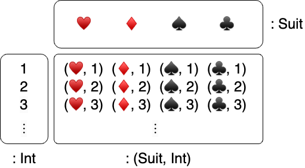
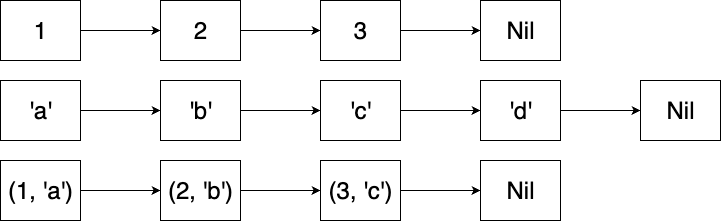

# 现代编程思想

## 多元组，结构体、枚举与错误类型

### 月兔公开课课程组

# 基础数据类型：多元组、结构体、元组结构体

# 回顾：多元组

- 多元组：**固定**长度的**不同**类型数据的集合
    - 定义：`(<表达式>, <表达式>, ...)`
    - 类型：`(<表达式类型>, <表达式类型>, ...)`
    - 例如：
        - 身份信息：`("Bob", 2023, 10, 24): (String, Int, Int, Int)`
        - 零元组：`() : Unit`
    - 成员访问：
        - `<多元组>.<索引>`：`(2023, 10, 24).0 == 2023`
- 列表：**任意**长度的**相同**类型数据的集合
    - 例如：
        - 字符的序列：`Cons('H', Cons('i', Cons('!', Nil)))`

# 笛卡尔积

- 一个多元组类型的元素即是每个组成类型的元素构成的有序元素组
    - 集合的笛卡尔积
    - 例：扑克牌的所有花色：{ ♥️ ♦️ ♠️ ♣️ } $\times \{ n \in \mathbb{N} | 1 \leq n \leq 52 \}$ 

  

# 结构体

- 元组的问题在于，难以理解其所代表的数据
    - `(String, Int)`：一个人的姓名和年龄？地址和邮编？
    - `(Double, Double, Double)`：三维空间中的坐标？向量？
- 结构体允许我们赋予**名称**
    - `struct PersonalInfo { name : String; age : Int }`
    - `struct AddressInfo { address : String; postal : Int }`
    - `struct Vector3 { x: Double; y: Double; z: Double }`
    - `struct Point3 { x: Double; y: Double; z: Double }`
    通过名称，我们能明确数据的信息以及对应字段的含义

# 结构体的定义

- 结构体的定义形如`struct <结构体名称> { <字段名> : <类型> ; ... }`
    - `struct PersonalInfo { name : String; age : Int}`
- 定义结构体的值时，形如`{ <字段名>: <值> , ... }`
    - `let info : PersonalInfo = { name : "Moonbit", age : 3 }`
    - 结构体的值的定义不在意顺序：`{ age : 3, name : "Moonbit" }`
- 如遇到字段名相同的定义无法区分时，可在后面加上类型声明以作区分
    - `struct A { val : Int }`
    - `struct B { val : Int }`
    - `let x = ( { val : 1, } : A )`

# 结构体的访问与更新

- 访问结构体时，我们通过`<结构体>.<字段名>`

  ```moonbit
  let old_info : PersonalInfo = { name : "Moonbit", age : 3, }
  let a : Int = old_info.age // 1
  ```
- 更新原有的结构体时，我们可以复用原有的部分，如

  ```moonbit
  let new_info = { .. old_info, age : 2, }
  let other_info = { .. old_info, name : "Hello", }
  ```

# 多元组与结构体的关系

- 多元组是 structural：只要结构相同（字段类型一一对应）就类型兼容

  ```moonbit
  fn accept_tuple(tuple : (Int, String)) -> Bool {
    true
  }
  let accepted : Bool = accept_tuple((1, "Yes"))
  ```

- 结构体是 nominal：只有类型名相同（字段顺序可以打乱）才类型兼容
  ```moonbit
  struct A { val : Int ; other : Int }
  struct B { val : Int ; other : Int }
  fn accept_a(a : A) -> Bool {
    true
  }
  let not_accepted : Bool = accept_a(({ val : 1, other : 2 } : B)) // DO NOT COMPILE
  let accepted : Bool = accept_a(({other : 2, val : 1} : A))
  ```

# 元组结构体

- 考虑如下情况：
  - 同样的字段，不同的类型

    ```moonbit
    struct Vector3 { x: Double; y: Double; z: Double }
    struct Point3 { x: Double; y: Double; z: Double }
    ```

  - 类型名称和字段的顺序，比字段名称更有代表性
  
    ```moonbit
    struct IntPair { first : Int; second : Int }
    struct Interval { start : Int; end : Int }
    ```

# 元组结构体

- 元组结构体：
  - 命名的元组
  - 字段不命名的结构体
- 元组结构体的定义：`struct <元组结构体名称>(<类型>, ...)`
- 值的定义：`<元组结构体名称>(<表达式>, ...)`
- 通过索引访问：`<元组结构体>.<索引>`
- 例子：
  ```moonbit
  struct IntPair(Int, Int)
  let pair : IntPair = IntPair(0, 1)
  test {
    inspect(pair.0, content="0")
  }
  ```
- 元组结构体是 nominal：类型名相同，且字段类型一一对应则类型兼容

# 模式匹配

- 回顾：我们可以通过模式匹配查看列表和Option的结构

  ```moonbit
  fn head_opt(list : List[Int]) -> Option[Int] {
    match list {
      Nil => None
      Cons(head, _tail) => Some(head)
    }
  }
  ```

  ```moonbit
  fn get_or_else(option_int : Option[Int], default : Int) -> Int {
    match option_int {
      None => default
      Some(value) => value
    }
  }
  ```

# 模式匹配

- 模式匹配可以匹配值（逻辑值、数字、字符、字符串）或者构造器
  ```moonbit
  fn is_zero(i : Int) -> Bool {
    match i {
      0 => true
      1 | 2 | 3 => false
      _ => false
    }
  }
  ```
    
- 构造器中可以嵌套模式进行匹配，或定义标识符绑定对应结构

  ```moonbit
  fn contains_zero(l : List[Int]) -> Bool {
    match l {
      Nil => false
      Cons(0, _) => true
      Cons(_, tl) => contains_zero(tl)
    }
  }
  ```

# 多元组、结构体、元组结构体的模式匹配

- 多元组模式匹配需数量一一对应
  ```moonbit
  fn first(pair : (Int, Int)) -> Int {
    match pair { 
      (first, second) => first 
    }
  }
  ```

- 元组结构体模式匹配和元组类似，需要加上类型名称
  ```moonbit 
  fn second(pair : IntPair) -> Int {
    match pair { 
      IntPair(first, second) => second 
    }
  }
  ```

# 多元组、结构体、元组结构体的模式匹配

- 结构体模式匹配可以匹配部分字段；可以不用另外命名标识符

  ```moonbit
  fn baby_name(info : PersonalInfo) -> String? {
    match info {
      { age: 0, .. } => None
      { name, age } => Some(name)
    }
  }
  ```

# 缝合列表

我们试图缝合两个列表，生成一个数字与字符的二元组的列表，以最短者为准

```moonbit
fn zip(l1 : List[Int], l2 : List[Char]) -> List[(Int, Char)] {
  match (l1, l2) {
    (Cons(hd, tl), Cons(hd2, tl2)) => Cons((hd, hd2), zip(tl, tl2))
    _ => Nil
  }
}
```



# 缝合列表

需要注意到模式匹配的顺序是从上到下的

```moonbit
fn zip(l1 : List[Int], l2 : List[Char]) -> List[(Int, Char)] {
  match (l1, l2) {
    _ => Nil
    // 编辑器会提示未使用的模式及无法抵达的代码
    (Cons(hd, tl), Cons(hd2, tl2)) => Cons((hd, hd2), zip(tl, tl2))
  }
}
```

# 枚举类型

# 不同情况的并集

- 如何定义周一到周日的集合？
- 如何定义硬币落下结果的集合？
- 如何定义表示整数四则运算的结果的集合？
- ...

# 枚举类型

为了表示不同情况的数据结构，我们使用枚举类型

```moonbit
enum DaysOfWeek {
  Monday; Tuesday; Wednesday; Thursday; Friday; Saturday; Sunday
}
```
  
```moonbit
enum Coin {
  Head
  Tail
}
```

# 枚举类型的定义与构造

```moonbit
enum DaysOfWeek {
  Monday; Tuesday; Wednesday; Thursday; Friday; Saturday; Sunday
}
```

- 每一种可能的情况即是构造器
  ```moonbit
  let monday : DaysOfWeek = Monday
  let tuesday : DaysOfWeek = Tuesday 
  ```

- 枚举类型定义可能重复，需要加上`<类型>::`加以区分

  ```moonbit
  enum Repeat1 { A; B }
  enum Repeat2 { A; B }
  let x : Repeat1 = Repeat1::A  
  ```

# 枚举类型的意义

- 对比一下两个函数，枚举类型可以与现有类型区分开，更好地实现抽象
  ```moonbit
  fn tomorrow(today : Int) -> Int
  fn tomorrow(today : DaysOfWeek) -> DaysOfWeek
  let tuesday = 1 * 2 // 这是周二吗？
  ```
- 禁止不合理数据的表示
  ```moonbit
  struct UserId { email : Option[String]; telephone : Option[Int] }
  enum UserId {
    Email(String)
    Telephone(Int)
  }
  ```

# 枚举类型

- 枚举类型的每一种情况也可以承载数据，如

  ```moonbit
  enum Option[T] {
    Some(T)
    None
  }
  ```

  ```moonbit
  enum ComputeResult {
    Success(Int)
    Overflow
    DivideByZero
  }
  ```

# is 表达式

- is 表达式用于测试某个值是否符合某个模式
  ```moonbit expr
  let opt : Option[Int] = Some(10)
  inspect(opt is None, content="false") 
  inspect(0 is 1, content="false")
  let pair = Pair(1, 2)
  inspect(pair is Pair(_, _), content="true")
  ```
- is 表达式也会对标识符进行绑定  
  ```moonbit
  fn get_or_else2(option_int : Option[Int], default : Int) -> Int {
    if option_int is Some(value) {
      value 
    } else {
      default
    }
  }
  ```

# 本地定义中的匹配

我们还可以在**本地**定义中利用模式进行匹配

- `let <模式> = <表达式>`

此时会根据模式将表达式的值的子结构绑定到定义的标识符上，如：

- `let (first, second) = (1, 2) // first == 1, second == 2`
- `let Pair(first, second) = Pair(1, 2) // first == 1, second == 2`
- `let Cons(1, x) = List::Cons(1, Nil) // x == Nil`
- `let Cons(2, x) = List::Cons(1, Nil) // 运行时错误，程序中止`
- ```moonbit 
  fn unsafe_get(option_int : Option[Int]) -> Int { 
    let Some(value) = option_int
    value
  }
  ```

# 错误类型

# 当程序出现问题

- 当程序的输入不符合预期
- 当试图访问的文件不存在
- 当传输数据时网络突然中断
- ...

# 错误类型

- 月兔中的错误有一个统一的类型 `Error`
- `Error` 类型无法直接构造，必须使用 `suberror` 定义 `Error` 的子类型
- 定义错误类型：
  - 无负载数据的错误类型：`suberror <错误类型1>`，例如 `suberror E1`
  - 有单一负载的错误类型：`suberror <错误类型2> <负载类型>`，
    例如 `suberror E2 Int`
  - 类似枚举的错误类型：`suberror <错误类型3> { <情形1>; <情形2>; ... }`
    例如 `suberror E3 { Case1; Case2(Int); }`
- 所有的错误类型都可以被自动提升为 `Error` 类型

# 构造错误类型的值

- 定义错误类型：
  - `suberror <错误类型1>`，例如 `suberror E1`
  - `suberror <错误类型2> <负载类型>`，例如 `suberror E2 Int`
  - `suberror <错误类型3> { <情形1>; <情形2>; ... }`
    例如 `suberror E3 { Case1; Case2(Int); }`
- 定义错误的值：
  - `<错误类型1>`，例如 `E1 : E1`
  - `<错误类型2>(<负载类型的值>)`，例如 `E2(10) : E2`
  - `<情形>`，例如 `Case1 : E3` 或 `Case2(10) : E3`
- 所有的错误同时也是 `Error` 类型的值：`E1 : Error`

# 函数中抛出错误

- 错误类型和错误的值可以当作普通的类型和值使用
- 关键字 `raise` 用于从函数中抛出错误：`raise <错误表达式>`。抛出错误后，函数的执行将被中断，并将错误传递给调用者。
- 函数签名中使用 `raise` 关键字来指明可能抛出的错误类型

  ```moonbit
  suberror DivError String
  fn div(x : Int, y : Int) -> Int raise DivError {
    if y == 0 {
      raise DivError("division by zero")
    } else {
      x / y
    }
  }
  ```
- 在这个例子中，`div(1, 0)` 会抛出 `DivError("division by zero")` 错误。

# 函数中抛出错误

- 不关心错误的具体类型时，可以用 `Error` 来表示：
  `let e : Error = DivError("division error")`
- `Error` 出现在函数签名中时，可以省略：
  `fn div(x : Int, y : Int) -> Int raise Error { ... }` 等价于
  `fn div(x : Int, y : Int) -> Int raise { ... }`
- 对于不抛出错误的函数，签名中可以标注 `noraise`：
  `fn add(x : Int, y : Int) -> Int noraise { x + y }`

# 处理错误

# 捕获错误的 try-catch 表达式

- 使用 try-catch 表达式可以捕获错误并进行处理
- 捕获错误的语法：
  ```
  try <可能抛出错误的表达式0> catch { 
    <模式1> => <表达式1>
    <模式2> => <表达式2> 
    ...
  } noraise { 
    <模式3> => <表达式3> 
  }
  ```
- `catch` 部分的每一个分支都可以匹配不同的错误类型，并提供一个表达式作为整个 try-catch 表达式的结果。
- `noraise` 部分用于处理没有错误发生的情况。如果 `<表达式0>` 没有抛出错误，其化简的值会匹配 `模式3`。此时 `<表达式3>` 为整个 try-catch 表达式的结果。
- 当 `noraise` 部分没有任何处理过程时，可以省略。

# 捕获错误的化简

- 化简 `<可能抛出错误的表达式>`。
- 如果发生错误，查找匹配的 `catch` 分支进行处理。
- 如果没有错误发生，进入 `noraise` 块。
- 无论进入哪个分支，最终的计算结果即是整个 try 表达式的结果

# 捕获错误的化简

```
try div(1, 0) catch { 
  DivError(s) => 0 
} noraise { v => v }
```
$\mapsto$ 计算会抛出错误的表达式
```
try (raise DivError("division by zero")) catch { 
  DivError(s) => 0 
} noraise { v => v }
``` 
$\mapsto$ 匹配错误并将结果作为整个 try-catch 表达式的结果
```
0
```

# 混合错误

try-catch 表达式中可以捕获多个错误类型

```moonbit
fn f1() -> Unit raise E1 { ... }

fn f2() -> Unit raise E2 { ... }

try {
  f1()
  f2()
} catch {
  E1 => ...
  E2 => ...
  e => ... // 捕获其它错误
}
```

当在 try-catch 表达式中捕获多个错误类型时，必须用标识符或者通配符 `_` 来捕获所有可能的错误。

# 其它错误处理方式

- 重新抛出错误：当不想要处理错误时，直接使用表达式，可以重新抛出错误：
  
  ```moonbit
  fn div_reraise(x : Int, y : Int) -> Int raise DivError {
    div(x, y) // 如果 `div` 引发错误，则重新抛出错误
  }
  ```

- 直接崩溃：使用 `try! <表达式>` 可以在发生错误时直接引发程序崩溃

  ```moonbit
  fn div_panic(x : Int, y : Int) -> Int {
    try! div(x, y) // 如果 `div` 引发错误，则程序崩溃
  }
  ```

- 转化为 Result：使用 `try? <表达式>` 把一个类型为 `R`、可能抛出 `E` 类型的表达式转化为 `Result[R, E]` 类型的值

# 其它错误处理方式

- 转化为 Result：使用 `try? <表达式>` 把一个类型为 `R`、可能抛出 `E` 错误类型的表达式转化为 `Result[R, E]` 类型的值

  ```moonbit
  enum Result[R, E] {
    Ok(R)
    Err(E)
  }

  test {
    inspect(try? div(9, 3), content="Ok(3)")
    inspect(try? div(3, 0), content="Err(DivError(\"division by zero\"))")
  }
  ```

# 总结

- 本章节介绍了月兔中的诸多自定义数据类型，包括
    - 多元组
    - 结构体
    - 枚举类型
    - 错误类型
