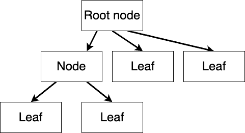
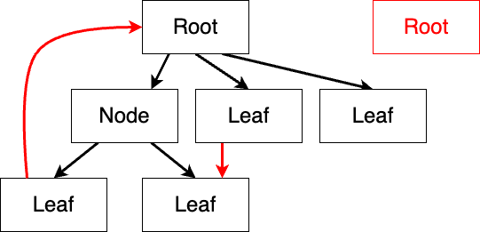
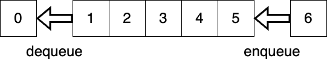
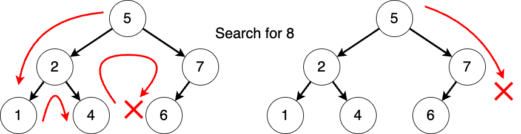
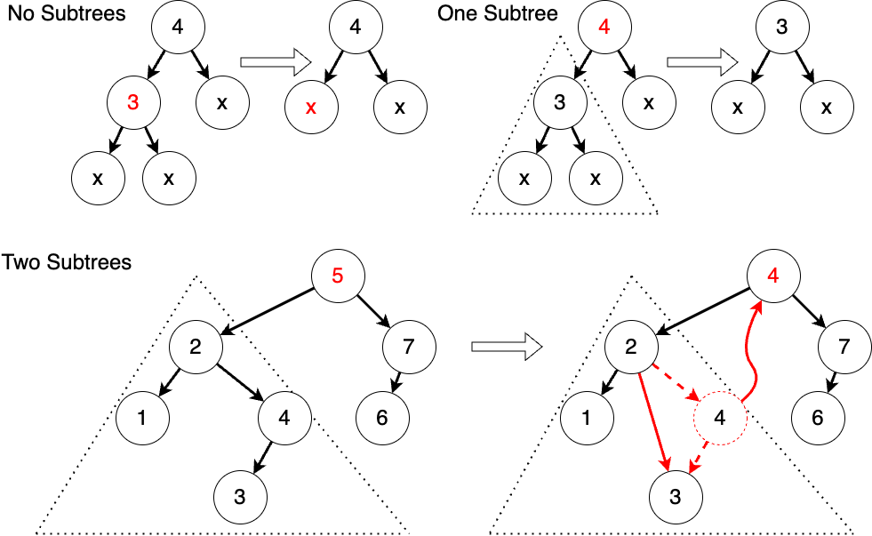
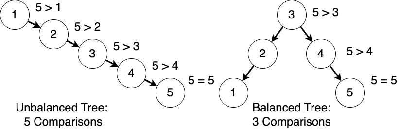

# Modern Programming Ideology: Trees

Welcome to Modern Programming Ideology brought to you by the IDEA's Digital Infrastructure Innovation. Today, we explore a common data structure: trees, and related algorithms.

In this lecture, we will start with a simple tree, understand the concept, and then learn about a specialized tree: binary tree. After that, we will explore a specialized binary tree: binary search tree. Further, we will also learn about the balanced binary tree.

Trees are very common plants in our lives, as shown in the diagram. 


A tree has a root with multiple branches, each branch having leaves or other small branches. In fact, many data structures in our everyday lives look like a tree. For example, the pedigree chart, a.k.a., a family tree, grows from a pair of ancestors. We also use the phrase "branching out" to describe this process. Another example is file structure, where a folder may contain some files and other folders, just like leaves and branches. Mathematical expressions can also be represented as a tree, where each node is an operator, and each leaf is a number, with operators closer to the root being computed later.

## Trees

In data structures, a tree is a finite collection of nodes that have a hierarchical relationship. Each node is a structure that stores data. It is common to describe this hierarch using family relationships, like parents, children, descendants and ancestors. Sometimes, we say there is a parent-child relationship between adjacent nodes, calling them parent nodes and child nodes. A node's descendants are all the nodes that stem from a node, while a node’s ancestors are all the nodes that it stems from.

If a tree is not empty, it should have exactly one root node, which has only child nodes and no parent nodes. All nodes except the root node should have exact one parent node. Nodes without child nodes, which are the outermost layer of nodes, are called leaf nodes, akin to the leaves of a tree. Additionally, no node can be its own descendant, meaning cycles cannot exist within the tree.



In a tree, an edge refers to a pair of nodes (u, v), where either u is the parent node of v or v is the parent node of u; simply put, these two nodes should have a parent-child relationship. We use arrows in diagrams to indicate parent-child relationships, with the arrow pointing from an ancestor to its descendant.

The example below is not a tree. 



Each red mark violates the requirements of a tree. In the upper right, there's another root node without a parent node, implying two root nodes in a tree, which is not allowed. At the bottom, the left leaf node has an extra arrow pointing to the root node, implying it's the parent node of the root, violating the structure requirements. And the right leaf node has two parent nodes, which also doesn't comply with the requirements.

It's common to place the root node at the top, with child nodes arranged below their parent nodes. We have some terms related to trees. Firstly, the depth of a node corresponds to the length of the path from the root node down to that node. In other words, the number of edges traversed when going from the root node downwards. Therefore, the depth of the root is 0. Then the height of a node corresponds to the length of the longest path from the node to a leaf node. Likewise, the height of a leaf node is 0. Finally, there's the height of a tree, which is equivalent to the height of the root node. If a tree has only one node, it is both the root node and a leaf node, with a height of 0. If a tree is empty, meaning it has no nodes, we define its height as -1. However, some books may define it differently, considering the layers of the tree, with the root being the first layer, and so on.

Having discussed the logical structure of a tree, let's now consider its storage structure. While the logical structure defines the relationships between data, the storage structure defines the specific representation of data. We'll use a binary tree as an example, where each node has at most two children. Here, we'll represent the tree using a list of tuples. Each tuple defines a parent-child relationship, such as `(0, 1)`, indicating that node 0 is the parent of node 1. 

Another way is to use algebraic data structures we have talked about previously:

```moonbit no-check
Node(0, 
  Node(1, 
    Leaf(3), 
    Empty), 
  Leaf(2))
```

We define several cases using an enumeration type: `Node` represents a regular tree node with its own number and two subtrees, `Leaf` represents a tree with only one node, i.e., a leaf node, having only its own number, and `Empty` represents an empty tree. With this representation, we can define a tree structure similar to before. Of course, this is just one possible implementation. 

The final approach is a list where each level's structure is arranged consecutively from left to right:


For example, the root node is placed at the beginning of the list, followed by nodes of the second level from left to right, then nodes of the third level from left to right, and so on. Thus, node 3 and the node to its right are children of node 1, while the two nodes after are children of 2. These three nodes are all empty in the example. 

We can see that all three methods define the same tree, but their storage structures are quite different. Hence, we can conclude that the logical structure of data is independent of its storage structure.

Finally, the tree data structure has many derivatives. For example, a segment tree stores intervals and corresponding data, making it suitable for one-dimensional queries. Binary trees are a special type where each node has at most two branches, namely the left subtree and the right subtree. B-trees are suitable for sequential access, facilitating the storage of data on disks. KD-trees and R-trees, which are derivatives of binary trees and B-trees respectively, are suitable for storing spatial data structures. Apart from these, there are many other tree structures.

## Binary Trees

A binary tree is either empty or consist of nodes that have at most two subtrees: a left subtree and a right subtree. For example, both subtrees of a leaf node are empty. Here, we adopt a definition based on recursive enumeration types, with default data storage being integers.

```moonbit
enum IntTree {
  Node(Int, IntTree, IntTree) // data, left subtree, right subtree
  Empty
}
```

The first algorithm we will discuss is binary tree traversal (or search). Tree traversal refers to the process of visiting all nodes of a tree in a certain order without repetition. Typically, there are two methods of traversal: depth-first and breadth-first. Depth-first traversal always visits one subtree before the other. During the traversal of a subtree, it recursively visits one of its subtrees. Thus, it always reaches the deepest nodes first before returning. For example, 

 

in the diagram, we first visit the left subtree, then the left subtree again, leading to the visit of 3. Subsequently, we continuously visit the right subtree, resulting in the visit of 5. Finally, we visit the right subtree of the entire tree, which is 2. On the other hand, breadth-first traversal starts from the root node and proceeds layer by layer, visiting nodes at a certain depth before moving deeper. For the same tree, breadth-first traversal will visit the root node first, followed by subtrees 1 and 2, then 3 and 4, and finally the deepest node 5.

Depth-first traversal usually involves three variations: preorder traversal, inorder traversal, and postorder traversal. The difference lies in when the root node is visited while traversing the entire tree. For example, in preorder traversal, the root node is visited first, followed by the left subtree, and then the right subtree. Taking the tree we just saw as an example, this means we start with 0, then visit the left subtree; when visiting the left subtree, we start from the root node again, which is 1; then 3, 4, 5, and 2. In inorder traversal, the left subtree is visited first, followed by the root node, and then the right subtree. Hence, it first visits the left subtree. At this moment, there is still a left subtree, so we go down to tree 3. Now, it's a leaf node without a left subtree, so we visit the root node 3. Then we return to visit the root node 1 of the subtree and proceed to visit the right subtree. Postorder traversal follows a similar logic, visiting the left subtree first, then the right subtree, and finally the root node. In fact, solving the Fibonacci sequence can be seen as a postorder traversal, as we first visit the (n-1)th and (n-2)th items, which are two subtrees, and then solve the nth item, which is the value of the root node. As for breadth-first traversal, we have already explained it: from left to right, the order is `[0, 1, 2, 3, 4, 5]`.

Let's take a look at the specific implementation of these two traversals in terms of finding a specific value in the tree's nodes. Firstly, let's consider depth-first traversal. 

```moonbit
fn dfs_search(target: Int, tree: IntTree) -> Bool {
  match tree { // check the visited tree 
    Empty => false // empty tree implies we are getting deepest
    Node(value, left, right) => // otherwise, search in subtrees
      value == target || dfs_search(target, left) || dfs_search(target, right)
  }
}
```

As we introduced earlier, this is a traversal based on structural recursion. We first handle the base case, i.e., when the tree is empty, as shown in the third line. In this case, we haven't found the value we're looking for, so we return `false`. Then, we handle the recursive case. For a node, we check if its value is the desired result, as shown in line 5. If we find it, the result is `true`. Otherwise, we continue to traverse the left and right subtrees alternately, if either we find it in left subtree or right subtree will the result be `true`. In the current binary tree, we need to traverse both the left and right subtrees to find the given value. The binary search tree introduced later will optimize this process. The only differences between preorder, inorder, and postorder searches is the order of operations on the current node, the left subtree search, and the right subtree search.

### Short-circuit Evaluation of Booleans

Here, we supplement the content not mentioned in the second lesson, the short-circuit evaluation of booleans. The logical `OR` and `AND` operations are short-circuited. This means that if the result of the current evaluation can be determined, the calculation will be terminated, and the result will be returned directly. For example, in the first case, we are evaluating `true ||` some value. It's clear that `true || any value` will always be true, so only the left side of the operation needs to be evaluated, and the right side won't be evaluated. Therefore, even if we write an instruction such as `abort` here to halt the program, the program will still run normally because the right side hasn't been computed at all. Similarly, if we evaluate `false &&` some value, knowing that `false && any value` will always be false, we won't evaluate the right side either. This brings us back to the traversal of the tree we discussed earlier. When using logical OR, traversal will immediately terminate once any condition is met.

### Queue

Now let's continue with breadth-first traversal. 


As mentioned earlier, breadth-first traversal involves visiting each subtree layer by layer. In this case, to be able to record all the trees we are going to visit, we need a brand-new data structure: the queue.



A queue is a first-in-first-out (FIFO) data structure. Each time, we dequeue a tree from the queue and check whether its node value is the one we're searching for. If not, we enqueue its non-empty subtrees from left to right and continue the computation until the queue is empty.

Let's take a closer look. Just like lining up in real life, the person who enters the line first gets served first, so it's important to maintain the order of arrival. The insertion and deletion of data follow the same order, as shown in the diagram. We've added numbers from 0 to 5 in order. After adding 6, it follows 5; and if we delete from the queue, we start from the earliest added 0.

The queue we're using here is defined by the following interface: 

```moonbit no-check
fn empty[T]() -> Queue[T] // construct an empty queue
fn enqueue[T](q: Queue[T], x: T) -> Queue[T] // add element to the tail
// attempt to dequeue an element, return None if the queue is empty
fn pop[T](q: Queue[T]) -> (Option[T], Queue[T]) 
```

<!-- Implementation of Queue

```moonbit
struct Queue[T] {
  front:List[T]
  back:List[T]
}

/// `Queue::default[T]()`
///
/// Create an empty queue 创建空队列
fn Queue::default[T]() -> Queue[T] {
  { front: Nil, back: Nil }
}

fn empty[T]() -> Queue[T] {
  Queue::default()
}

/// `from_list[T](front: List[T])`
///
/// Create queue from a list 从列表创建队列
fn Queue::from_list[T](front: List[T]) -> Queue[T] {
  { front:front, back:Nil }
}

/// `is_empty[T](q: Queue[T])`
///
/// Check if a queue is empty 检查列表是否为空
fn Queue::is_empty[T](q: Queue[T]) -> Bool {
  match q {
    {front:Nil, back:Nil} => true
    _ => false
  }
}

/// `list_rev[T](xs: List[T])`
///
/// Reverse a list with tail recursion 基于尾递归的列表反转
fn list_rev[T](xs: List[T]) -> List[T] {
  fn go(acc, xs: List[T]) {
    match xs {
      Nil => acc
      Cons(x, rest) => go((Cons(x, acc) : List[T]), rest)
    }
  }

  go(Nil, xs)
}

/// `norm[T](q: Queue[T])`
///
/// Feed `back` into `front` so that `front` always have something 反转队列结构；确保列表头始终有元素
fn norm[T](q: Queue[T]) -> Queue[T] {
  match q {
    {front:Nil, back:b} => { front:list_rev(b), back:Nil }
    q => q
  }
}

/// `enqueue[T](q: Queue[T], x: T)`
///
/// Add an element to the end of the queue 向队尾添加一个元素
fn enqueue[T](q: Queue[T], x: T) -> Queue[T] {
  match q {
    {front:f, back:b} => norm({ front:f, back:Cons(x, b) })
  }
}

/// `pop[T](q: Queue[T])`
///
/// Remove the first element from the queue 取出队列中第一个元素
fn pop[T](q: Queue[T]) -> (Option[T], Queue[T]) {
  match q {
    {front:Nil, back:_} => (None, q)
    {front:Cons(x, f), back:b} => (Some(x), norm({front:f, back:b}))
  }
}
```
-->

`empty`: construct an empty queue; `enqueue`: add an element to the queue, i.e., add it to the tail; `pop`: attempt to dequeue an element and return the remaining queue. If the queue is already empty, the returned value will be `None` along with an empty queue. For example, 

```moonbit no-check
let q = enqueue(enqueue(empty(), 1), 2)
let (head, tail) = pop(q)
assert(head == Some(1))
assert(tail == enqueue(empty(), 2))
```

we've added 1 and 2 to an empty queue. Then, when we try to dequeue an element, we should get `Some(1)`, and what's left should be equivalent to adding 2 to an empty queue.

Let's return to the implementation of our breadth-first traversal. 

```moonbit
fn bfs_search(target: Int, queue: Queue[IntTree]) -> Bool {
  match pop(queue) {
    (None, _) => false // If the queue is empty, end the search
    (Some(head), tail) => match head { // If the queue is not empty, operate on the extracted tree
      Empty => bfs_search(target, tail) // If the tree is empty, operate on the remaining queue
      Node(value, left, right) => 
        if value == target { true } else {
          // Otherwise, operate on the root node and add the subtrees to the queue
          bfs_search(target, enqueue(enqueue(tail, left), right))
        }
    }
  }
}
```

If we want to search for a specific value in the tree's nodes, we need to maintain a queue containing trees, as indicated by the parameters. Then, we check whether the current queue is empty. By performing a `pop` operation and pattern matching on the head of the queue, if it's empty, we've completed all the searches without finding the value, so we return `false`. If the queue still has elements, we operate on this tree. If the tree is empty, we directly operate on the remaining queue; if the tree is not empty, as before, we check if the current node is the value we're looking for. If it is, we return `true`; otherwise, we enqueue the left and right subtrees `left` and `right` into the queue and continue searching the queue.

So far, we've concluded our introduction to tree traversal. However, we may notice that this type of search doesn't seem very efficient because every subtree may contain the value we're looking for. Is there a way to reduce the number of searches? The answer lies in the binary search tree, which we'll introduce next.

## Binary Search Tree

Previously, we mentioned that searching for elements in a binary tree might require traversing the entire tree. For example, in the diagram below, we attempt to find the element 8 in the tree. 



For the left binary tree, we have to search the entire tree, ultimately concluding that 8 is not in the tree.

To facilitate searching, we impose a rule on the arrangement of data in the tree based on the binary tree: from left to right, the data is arranged in ascending order. This gives rise to the binary search tree. According to the rule, all data in the left subtree should be less than the node's data, and the node's data should be less than the data in the right subtree, as shown in the diagram on the right. 

We notice that if we perform an inorder traversal, we can traverse the sorted data from smallest to largest. Searching on a binary search tree is very simple: determine whether the current value is less than, equal to, or greater than the value we are looking for, then we know which subtree should be searched further. In the example above, when we check if 8 is in the tree, we find that 8 is greater than 5, so we should search on the right subtree next. When we encounter 7, we find that there is no right subtree, meaning there are no numbers greater than 7, so we conclude that 8 is not in the tree. As you can see, our search efficiency has greatly improved. In fact, the maximum number of searches we need to perform, in the worst-case scenario, is the height of the tree plus one, rather than the total number of elements. In some cases, the height of the tree may also equal the total number of elements, as we will see later.

To maintain such a tree, we need special algorithms for insertion and deletion to ensure that the modified tree still maintains its order. Let's explore these two algorithms.


For the insertion on a binary search tree, we also use structural recursion. First, we discuss the base case where the tree is empty. In this case, we simply replace the tree with a new tree containing only one node with the value we want to insert. Next, we discuss the recursive case. If a tree is non-empty, we compare the value we want to insert with the node's value. If it's less than the node, we insert the value into the left subtree and replace the left subtree with the subtree after insertion. If it's greater than the node, we replace the right subtree. For example, if we want to insert 3, we need to compare it with each node. For instance, if it's less than 5, we operate on the left subtree. Later, if it's greater than 2, we operate on the right subtree. We focus on this subtree. As we can see, since 3 is less than 4, we should insert it into the left subtree. Then since this is an empty tree, we construct a tree containing only one node and replace the left subtree with a tree only containing 4.

```moonbit
fn insert(tree: IntTree, value: Int) -> IntTree {
  match tree {
    Empty => Node(value, Empty, Empty) // construct a new tree if it's empty
    Node(v, left, right) => // if not empty, update one subtree by insertion
      if value == v { tree } else 
      if value < v { Node(v, insert(left, value), right) } else 
        { Node(v, left, insert(right, value)) } 
  }
}
```

Here we can see the complete insertion code. In line 3, if the original tree is empty, we reconstruct a new tree. In lines 6 and 7, if we need to update the subtree, we use the `Node` constructor to build a new tree based on the updated subtree.

Next, we discuss the delete operation. 



Similarly, we do it with structural recursion. If the tree is empty, it's straightforward because we don't need to do anything. If the tree is non-empty, we need to compare it with the current value and determine whether the current value needs to be deleted. If it needs to be deleted, we delete it. We'll discuss how to delete it later; if it's not the value we want to delete, we still need to compare it and find the subtree where the value might exist, then create an updated tree after deletion. The most crucial part of this process is how to delete the root node of a tree. If the tree has no subtrees or only one subtree, it's straightforward because we just need to replace it with an empty tree or the only subtree. The trickier part is when there are two subtrees. In this case, we need to find a new value to be the root node, and this value needs to be greater than all values in the left subtree and less than all values in the right subtree. There are two values that satisfy this condition: the maximum value in the left subtree and the minimum value in the right subtree. Here, we use the maximum value in the left subtree as an example. Let's take another look at the schematic diagram. If there are no subtrees, we simply replace it with an empty tree; if there's one subtree, we replace it with the subtree. If there are two subtrees, we need to set the maximum value in the left subtree as the value of the new root node and delete this value from the left subtree. The good news is that this value has at most one subtree, so the operation is relatively simple.

```moonbit
fn remove_largest(tree: IntTree) -> (IntTree, Int) {
    match tree {
    Node(v, left, Empty) => (left, v)
    Node(v, left, right) => { 
        let (newRight, value) = remove_largest(right)
        (Node(v, left, newRight), value)
    } }
}
```

```moonbit no-check
fn remove(tree: IntTree, value: Int) -> IntTree {
    match tree { ...
      Node(root, left, right)  => if root == value {
        let (newLeft, newRoot) => remove_largest(left)
        Node(newRoot, newLeft, right)
    } else ... }
}
```

Here, we demonstrate part of the deletion of a binary search tree. We define a helper function to find and delete the maximum value from the left subtree. We keep traversing to the right until we reach a node with no right subtree because having no right subtree means there are no values greater than it. Based on this, we define the deletion, where when both subtrees are non-empty, we can use this helper function to obtain the new left subtree and the new root node. We omit the specific code implementation here, leaving it as an exercise for you to practice after class.

### Balanced Binary Trees

Finally, we delve into the balanced binary trees. When explaining binary search trees, we mentioned that the worst-case number of searches in a binary search tree depends on the height of the tree. Insertion and deletion on a binary search tree may cause the tree to become unbalanced, meaning that one subtree's height is significantly greater than the other's. For example, if we insert elements from 1 to 5 in sequence, we'll get a tree as shown in the lower left diagram. 



We can see that for the entire tree, the height of the left subtree is -1 because it's an empty tree, while the height of the right subtree is 3. In this case, the worst-case number of searches equals the number of elements in the tree, which is 5. However, if the tree is more balanced, meaning the heights of the two subtrees are similar, as shown in the right diagram, the maximum depth of a node is at most 2, which is approximately $log_2n$ times, where n is the number of elements in the tree. As you may recall from the curve of the logarithmic function, when the number of elements in the tree is large, there can be a significant difference in the worst-case search time between the two scenarios. Therefore, we hope to avoid this worst-case scenario to ensure that we always have good query performance. To achieve this, we can introduce a class of data structures called balanced binary trees, where the heights of any node's left and right subtrees are approximately equal. Common types of balanced binary trees include AVL trees, 2-3 trees, or red-black trees. Here, we'll discuss AVL trees, which are relatively simple.

The key to maintaining balance in a binary balanced tree is that when the tree becomes unbalanced, we can rearrange the tree to regain balance. The insertion and deletion of AVL trees are similar to standard binary search trees, except that AVL trees perform adjustments after each insertion or deletion to ensure the tree remains balanced. We add a height attribute to the node definition. 

```moonbit no-check
enum AVLTree {
  Empty
  // current value, left subtree, right subtree, height
  Node(Int, AVLTree, AVLTree, Int) 
}
fn create(value: Int, left: AVLTree, right: AVLTree) -> AVLTree
fn height(tree: AVLTree) -> Int
```

The creation function creates a new AVL tree without explicitly maintaining its height. Since the insertion and deletion operations of AVL trees are similar to standard binary search trees, we won't go into detail here.


After inserting or deleting an element, we traverse back from the modified location until we find the first unbalanced position, which we call z. Then, we use y to represent the higher subtree of z, and x is the higher subtree of y. Next, we discuss rebalancing. In the first case, x is between y and z. In this case, we can move x above its parent and grandparent. We can see that the depths of x's two subtrees decrease by 1, thereby reducing the height of the entire tree. Although the depth of T4 increases by 1, it was originally lower than the left subtree, so it remains balanced. The other case is when x is on y and z's same side. In this case, we can reduce the height of the tree by making y the root node. The purpose is still to reduce the depths of the two deepest subtrees to decrease the height of the left subtree.

```moonbit no-check
fn balance(left: AVLTree, z: Int, right: AVLTree) -> AVLTree {
  if height(left) > height(right) + 1 {
    match left {
      Node(y, left_l, left_r, _) => 
        if height(left_l) >= height(left_r) { 
          create(left_l, y, create(lr, z, right)) // x is on y and z's same side 
        } else { match left_r {
          Node(x, left_right_l, left_right_r, _) =>  // x is between y and z
            create(create(left_l, y, left_right_l), x, create(left_right_r, z, right))
        } }
    }
  } else { ... }
}
```

Here is a snippet of code for a balanced tree. You can easily complete the code once you understand what we just discussed. We first determine if a tree is unbalanced, by checking if the height difference between the two subtrees exceeds a specific value and which side is higher. After determining this, we perform a rebalancing operation. At this point, the root node we pass in is z, and the higher side after pattern matching is y. Then, based on the comparison of the heights of y's two subtrees, we further determine whether x is y and z's same side or between y and z, as shown in line 6. Afterwards, we recombine based on the scenarios discussed earlier, as shown in lines 6 and 9. Taking insertion of an element as an example: 

```moonbit no-check
fn add(tree: AVLTree, value: Int) -> AVLTree {
  match tree {
    Node(v, left, right, _) as t => {
      if value < v { balance(add(left, value), v, right) } else { ... }
    }
    Empty => ...
  }
}
```

After inserting the element, we directly perform a rebalancing operation on the resulting tree.

## Summary

In this chapter, we introduced the trees, including the definition of a tree and its related terminology, the definition of a binary tree, traversal algorithms, the definition of a binary search tree, its insertion and deletion operations, as well as the rebalancing operation of AVL trees, a type of balanced binary tree. We recommend reading Chapters 12 and 13 of "Introduction to Algorithms" for further study.