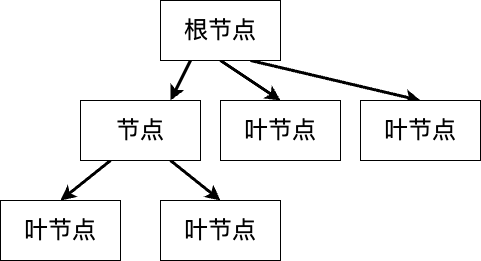
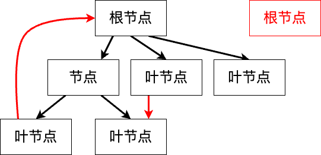
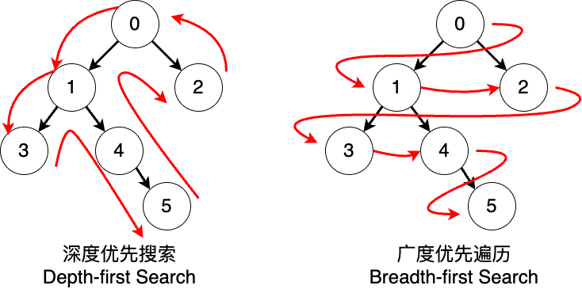
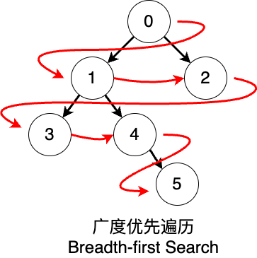
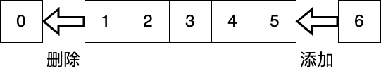
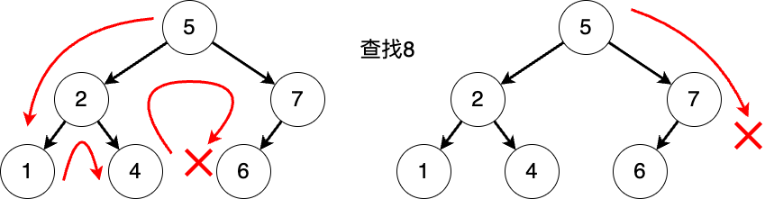
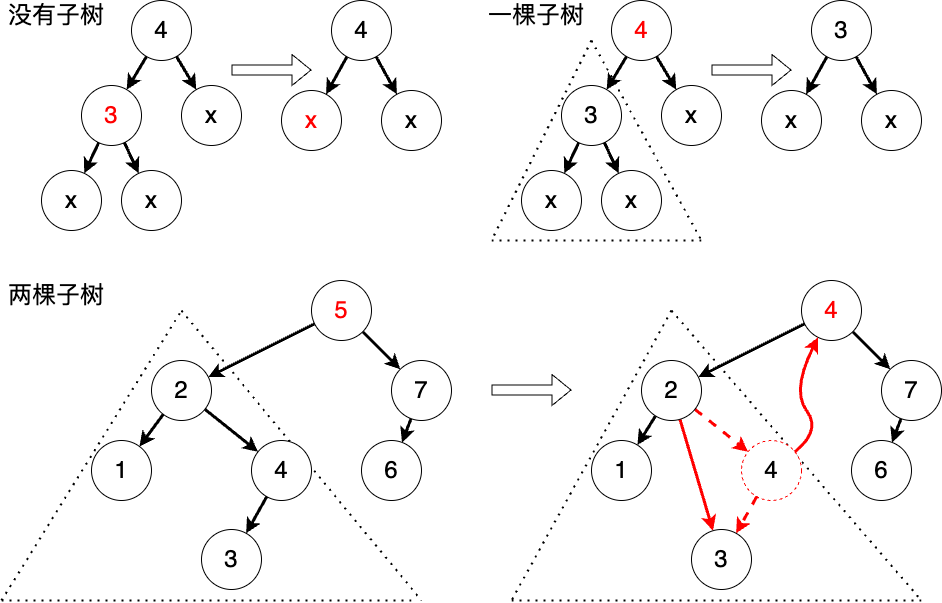
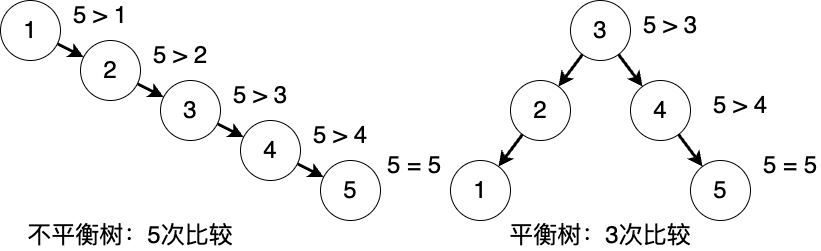

# 现代编程思想

## 树

### Hongbo Zhang

# 数据结构：树
- 树
- 二叉树
- 二叉搜索树
- 二叉平衡树

# 生活中的树状图

- 生活中有很多的数据的结构与一颗树相似
  - 谱系图（又称，家族树）
  - 文件结构
  - 数学表达式
  - ……


# 树的逻辑结构

- 数据结构中，**树**是由有限个**节点**构成的具有**层次**关系的集合
  - 节点是存储数据的结构，节点之间存在亲子关系：父节点和子节点
  - 如果树不为空，则它拥有一个**根节点**：根节点没有父节点
  - 所有非根节点都有唯一的父节点
  - 如果没有子节点的节点可称为叶节点
  - 任何节点不能是自己的后代节点：树中不能有环路
  - 树的一条边指的是一对节点(u, v)，其中u是v的父节点或者v是u的父节点


# 树的逻辑结构

- 这不是一颗树


# 树的逻辑结构

- 计算机中的树根节点在上，子节点在父节点下方
- 相关术语
  - 节点的**深度**：根节点下到这个节点的路径的长度（边的数量）
    - 根节点深度为0
  - 节点的**高度**：节点下到叶节点的最长路径的长度
    - 叶节点高度为0
  - 树的**高度**：根节点的高度
    - 只有一个节点的树高度为0
    - 空树（没有节点的树）高度为-1
- 也有的定义将树的高度等同于最大层次，以根为第一层

# 树的存储结构

- 树的存储方式有多种（以二叉树为例，省略节点存储的数据）
  - 节点与子节点关系的列表：`[ (0, 1), (0, 2), (1, 3) ]`
  - 代数数据结构定义
    ```moonbit skip
    Node(0, 
      Node(1, 
        Leaf(3), 
        Empty), 
      Leaf(2))
    ```
  - 列表定义
  
- 数据的逻辑结构独立于存储结构

# 种类繁多的树结构

- 线段树：每一个节点都存储了一根线段及对应的数据，适合一维查询
- 二叉树：每个节点至多有两个分支：左子树与右子树
- KD-Tree：支持K-维度的数据（例如平面中的点、空间中的点等）的存储与查询的二叉树，每一层更换分叉判定的维度
- B-Tree：适合顺序访问，利于硬盘存储数据
- R-Tree：存储空间几何结构
- ……

# 数据结构：二叉树

- 二叉树要么是一棵空树，要么是一个节点；它最多具有两个子树：左子树与右子树
  - 叶节点的两个子树都是空树
- 基于**递归枚举类型**的定义（本节课默认存储数据为整数）
```moonbit
enum IntTree {
  Node(Int, IntTree, IntTree) // 存储的数据，左子树，右子树
  Empty
}
```

# 二叉树的遍历

- 树的**遍历**是指以某种规律，不重复地访问树的所有节点的过程
- 深度优先遍历：总是先访问一个子树，再访问另一个子树
- 广度优先遍历：从根节点开始，访问深度相同节点
 

# 二叉树的遍历
- 前序遍历：先访问根节点，再访问左子树，再访问右子树
  - `[0, 1, 3, 4, 5, 2]`
- 中序遍历：先访问左子树，再访问根节点，再访问右子树
  - `[3, 1, 4, 5, 0, 2]`
- 后序遍历：先访问左子树，再访问右子树，再访问根节点
  - `[3, 5, 4, 1, 2, 0]`
- 广度优先遍历：`[0, 1, 2, 3, 4, 5]`
 

# 深度优先遍历：查找为例

- 我们想要在树的节点中查找是否有特定的值
- 结构化递归
  - 先对基本情形进行处理：空树
  - 再对递归情形进行处理，并递归
```moonbit
fn dfs_search(target: Int, tree: IntTree) -> Bool {
  match tree { // 判断当前访问的树
    Empty => false // 若为空树，则已抵达最深处
    Node(value, left, right) => // 否则，再对子树轮流遍历
      value == target || dfs_search(target, left) || dfs_search(target, right)
  }
}
```
- 前序、中序、后序遍历只是改变顺序

# 逻辑值的短路运算

- 短路运算：当发现当前求解值可以被确定，则中断计算并返回结果
  - `let x = true || { abort("程序中止") }`：因为`true || 任何值`均为真，因此不会计算`||`右侧表达式
  - `let y = false && { abort("程序中止") }`：因为`false && 任何值`均为假，因此不会计算`&&`右侧表达式
- 树的遍历
  - `value == target || dfs_search(target, left) || dfs_search(target, right)`在找到后即会中止遍历
  
# 广度优先遍历

- 对每一层子树，挨个访问，并按照顺序，接着访问它们的子树
- 算法的实现依赖先进先出的数据结构：队列
  - 我们对队列中现有的树，取出一个，对它的根节点进行操作，再将它的所有非空子树从左到右加入队列最后，直到队列为空


# 数据结构：队列

- 就像生活中排队一样，先进入队伍的人最先获得服务
- 对于数据的插入和删除遵循先进先出（First In First Out, FIFO）的原则
  - 队尾插入数据，队头删除数据


# 数据结构：队列
- 我们在此使用的队列由以下接口定义：
```moonbit
fn[T] empty() -> Queue[T] { ... } // 创建空队列
fn[T] enqueue(q: Queue[T], x: T) -> Queue[T] { ... }  // 向队尾添加元素
// 尝试取出一个元素，并返回剩余队列；若为空则为本身
fn[T] pop(q: Queue[T]) -> (Option[T], Queue[T]) { ... }
```
- 例如
```moonbit
let q = enqueue(enqueue(empty(), 1), 2)
let (head, tail) = pop(q)
assert_eq(head, Some(1))
assert_eq(tail, enqueue(empty(), 2))
```

# 广度优先遍历：查找为例

- 我们想要在树的节点中查找是否有特定的值
```moonbit
fn bfs_search(target: Int, queue: Queue[IntTree]) -> Bool {
  match pop(queue) {
    (None, _) => false // 若队列为空，结束搜索
    (Some(head), tail) => match head { // 若队列非空，对于取出的树进行操作
      Empty => bfs_search(target, tail) // 若树为空树，则对剩余队列进行操作
      Node(value, left, right) => 
        if value == target { true } else {
          // 否则，操作根节点并将子树加入队列
          bfs_search(target, enqueue(enqueue(tail, left), right))
        }
    }
  }
}
```

# 数据结构：二叉搜索树

- 为了方便搜索，我们将数据从小到大依次排序，便获得了基于二叉树的**二叉搜索树（Binary Search Tree）**
  - 左子树的数据小于根节点的数据小于右子树的数据
  - 中序遍历（左、根、右）能从小到大遍历排序后的数据
  - 搜索的最坏情况的次数是树的高度 + 1，而非元素总数
- 二叉搜索树的插入与删除需要保证操作结束后的树依然保持着顺序


# 二叉搜索树的插入

- 对于一棵树
  - 如果为空，则替换为插入值构成的子树
  - 如果为非空，则与当前值进行比较，选择适当的子树替换为插入值后的子树


# 二叉搜索树的插入

- 对于一棵树
  - 如果为空，则替换为插入值构成的子树
  - 如果为非空，则与当前值进行比较，选择适当的子树替换为插入值后的子树
```moonbit
fn insert(tree: IntTree, value: Int) -> IntTree {
  match tree {
    Empty => Node(value, Empty, Empty) // 若为空，则构建新树
    Node(v, left, right) => // 若非空，则基于更新后的子树构建新的树
      if value == v { tree } else 
      if value < v { Node(v, insert(left, value), right) } else 
        { Node(v, left, insert(right, value)) } 
  }
}
```

# 二叉搜索树的删除

- 对于一棵树
  - 如果为空，则不进行任何操作
  - 如果为非空，则与当前值比较
    - 如果当前值为待删除的节点，则删除该节点
    - 否则，选择恰当的子树进行删除操作并替换为删除后的子树
- 对于一棵树，删除根节点意味着
  - 如果没有子树，则直接替换为空树
  - 如果只有一个子树，则替换为该子树
  - 如果有两个子树，则根节点替换为左子树的最大值，同时左子树删除该最大值（或者也可以对右子树的最小值进行操作）


# 二叉搜索树的删除


# 二叉搜索树的删除
我们使用辅助函数`fn remove_largest(tree: IntTree) -> (IntTree, Int)`来找到并删除子树中的最大值。我们一路向右找到没有右子树的节点为止
```moonbit
match tree {
  Node(v, left, Empty) => (left, v)
  Node(v, left, right) => { 
    let (newRight, value) = remove_largest(right)
    (Node(v, left, newRight), value)
} }
```

我们定义删除操作`fn remove(tree: IntTree, value: Int) -> IntTree`
```moonbit
match tree { ...
  Node(root, left, right)  => if root == value {
    let (newLeft, newRoot) => remove_largest(left)
    Node(newRoot, newLeft, right)
  } else ... }
```

# 数据结构：二叉平衡树

- 二叉搜索树可能出现不平衡的现象：部分节点出现在深度较大的地方，影响性能
  - 搜索的最坏情况的次数是树的高度 + 1；大小为$n$的二叉树的高度最大为$n - 1$

- 为了避免这种情况的发生，我们采用平衡树：任意节点的子树的高度相差无几
  - 平衡树高度约为$\texttt{log}_2{n}$
  - 二叉平衡树有AVL Tree、二三树、红黑树等多种实现

# 二叉平衡树 AVL Tree

- 当树发生不平衡的时候，需要进行旋转来再次获得平衡
  - 根据子树高度进行重新排列，使高度更高的子树处在较浅的位置
- AVL树在每次插入、删除后都进行调整，维持树的平衡
  - 插入、删除操作类似于标准二叉搜索树
  - 为方便维护，在节点中添加高度属性
```moonbit
enum AVLTree {
  Empty
  Node(Int, AVLTree, AVLTree, Int) // 当前节点值、左子树、右子树、树高度
}
fn create(value: Int, left: AVLTree, right: AVLTree) -> AVLTree { ... }
fn height(tree: AVLTree) -> Int { ... }
```

# 二叉平衡树 AVL Tree


# 二叉平衡树 AVL Tree

我们对一棵树进行再平衡操作

```moonbit
fn balance(left: AVLTree, z: Int, right: AVLTree) -> AVLTree {
  if height(left) > height(right) + 1 {
    match left {
      Node(y, left_l, left_r, _) => 
        if height(left_l) >= height(left_r) { 
          create(left_l, y, create(lr, z, right)) // x在y z同侧
        } else { match left_r {
          Node(x, left_right_l, left_right_r, _) =>  // x在y z中间
            create(create(left_l, y, left_right_l), x, create(left_right_r, z, right))
        } }
    }
  } else { ... }
}
```

# 二叉平衡树

我们在添加后对生成的树进行再平衡

```moonbit
fn add(tree: AVLTree, value: Int) -> AVLTree {
  match tree {
    Node(v, left, right, _) as t => {
      if value < v { balance(add(left, value), v, right) } else { ... }
    }
    Empty => ...
  }
}
```
# 总结

- 本章节我们学习了树这一数据结构，包括
  - 树的定义及相关术语
  - 二叉树的定义以及遍历
  - 二叉搜索树的定义以及增删操作
  - 二叉平衡树AVL树的再平衡操作
- 拓展阅读
  - 《算法导论》第12、13章

