# Modern Programming Ideology

## Trees

### MoonBit Open Course Team

# Data Structures: Trees

- Trees
- Binary trees
- Binary search trees
- Binary balanced trees

# Trees in Everyday Life

- Many data structures in everyday life resemble a tree
  - Pedigree chart (also known as, family tree)
  - File structure
  - Mathematical expressions
  - ...

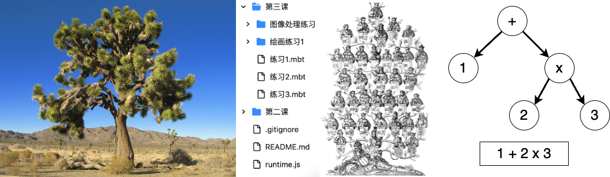

# Logical Structure of Trees

- In data structures, a **tree** is a finite collection of **nodes** that have a hierarchical relationship
  - Nodes are structures that store data, and there exists a parent-child relationship between them: parent nodes and child nodes
  - If the tree is not empty, it has a **root node**, which has no parent node
  - All non-root nodes have a unique parent node
  - Nodes without child nodes can be called leaf nodes
  - No node can be its own descendant: the tree cannot have cycles
  - An edge in a tree refers to a pair of nodes (u, v), where u is v's parent or v is u's parent

# Logical Structure of Trees

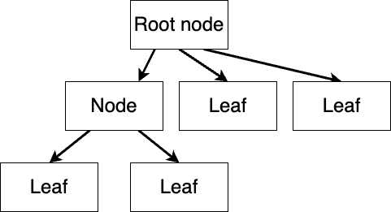

# Logical Structure of Trees

- This is not a tree
  
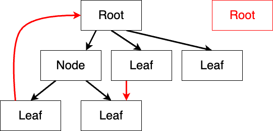

# Logical Structure of Trees

- The root of a tree is on top, and children are below their parents
- Related terminology:
  - **Depth** of a node: the length of the path (number of edges) from the root node down to that node
    - The root node's depth is 0
  - **Height** of a node: the length of the longest path from the node down to a leaf node
    - Leaf node's height is 0
  - **Height** of a tree: the height of the root node
    - A tree with only one node has a height of 0
    - An empty tree (a tree without nodes) has a height of -1
- Some definitions equate the height of the tree with the maximum level, with the root as the first level

# Tree Storage Structures

- There are various ways to store trees (taking binary trees as an example, omitting the data stored in the nodes)
  - List of node to child node relationships: `[ (0, 1), (0, 2), (1, 3) ]`
  - Algebraic data structure definition
    ```moonbit no-check
    Node(0, 
      Node(1, 
        Leaf(3), 
        Empty), 
      Leaf(2))
    ```
  - List definition
  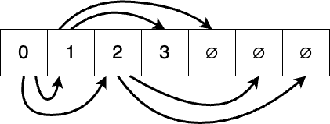
- The logical structure is independent of the storage structure

# A Variety of Tree Structures

- Segment Tree: Each node stores a segment and corresponding data, suitable for one-dimensional queries
- Binary Tree: Each node has at most two branches: a left subtree and a right subtree
- KD-Tree: Supports storage and querying of K-dimensional data (such as points on a plane, points in space, etc.) in a binary tree, with each level changing the dimension of the bifurcation criterion
- B-Tree: Suitable for sequential access, beneficial for data storage on hard drives
- R-Tree: Stores spatial geometric structures
- ...

# Data Structures: Binary Tree

- A binary tree is either empty or consist of nodes that have at most two subtrees: a left subtree and a right subtree.
  - Both subtrees of a leaf node are empty trees
- Based on the **recursive enumeration type** definition (assuming stored data are integers here)
  
```moonbit
enum IntTree {
  Node(Int, IntTree, IntTree) // data, left subtree, right subtree
  Empty
}
```

# Traversal of Binary Trees

- **Tree traversal** refers to the process of visiting all nodes of a tree in a certain order without repetition
- Depth-first traversal: Always visits one subtree before visiting another
- Breadth-first traversal: Starting from the root node, visits nodes of the same depth layer by layer
  
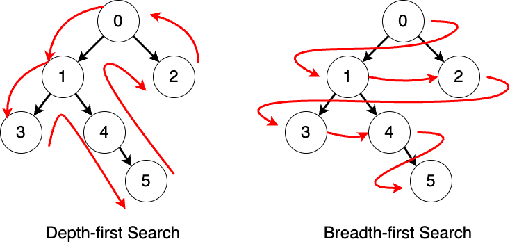

# Traversal of Binary Trees

- Preorder traversal: Visit the root node first, then the left subtree, then the right subtree
  - `[0, 1, 3, 4, 5, 2]`
- Inorder traversal: Visit the left subtree first, then the root node, then the right subtree
  - `[3, 1, 4, 5, 0, 2]`
- Postorder traversal: Visit the left subtree first, then the right subtree, then the root node
  - `[3, 5, 4, 1, 2, 0]`
- Breadth-first traversal: `[0, 1, 2, 3, 4, 5]`
  


# Depth-First Search: Using Search as an Example

- To find a specific value in a tree's nodes
- Structural recursion
  - First, handle the base case: an empty tree
  - Then, handle the recursive case and recurse
  
```moonbit
fn dfs_search(target: Int, tree: IntTree) -> Bool {
  match tree { // check the visited tree 
    Empty => false // empty tree implies we are getting deepest
    Node(value, left, right) => // otherwise, search in subtrees
      value == target || dfs_search(target, left) || dfs_search(target, right)
  }
}
```
- The difference between preorder, inorder, and postorder searches is the order of operations on the current node

# Short-Circuit Logical Operations

- Short-circuit operation: If the result of the current evaluation can be determined, the calculation will be terminated, and the result will be returned directly
  - `let x = true || { abort("Program stops") }`: Because `true || any value` is always true, the expression on the right side of `||` will not be evaluated
  - `let y = false && { abort("Program stops") }`: Because `false && any value` is always false, the expression on the right side of `&&` will not be evaluated
- Tree traversal
  - `value == target || dfs_search(target, left) || dfs_search(target, right)` will stop traversal as soon as the target is found

# Breadth-First Search

- Visit each subtree on the same level one by one and in order, then proceed to visit their subtrees
- The implementation of the algorithm relies on a First-In-First-Out data structure: queue
  - For the trees currently in the queue, we dequeue a tree, operate on its root node, then add all of its non-empty subtrees from left to right to the end of the queue, until the queue is empty
  
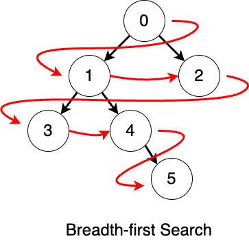

# Data Structure: Queues

- Similar to queuing in everyday life, the first person to enter the queue gets served first
- The insertion and removal of data follow the First-In-First-Out (FIFO) principle
  - Data is inserted at the back of the queue and removed from the front
  


# Data Structure: Queues

- The queue we use here is defined by the following interfaces:
  
```moonbit no-check
fn empty[T]() -> Queue[T] // construct an empty queue
fn enqueue[T](q: Queue[T], x: T) -> Queue[T] // add element to the tail
// attempt to dequeue an element, return None if the queue is empty
fn pop[T](q: Queue[T]) -> (Option[T], Queue[T]) 
```

<!-- Implementation of Queue

```moonbit
struct Queue[T] {
  front:List[T]
  back:List[T]
}

/// `Queue::default[T]()`
///
/// Create an empty queue 创建空队列
fn Queue::default[T]() -> Queue[T] {
  { front: Nil, back: Nil }
}

fn empty[T]() -> Queue[T] {
  Queue::default()
}

/// `from_list[T](front: List[T])`
///
/// Create queue from a list 从列表创建队列
fn Queue::from_list[T](front: List[T]) -> Queue[T] {
  { front:front, back:Nil }
}

/// `is_empty[T](q: Queue[T])`
///
/// Check if a queue is empty 检查列表是否为空
fn Queue::is_empty[T](q: Queue[T]) -> Bool {
  match q {
    {front:Nil, back:Nil} => true
    _ => false
  }
}

/// `list_rev[T](xs: List[T])`
///
/// Reverse a list with tail recursion 基于尾递归的列表反转
fn list_rev[T](xs: List[T]) -> List[T] {
  fn go(acc, xs: List[T]) {
    match xs {
      Nil => acc
      Cons(x, rest) => go((Cons(x, acc) : List[T]), rest)
    }
  }

  go(Nil, xs)
}

/// `norm[T](q: Queue[T])`
///
/// Feed `back` into `front` so that `front` always have something 反转队列结构；确保列表头始终有元素
fn norm[T](q: Queue[T]) -> Queue[T] {
  match q {
    {front:Nil, back:b} => { front:list_rev(b), back:Nil }
    q => q
  }
}

/// `enqueue[T](q: Queue[T], x: T)`
///
/// Add an element to the end of the queue 向队尾添加一个元素
fn enqueue[T](q: Queue[T], x: T) -> Queue[T] {
  match q {
    {front:f, back:b} => norm({ front:f, back:Cons(x, b) })
  }
}

/// `pop[T](q: Queue[T])`
///
/// Remove the first element from the queue 取出队列中第一个元素
fn pop[T](q: Queue[T]) -> (Option[T], Queue[T]) {
  match q {
    {front:Nil, back:_} => (None, q)
    {front:Cons(x, f), back:b} => (Some(x), norm({front:f, back:b}))
  }
}
```
-->

- For example
  
```moonbit no-check
let q = enqueue(enqueue(empty(), 1), 2)
let (head, tail) = pop(q)
assert(head == Some(1))
assert(tail == enqueue(empty(), 2))
```

# Breadth-First Search: Using Search as an Example

- To find a specific value in a tree's nodes
  
```moonbit 
fn bfs_search(target: Int, queue: Queue[IntTree]) -> Bool {
  match pop(queue) {
    (None, _) => false // If the queue is empty, end the search
    (Some(head), tail) => match head { // If the queue is not empty, operate on the extracted tree
      Empty => bfs_search(target, tail) // If the tree is empty, operate on the remaining queue
      Node(value, left, right) => 
        if value == target { true } else {
          // Otherwise, operate on the root node and add the subtrees to the queue
          bfs_search(target, enqueue(enqueue(tail, left), right))
        }
    }
  }
}
```

# Data Structure: Binary Search Tree

- To facilitate searching, we arrange data in ascending order, thus forming a **Binary Search Tree** based on the binary tree:
  - Data in the left subtree is less than the data at the root node, which is less than the data in the right subtree.
  - An inorder traversal (left, root, right) will visit data in acsending order.
  - The worst-case number of searches is the height of the tree + 1, not the total number of elements.
- Insertions and deletions in a binary search tree have to maintain the order.
  
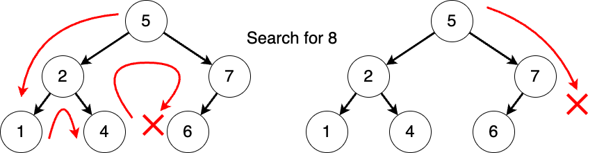

# Binary Search Tree Insertion

- For a tree:
  - If it's empty, replace it with a subtree containing only the inserted value.
  - If it's not empty, compare with the current value and choose the appropriate subtree to replace with the subtree after insertion.
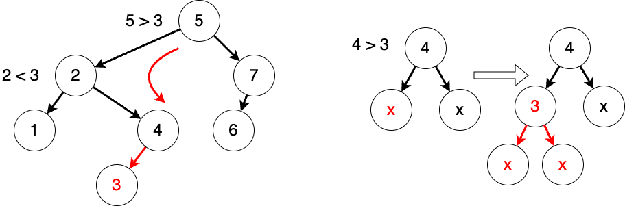

# Binary Search Tree Insertion

- For a tree:
  - If it's empty, replace it with a subtree containing only the inserted value.
  - If it's not empty, compare with the current value and choose the appropriate subtree to replace with the subtree after insertion.
```moonbit
fn insert(tree: IntTree, value: Int) -> IntTree {
  match tree {
    Empty => Node(value, Empty, Empty) // construct a new tree if it's empty
    Node(v, left, right) => // if not empty, update one subtree by insertion
      if value == v { tree } else 
      if value < v { Node(v, insert(left, value), right) } else 
        { Node(v, left, insert(right, value)) } 
  }
}
```

# Binary Search Tree Deletion

- For a tree:
  - If it's empty, do nothing.
  - If it's not empty, compare with the current value:
    - If the current value is the node to be deleted, then remove that node.
    - Otherwise, find the subtree where the value might exist, and update it with the subtree after deletion.
- To delete the root node of a tree:
  - If there are no subtrees, replace it with an empty tree.
  - If there's only one subtree, replace it with that subtree.
  - If there are two subtrees, replace the root node with the maximum value in the left subtree, while also deleting that maximum value in the left subtree (or alternatively, operate on the minimum value of the right subtree).

# Binary Search Tree Deletion
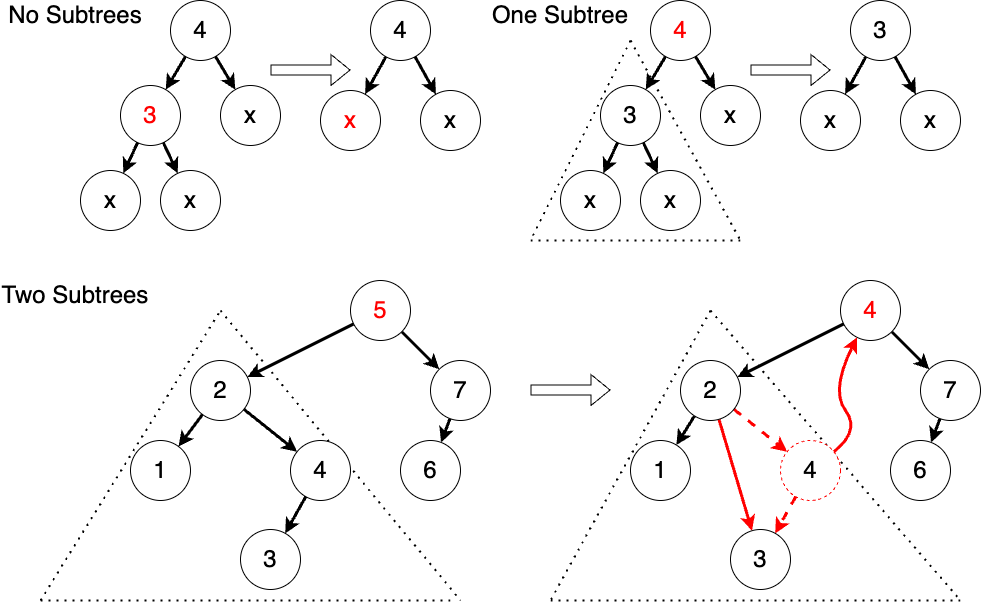

# Binary Search Tree Deletion

We use a helper function `fn remove_largest(tree: IntTree) -> (IntTree, Int)` to find and remove the largest value in a subtree. We keep traversing to the right until we reach a node with no right subtree.
```moonbit no-check
match tree {
  Node(v, left, Empty) => (left, v)
  Node(v, left, right) => { 
    let (newRight, value) = remove_largest(right)
    (Node(v, left, newRight), value)
} }
```

We define the deletion operation `fn remove(tree: IntTree, value: Int) -> IntTree`
```moonbit no-check
match tree { ...
  Node(root, left, right)  => if root == value {
    let (newLeft, newRoot) => remove_largest(left)
    Node(newRoot, newLeft, right)
  } else ... }
```

# Data Structure: Binary Balanced Trees

- Binary search trees can become unbalanced, with some nodes at deeper levels, which causes poor performance:
  - The worst-case number of searches is the height of the tree + 1; the height of a binary tree of size $n$ can be as high as $n - 1$.
  
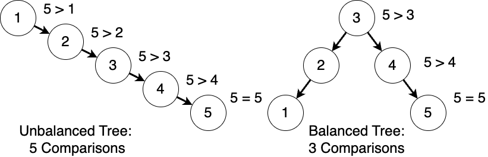
- To avoid this, we use balanced trees where the height difference is minimal:
  - The height of a balanced tree is approximately $\texttt{log}_2{n}$.
  - Various binary balanced trees include AVL Trees, 2-3 Trees, Red-Black Trees, etc.

# Binary Balanced Tree: AVL Tree

- When the tree becomes unbalanced, we rotate the trees to regain balance:
  - Reorganize the tree by height, to make the taller subtree in a shallower position.
- AVL trees will be adjusted after each insertion or deletion to maintain balance:
  - Insertion and deletion operations are similar to those in a standard binary search tree.
  - We add a height attribute to the node definition to facilitate height comparison.
  
```moonbit no-check
enum AVLTree {
  Empty
  // current value, left subtree, right subtree, height
  Node(Int, AVLTree, AVLTree, Int) 
}
fn create(value: Int, left: AVLTree, right: AVLTree) -> AVLTree
fn height(tree: AVLTree) -> Int
```

# Binary Balanced Tree: AVL Tree

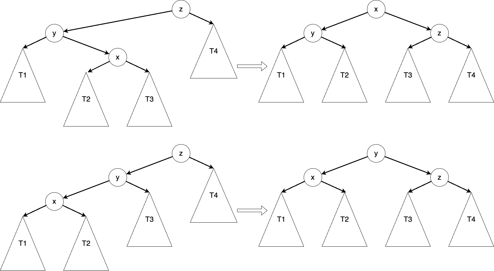

# Binary Balanced Tree: AVL Tree

We rebalance a tree with the following operation:

```moonbit no-check
fn balance(left: AVLTree, z: Int, right: AVLTree) -> AVLTree {
  if height(left) > height(right) + 1 {
    match left {
      Node(y, left_l, left_r, _) => 
        if height(left_l) >= height(left_r) { 
          create(left_l, y, create(lr, z, right)) // x is on y and z's same side 
        } else { match left_r {
          Node(x, left_right_l, left_right_r, _) =>  // x is between y and z
            create(create(left_l, y, left_right_l), x, create(left_right_r, z, right))
        } }
    }
  } else { ... }
}
```

# Binary Balanced Tree

We rebalance the tree after adding a new value:

```moonbit no-check
fn add(tree: AVLTree, value: Int) -> AVLTree {
  match tree {
    Node(v, left, right, _) as t => {
      if value < v { balance(add(left, value), v, right) } else { ... }
    }
    Empty => ...
  }
}
```

# Summary

- In this chapter, we learned about the tree, including:
  - Definitions and related terminology of trees
  - Definitions and traversals of binary trees
  - Definitions and insertion/deletion operations of binary search trees
  - Rebalancing AVL trees
- Further reading:
  - Chapters 12 and 13 of "Introduction to Algorithms"