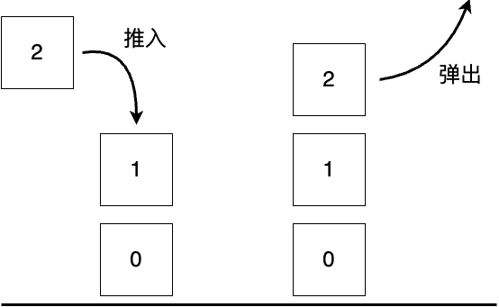

# 现代编程思想

## 泛型与高阶函数

### Hongbo Zhang

# 设计良好的抽象
- 软件工程中，我们要设计良好的抽象
  - 当代码多次重复出现
  - 当抽出的逻辑具有合适的语义
- 编程语言为我们提供了各种抽象的手段
  - 函数、泛型、高阶函数、接口……

# 泛型函数与泛型数据

# 堆栈

- 栈是一个由一系列对象组成的一个集合，这些对象的插入和删除遵循后进先出原则（Last In First Out）


# 堆栈

- 我们定义以下操作，以存储整数的堆栈`IntStack`为例
```moonbit no-check
empty: () -> IntStack // 创建新的堆栈
push : (Int, IntStack) -> IntStack // 将新的元素加入栈顶
pop: IntStack -> (Option[Int], IntStack) // 从堆栈取出元素
```



# 整数堆栈

- 我们实现整数堆栈的定义
  - `self`关键字允许我们链式调用：`IntStack::empty().push(1).pop()`

```moonbit
enum IntStack {
  Empty
  NonEmpty(Int, IntStack)
}
fn IntStack::empty() -> IntStack { Empty }
fn push(self: IntStack, value: Int) -> IntStack { NonEmpty(value, self) }
fn pop(self: IntStack) -> (Option[Int], IntStack) {
  match self {
    Empty => (None, Empty)
    NonEmpty(top, rest) => (Some(top), rest)
  }
}
```
- 事实上，月兔中的列表就是一个堆栈

# 字符串堆栈

- 除了存储整数，我们也会希望存储字符串

```moonbit
enum StringStack {
  Empty
  NonEmpty(String, StringStack)
}
fn StringStack::empty() -> StringStack { Empty }
fn push(self: StringStack, value: String) -> StringStack { NonEmpty(value, self) }
fn pop(self: StringStack) -> (Option[String], StringStack) {
  match self {
    Empty => (None, Empty)
    NonEmpty(top, rest) => (Some(top), rest)
  }
}
```

- 我们希望存储很多很多类型在堆栈中
  - 每个类型都要定义一个对应的堆栈吗？
  - `IntStack`和`StringStack`似乎结构一模一样？

# 泛型数据结构与泛型函数

- **泛型数据结构**与**泛型函数**以类型为参数，构建更抽象的结构

```moonbit
enum Stack[T] {
  Empty
  NonEmpty(T, Stack[T])
}
fn Stack::empty[T]() -> Stack[T] { Empty }
fn push[T](self: Stack[T], value: T) -> Stack[T] { NonEmpty(value, self) }
fn pop[T](self: Stack[T]) -> (Option[T], Stack[T]) {
  match self {
    Empty => (None, Empty)
    NonEmpty(top, rest) => (Some(top), rest)
  }
}
```
- 将`T`替换为`Int`或`String`即相当于`IntStack`与`StringStack`

# 泛型数据结构与泛型函数

- 我们用`[<类型1>, <类型2>, ...]`来定义泛型的类型参数
  - `enum Stack[T]{ Empty; NonEmpty(T, Stack[T]) }`
  - `struct Pair[A, B]{ first: A; second: B }`
  - `fn identity[A](value: A) -> A { value }`
  - `Stack`与`Pair`可以看做从类型上的函数：类型构造器
- 类型参数多数时候会根据参数被自动推导


# 泛型数据结构：队列

- 我们定义如下的操作：
```moonbit no-check
fn empty[T]() -> Queue[T] // 创建空队列
fn push[T](q: Queue[T], x: T) -> Queue[T] // 向队尾添加元素
// 尝试取出一个元素，并返回剩余队列；若为空则为本身
fn pop[T](q: Queue[T]) -> (Option[T], Queue[T]) 
```
- 我们可以用一个列表（堆栈）模拟队列，但是效率低下
  - 在队尾添加元素需要重新构建整个列表
  - `Cons(1, Cons(2, Nil))` => `Cons(1, Cons(2, Cons(3, Nil)))`

# 泛型数据结构：队列

- 我们用两个堆栈模拟队列
```moonbit 
struct Queue[T] {
  front: Stack[T] // 负责取出操作
  back: Stack[T] // 负责存储操作
}
```
- 当添加数据时，存入`back`；当读取数据时，从`front`中取出
- 操作后，若`front`为空，则通过反转队列，将`back`转为`front`
  - 确保若队列非空，则`front`非空
  - 队列反转的开销将在多次读取中平摊


# 泛型数据结构：队列

- 我们用两个堆栈模拟队列
```moonbit no-check
struct Queue[T] {
  front: Stack[T] // 负责取出操作
  back: Stack[T] // 负责存储操作
}
```
- 当添加数据时，存入`back`；当读取数据时，从`front`中取出
- 操作后，若`front`为空，则通过反转队列，将`back`转为`front`
  - 确保若队列非空，则`front`非空
  - 队列反转的开销将在多次读取中平摊


# 泛型数据结构：队列

- 我们用两个堆栈模拟队列
```moonbit no-check
struct Queue[T] {
  front: Stack[T] // 负责取出操作
  back: Stack[T] // 负责存储操作
}
```
- 当添加数据时，存入`back`；当读取数据时，从`front`中取出
- 操作后，若`front`为空，则通过反转队列，将`back`转为`front`
  - 确保若队列非空，则`front`非空
  - 队列反转的开销将在多次读取中平摊


# 泛型数据类型：队列

```moonbit no-check
struct Queue[T] {
  front: Stack[T]
  back: Stack[T]
}
fn Queue::empty[T]() -> Queue[T] { {front: Empty, back: Empty} }
fn push[T](self: Queue[T], value: T) -> Queue[T] { // 将元素存入队尾
  normalize({ ..self, back: self.back.push(value)}) // 通过定义第一个参数为self，我们可以用xxx.f()
}
fn pop[T](self: Queue[T]) -> (Option[T], Queue[T]) { // 取出第一个元素
  match self.front {
    Empty => (None, self)
    NonEmpty(top, rest) => (Some(top), normalize({ ..self, front: rest}))
  }
}
fn normalize[T](self: Queue[T]) -> Queue[T] { // 如果front为空，反转back到front
  match self.front {
    Empty => { front: self.back.reverse(), back: Empty }
    _ => self
  }
}
fn reverse[T](self: Stack[T]) -> Stack[T] { // 辅助函数：反转堆栈
 // 省略实现
}
```

# 高阶函数

# 一些列表操作

- 我们要求一个整数列表的和
```moonbit
fn sum(list: List[Int]) -> Int {
  match list {
    Nil => 0
    Cons(hd, tl) => hd + sum(tl)
  }
}
```
- 我们要求一个列表长度
```moonbit
fn length[T](list: List[T]) -> Int {
  match list {
    Nil => 0
    Cons(hd, tl) => 1 + length(tl)
  }
}
```

# 一些列表操作

- 我们发现它们有共通点

```moonbit no-check
fn func[A, B](list: List[A]) -> B {
  match list {
    Nil => b // b : B
    Cons(hd, tl) => f(hd, func(tl)) // f : (A, B) -> B 
  }
}
```

- 在之前的例子中
  - 在求和中，`b`为0，`f`为`fn f(a, b) { a + b }`
  - 在求长度中，`b`为0，`f`为`fn f(a, b) { 1 + b }`
- 如何重用这个结构呢？

# 函数是一等公民

- 在月兔中，函数是一等公民。这就意味着，我们可以把函数作为参数传递，也可以将函数作为计算结果存储：
  - 以刚才的结构为例，函数可以作为参数传递
```moonbit
fn fold_right[A, B](list: List[A], f: (A, B) -> B, b: B) -> B {
  match list {
    Nil => b
    Cons(hd, tl) => f(hd, fold_right(tl, f, b))
  }
}
```
- 高阶函数：接受函数作为参数或以函数作为运算结果的函数

# 函数是一等公民
- 重复一个函数的运算
```moonbit
fn repeat[A](f: (A) -> A) -> (A) -> A { // repeat的类型是((A) -> A) -> (A) -> A
  fn (a) { f(f(a)) }  
} // 函数作为计算的结果

fn plus_one(i: Int) -> Int { i + 1 }
fn plus_two(i: Int) -> Int { i + 2 }

let add_two: (Int) -> Int = repeat(plus_one) // 存储函数

let compare: Bool = add_two(2) == plus_two(2) // true，两者皆为4
```

# 高阶函数的化简

`let add_two: (Int) -> Int = repeat(plus_one)`
&nbsp;     `repeat(plus_one)`
$\mapsto$ `fn (a) { plus_one(plus_one(a)) }`            替换表达式中的标识符

`let x: Int = add_two(2)`
&nbsp;     `add_two(2)`
$\mapsto$ `plus_one(plus_one(2))`          替换表达式中的标识符
$\mapsto$ `plus_one(2) + 1`                        替换表达式中的标识符
$\mapsto$ `(2 + 1) + 1`                                 替换表达式中的标识符
$\mapsto$ `3 + 1` $\mapsto$ `4`

# 函数的类型

- 函数的类型为$(t_\texttt{in}) \rightarrow t_\texttt{out}$，如
  - `(Int) -> Int` 整数到整数
  - `(Int) -> (Int) -> Int` 整数到函数
  - `(Int) -> ((Int) -> Int)` 同上
  - `((Int) -> Int) -> Int` 函数到整数

# 高阶函数的应用：列表折叠

- 我们刚才已经看到了列表折叠的一种可能性
```moonbit no-check
fn fold_right[A, B](list: List[A], f: (A, B) -> B, b: B) -> B {
  match list {
    Nil => b
    Cons(hd, tl) => f(hd, fold_right(tl, f, b))
  }
}
```
- 这种折叠从右向左构建，因此被称为`fold_right`


# 高阶函数的应用：列表折叠

- 我们也可以从另一个方向进行折叠
```moonbit
fn fold_left[A, B](list: List[A], f: (B, A) -> B, b: B) -> B {
  match list {
    Nil => b
    Cons(hd, tl) => fold_left(tl, f, f(b, hd))
  }
}
```
- 这种折叠从左向右构建，因此被称为`fold_left`


# 高阶函数的应用：列表映射

- 一个常见的操作是对列表中的每一个元素进行映射
  - 例如，从个人信息列表中获得姓名列表
  - `struct PersonalInfo { name: String; age: Int }`
```moonbit no-check
fn map[A, B](self: List[A], f: (A) -> B) -> List[B] {
  match list {
    Nil => Nil
    Cons(hd, tl) => Cons(f(hd), map(tl, f))
  }
}
let infos: List[PersonalInfo] = ???
let names: List[String] = infos.map(fn (info) { info.name })
```

# 高阶函数的应用：列表映射

- 事实上，我们还可以用`fold_right`来实现`map`函数
```moonbit
fn map[A, B](list: List[A], f: (A) -> B) -> List[B] {
  fold_right(list, fn (value, cumulator) { Cons(f(value), cumulator) }, Nil)
}
```
- 思考题：如何用`fold_right`来实现`fold_left`？


# 二叉搜索树
- 我们定义一个更一般的二叉搜索树，允许存放任意类型的数据
```moonbit no-check
// 我们利用泛型定义数据结构
enum Tree[T] {
  Empty
  Node(T, Tree[T], Tree[T])
}

// 我们需要一个比较函数来比较值的大小以了解顺序
// 负数表示小于，0表示等于，正数表示大于
fn insert[T](self: Tree[T], value: T, compare: (T, T) -> Int) -> Tree[T]
fn delete[T](self: Tree[T], value: T, compare: (T, T) -> Int) -> Tree[T]
```

# 总结

- 本章节我们学习了
  - 泛型和函数是一等公民的概念
  - 数据结构堆栈与队列的实现
- 推荐阅读
  - *Software Foundations* 第四章 或
  - *Programming Language Foundations in Agda* 第十章
