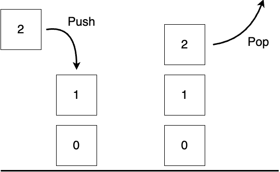
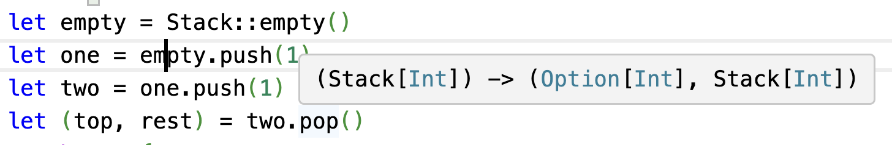
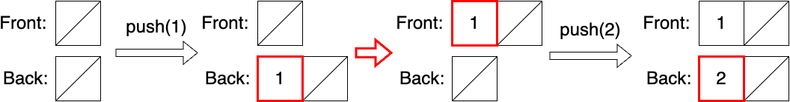
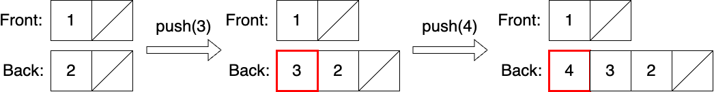
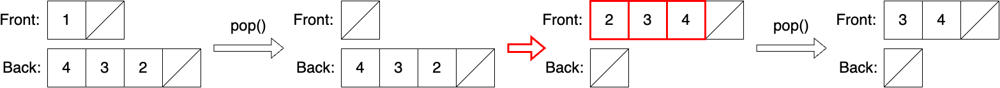
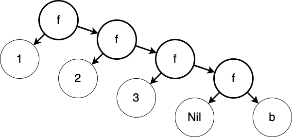
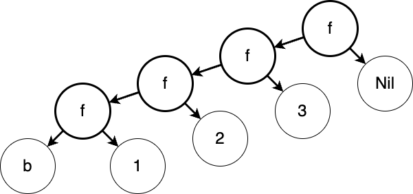

# Programming with MoonBit: A Modern Approach

## Generics and Higher-Order Functions

### MoonBit Open Course Team

# Good Abstractions Designing
- In software engineering, we need to design good abstractions
  - When code is repeated multiple times
  - When the extracted logic has appropriate semantics
- Programming languages provide various means of abstraction
  - Functions, generics, higher-order functions, interfaces, etc.

# Generic Functions and Generic Data

# Stack

- A stack is a collection of objects that are inserted and removed following the Last-In-First-Out (LIFO) principle


# Stack

- We define the following operations using an integer stack `IntStack` as an example
```moonbit no-check
empty: () -> IntStack // Create a new stack
push : (Int, IntStack) -> IntStack // Push a new element onto the stack
pop: IntStack -> (Option[Int], IntStack) // Pop an element from the top
```



# Integer Stack

- We implement the integer stack
  - Keyword `self`  allows chain calls: `IntStack::empty().push(1).pop()`

```moonbit
enum IntStack {
  Empty
  NonEmpty(Int, IntStack)
}
fn IntStack::empty() -> IntStack { Empty }
fn push(self: IntStack, value: Int) -> IntStack { NonEmpty(value, self) }
fn pop(self: IntStack) -> (Option[Int], IntStack) {
  match self {
    Empty => (None, Empty)
    NonEmpty(top, rest) => (Some(top), rest)
  }
}
```
- In fact, lists in MoonBit are essentially stacks

# String Stack

- Besides integers, we also want to store strings

```moonbit
enum StringStack {
  Empty
  NonEmpty(String, StringStack)
}
fn StringStack::empty() -> StringStack { Empty }
fn push(self: StringStack, value: String) -> StringStack { NonEmpty(value, self) }
fn pop(self: StringStack) -> (Option[String], StringStack) {
  match self {
    Empty => (None, Empty)
    NonEmpty(top, rest) => (Some(top), rest)
  }
}
```

- We want to store many types in the stack
  - Do we need to define a stack for each type?
  - `IntStack` and `StringStack` seem structurally identical

# Generic Data Structures & Generic Functions

- **Generic data structures** and **generic functions** use types as parameters to build more abstract structures

```moonbit
enum Stack[T] {
  Empty
  NonEmpty(T, Stack[T])
}
fn Stack::empty[T]() -> Stack[T] { Empty }
fn push[T](self: Stack[T], value: T) -> Stack[T] { NonEmpty(value, self) }
fn pop[T](self: Stack[T]) -> (Option[T], Stack[T]) {
  match self {
    Empty => (None, Empty)
    NonEmpty(top, rest) => (Some(top), rest)
  }
}
```
- Replacing `T` with `Int` or `String` in `Stack[T]` is equivalent to `IntStack` or `StringStack`

# Generic Data Structures & Generic Functions

- We define the type parameters of generics with `[<type1>, <type2>, ...]`
  - `enum Stack[T]{ Empty; NonEmpty(T, Stack[T]) }`
  - `struct Pair[A, B]{ first: A; second: B }`
  - `fn identity[A](value: A) -> A { value }`
  - `Stack` and `Pair` can be regarded as type constructors
- Type parameters are often inferred based on arguments


# Generic Data Structure: Queue

- We define the following operations:
```moonbit no-check
fn empty[T]() -> Queue[T] // Create an empty queue
fn push[T](q: Queue[T], x: T) -> Queue[T] // Add an element to the tail of the queue
// Try to dequeue an element and return the remaining queue; if empty, return itself
fn pop[T](q: Queue[T]) -> (Option[T], Queue[T])
```
- We can simulate a queue with a list (stack), but it's inefficient
  - Adding elements to the back requires reconstructing the entire list
  - `Cons(1, Cons(2, Nil))` => `Cons(1, Cons(2, Cons(3, Nil)))`

# Generic Data Structure: Queue

- We use two stacks to simulate a queue
```moonbit 
struct Queue[T] {
  front: Stack[T] // For removing elements
  back: Stack[T] // For storing elements
}
```
- When adding data, store it in `back`; when reading data, retrieve it from `front`
- After operations, if `front` is empty, reverse the queue and move `back` into `front`
  - Ensure that if the queue is not empty, `front` is not empty
  - The cost of reversing the queue is amortized over multiple reads



# Generic Data Structures: Queue

- We use two stacks to simulate a queue
```moonbit no-check
struct Queue[T] {
  front: Stack[T] // For removing elements
  back: Stack[T] // For storing elements
}
```
- When adding data, store it in `back`; when reading data, retrieve it from `front`
- After operations, if `front` is empty, reverse the queue and move `back` into `front`
  - Ensure that if the queue is not empty, `front` is not empty
  - The cost of reversing the queue is amortized over multiple reads



# Generic Data Structure: Queue

- We use two stacks to simulate a queue
```moonbit no-check
struct Queue[T] {
  front: Stack[T] // For removing elements
  back: Stack[T] // For storing elements
}
```
- When adding data, store it in `back`; when reading data, retrieve it from `front`
- After operations, if `front` is empty, reverse the queue and move `back` into `front`
  - Ensure that if the queue is not empty, `front` is not empty
  - The cost of reversing the queue is amortized over multiple reads



# Generic Data Type: Queue

```moonbit no-check
struct Queue[T] {
  front: Stack[T]
  back: Stack[T]
}
fn Queue::empty[T]() -> Queue[T] { {front: Empty, back: Empty} }
// Store element at the end of the queue
fn push[T](self: Queue[T], value: T) -> Queue[T] { 
  normalize({ ..self, back: self.back.push(value)}) // By defining the first argument as self, we can use xxx.f()
}
// Remove the first element
fn pop[T](self: Queue[T]) -> (Option[T], Queue[T]) { 
  match self.front {
    Empty => (None, self)
    NonEmpty(top, rest) => (Some(top), normalize({ ..self, front: rest}))
  }
}
// If front is empty, reverse back to front
fn normalize[T](self: Queue[T]) -> Queue[T] { 
  match self.front {
    Empty => { front: self.back.reverse(), back: Empty }
    _ => self
  }
}
// Helper function: reverse the stack
fn reverse[T](self: Stack[T]) -> Stack[T] { 
 // Implementation omitted
}
```

# Higher-Order Functions

# Some List Operations

- To calculate the sum of an integer list
```moonbit
fn sum(list: List[Int]) -> Int {
  match list {
    Nil => 0
    Cons(hd, tl) => hd + sum(tl)
  }
}
```
- To calculate the length of a list
```moonbit
fn length[T](list: List[T]) -> Int {
  match list {
    Nil => 0
    Cons(hd, tl) => 1 + length(tl)
  }
}
```

# Some List Operations

- We notice that they have considerable similarities

```moonbit no-check
fn func[A, B](list: List[A]) -> B {
  match list {
    Nil => b // b : B
    Cons(hd, tl) => f(hd, func(tl)) // f : (A, B) -> B 
  }
}
```

- In previous examples
  - In sum, `b` is 0, `f` is `fn f(a, b) { a + b }`
  - In length, `b` is 0, `f` is `fn f(a, b) { 1 + b }`
- How can we reuse this structure?

# Functions as First-Class Citizens

- In MoonBit, functions are first-class citizens. This means that functions can be passed as parameters and can also be stored as results.:
  - For the previous structure, functions can be passed as parameters
```moonbit
fn fold_right[A, B](list: List[A], f: (A, B) -> B, b: B) -> B {
  match list {
    Nil => b
    Cons(hd, tl) => f(hd, fold_right(tl, f, b))
  }
}
```
- Higher-order function: a function that takes functions as parameters or returns functions as results

# Functions as First-Class Citizens
- Repeating a function's computation
```moonbit
fn repeat[A](f: (A) -> A) -> (A) -> A { 
  fn (a) { f(f(a)) }  // Return a function as a result
} 

fn plus_one(i: Int) -> Int { i + 1 }
fn plus_two(i: Int) -> Int { i + 2 }

let add_two: (Int) -> Int = repeat(plus_one) // Store a function

let compare: Bool = add_two(2) == plus_two(2) // true, both equal 4
```

# Simplifying Higher-Order Functions

`let add_two: (Int) -> Int = repeat(plus_one)`
&nbsp;     `repeat(plus_one)`
$\mapsto$ `fn (a) { plus_one(plus_one(a)) }`            Substitute the identifier in the expression

`let x: Int = add_two(2)`
&nbsp;     `add_two(2)`
$\mapsto$ `plus_one(plus_one(2))`          Substitute the identifier in the expression
$\mapsto$ `plus_one(2) + 1`                        Substitute the identifier in the expression
$\mapsto$ `(2 + 1) + 1`                                 Substitute the identifier in the expression
$\mapsto$ `3 + 1` $\mapsto$ `4`

# Function Types

- The type of a function is $(t_\texttt{in}) \rightarrow t_\texttt{out}$, such as
  - `(Int) -> Int` Integers to integers
  - `(Int) -> (Int) -> Int` Integers to a function that accepts integers and returns integers
  - `(Int) -> ((Int) -> Int)` The same as the previous line
   `((Int) -> Int) -> Int` A function that accepts a function 

# Applying Higher-Order Functions: List Folding

- We have already seen one possibility for list folding
```moonbit no-check
fn fold_right[A, B](list: List[A], f: (A, B) -> B, b: B) -> B {
  match list {
    Nil => b
    Cons(hd, tl) => f(hd, fold_right(tl, f, b))
  }
}
```
- This function folds a list from right to left, hence it is called `fold_right`


# Applying Higher-Order Functions: List Folding

- We can also fold from another direction
```moonbit
fn fold_left[A, B](list: List[A], f: (B, A) -> B, b: B) -> B {
  match list {
    Nil => b
    Cons(hd, tl) => fold_left(tl, f, f(b, hd))
  }
}
```
- This function folds a list from left to right, hence it is called `fold_left`


# Applying Higher-Order Functions: List Mapping

- A common operation is to map each element of a list
  - For example, obtaining a list of names from a list of personal information
  - `struct PersonalInfo { name: String; age: Int }`
```moonbit no-check
fn map[A, B](self: List[A], f: (A) -> B) -> List[B] {
  match list {
    Nil => Nil
    Cons(hd, tl) => Cons(f(hd), map(tl, f))
  }
}
let infos: List[PersonalInfo] = ???
let names: List[String] = infos.map(fn (info) { info.name })
```

# Applying Higher-Order Functions: List Mapping

- In fact, we can also implement the `map` function using `fold_right`
```moonbit 
fn map[A, B](list: List[A], f: (A) -> B) -> List[B] {
  fold_right(list, fn (value, cumulator) { Cons(f(value), cumulator) }, Nil)
}
```
- Exercise: How to implement `fold_left` with `fold_right`?

# Binary Search Tree
- We define a more general binary search tree that allows storing data of any type
```moonbit no-check
enum Tree[T] {
  Empty
  Node(T, Tree[T], Tree[T])
}

// We need a comparison function to determine the order of values
// The comparison function should return an integer representing the comparison result
// -1: less than; 0: equal to; 1: greater than
fn insert[T](self: Tree[T], value: T, compare: (T, T) -> Int) -> Tree[T]
fn delete[T](self: Tree[T], value: T, compare: (T, T) -> Int) -> Tree[T]
```

# Summary

- In this chapter, we learned
  - The concepts of generics and functions as first-class citizens
  - Implementations of stacks and queues
- Recommended reading
  - *Software Foundations Volume 1: Logical Foundations* Chapter 4 
  - Or *Programming Language Foundations in Agda* Chapter 10

