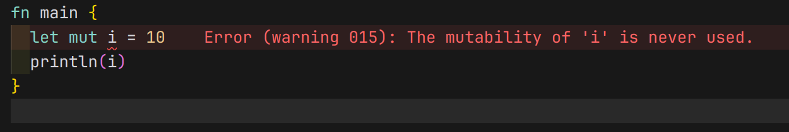

# Modern Programming Ideology: Imperative Programming

## Revisiting Functional Programming

Imperative programming is a style of programming where we give the computer a set of commands to execute, much like giving instructions to a person. It's about telling the computer exactly what to do, step by step. This is different from functional programming, where you define what you want in terms of mathematical functions. In functional programming, the same input will always give you the same output, and there's a concept called "referential transparency," which means you can replace a function call with its result without changing the program's behavior.

However, in the real world, we often need our programs to do more than just calculations. We might need them to read from a file, write to the screen, or change data in memory. These actions are called "side effects," and they can make our programs behave differently each time they run, even with the same input. This breaks the referential transparency, making our programs harder to understand and predict.

```moonbit expr
let x: Int = 1 + 1 // x can be directly replaced with 2
fn square(x: Int) -> Int { x * x };
let z: Int = square(x) // can be replaced with { 2 * 2 }, still resulting in 4
```

Let's look at the example here in MoonBit. We can declare a variable `x` and assign it the result of an expression, like `1 + 1`. This is straightforward and mirrors what we do in mathematics. We can also define a function `square` that takes an integer and returns its square. When we call `square(x)`, we get the result `4`, just like if we replaced `square(x)` with `{ 2 * 2 }`.

## Commands and Side Effects

In MoonBit, we can use the `print` command to output text to the screen. This is a side effect because it changes the state of the world outside our program. When we define a function, we usually want it to return a value, but sometimes we just want to perform an action without a return value. In such cases, we use the `Unit` type, which represents the absence of a meaningful return value, like a placeholder.

```moonbit
fn square(x: Int) -> Int { x * x }
fn init {
  let x: Int = {
    println("hello moonbit") // First, execute the command and perform output
    1 + 1 // Then, take the last value of the expression block as the block's value
  }
  let z: Int = square(x) // Output once
}
```

```moonbit
fn init {
  let z: Int = {
    println("hello moonbit");
    1 + 1
  } * {
    println("hello moonbit");
    1 + 1
  } // return value is also 4, but output twice, which means the block's effect is not equal to x
}
```

Here's a simple example: we define a function `init`, a function that will be executed at the initialization stage of the program, that prints a greeting message and then calculates the value of `x`. The `println` command is executed first, and then the result of the expression `1 + 1` is used as the value of `x`. This function has a side effect (printing), but it also returns a value (the value of `x`), which is why we use the `Unit` type to indicate that the primary purpose of this function is not to return a value.

## Variables and Aliases

In MoonBit, we can create mutable variables using `let mut`. The `mut` keyword tells MoonBit that the variable can change. This is important because it affects how we think about the data. For example, if we have a struct (a collection of values) called `Ref`, we can create a mutable reference with an integer inside it. We can then change the value of that integer, and any other references to the same `Ref` struct will see the updated value. This is because they are aliases, or different names for the same data.

```moonbit
struct Ref[T] { mut val : T }

fn init {
  let ref: Ref[Int] = { val: 1 } // ref itself is just a data binding
  ref.val = 10 // We can modify the fields of the struct
  println(ref.val.to_string()) // Output 10
}
```

Multiple identifiers pointing to the same mutable data structure can be considered aliases, which need to be handled carefully.

```moonbit
fn alter(a: Ref[Int], b: Ref[Int]) -> Unit {
  a.val = 10
  b.val = 20
}

fn init {
  let x: Ref[Int] = { val : 1 }
  alter(x, x)
  println(x.val.to_string()) // x.val will be changed twice
}
```

the `alter` function takes two mutable references to `Ref` structs, and then changes the value of the `val` field of both of them. This means that the `x` variable will also be changed twice, because it's just an alias for the `ref` variable.

## Debugger

Debugging is like being a detective. You're trying to figure out why your program isn't working as expected. MoonBit's debugger is a tool that helps you do this by showing you what's happening inside your program as it runs. You can pause the program at any point, look at the values of variables, and step through the code one line at a time. This is incredibly useful for understanding complex behavior and fixing bugs.


## Loops

Loops are a way to repeat a block of code multiple times. In MoonBit, we can use a `while` loop to do this. We start by defining a loop variable, say `i`, and giving it an initial value. Then we check the condition defined in the `while` loop. If the condition is true, we execute the commands inside the `while` loop's body. This process repeats until the condition is no longer true, at which point the loop ends. To avoid an infinite loop, we need to update the loop variable inside the loop body.

```moonbit
fn init {
  let mut i = 0
  while i < 2 {
    println("Output")
    i += 1
  } // Repeat output 2 times
}
```

For example, we might want to print the numbers from `0` to `1`. We can do this with a loop that checks if `i` is less than `2`. If it is, we print the current value of `i`, increment `i` by `1`, and then repeat the process. The loop continues until `i` is no longer less than `2`, and then we're done.

### Loops and Recursion

Loops and recursions are equivalent. A loop is a set of instructions that we repeat until a certain condition is met, while recursion is a way of solving a problem by breaking it down into smaller, similar problems. In programming, we can often rewrite a loop as a recursive function and vice versa.

For example, let's consider calculating the Fibonacci sequence. We can do this with a loop that keeps track of the last two numbers and updates them as it goes. Alternatively, we can write a recursive function that calls itself with smaller numbers until it reaches the base cases (0 and 1).

```moonbit
// Loop form
fn init {
  let mut i = 0
  while i < 2 {
    println("Hello!")
    i = i + 1
  }
}
```

// Recursive form

```moonbit
fn loop_(i: Int) -> Unit {
  if i < 2 {
    println("Hello!")
    loop_(i + 1)
  } else { () }
}
fn init {
  loop_(0)
}
```

### Controlling Loop Flow

Sometimes we want to control the flow of a loop more precisely. We might want to skip the rest of the current iteration or exit the loop entirely. In MoonBit, we can use `break` to exit a loop early or `continue` to skip the rest of the current iteration and move on to the next one.

For example, if we're printing numbers from `0` to `9`, but we want to skip the number `3`, we can use `continue` in the loop condition. If we want to stop the loop entirely when we reach `3`, we can use `break`.

```moonbit
fn print_first_3_break() -> Unit {
  let mut i = 0
  while i < 10 {
    i += 1
    print(i)
    println(" yes")
    if i == 3 {
      break // Skip from 3 onwards
    } else {
      println(i.to_string())
    }
  }
}
```

the excepted output is

```text
1 yes
2 yes
```

but if we change `break` to `continue`

```moonbit
fn print_first_3_continue() -> Unit {
  let mut i = 0
  while i < 10 {
    i += 1
    print(i)
    println(" yes")
    if i == 3 {
      continue // go into the next iteration
    } else {
      println(i.to_string())
    }
  }
}
```

the excepted output is

```text
1 yes
2 yes
 yes
 yes
 yes
 yes
 yes
 yes
 yes
```

- ## MoonBit Check

MoonBit has some built-in checks to help us write better code. It checks if a variable that's supposed to be mutable has been modified, which can help us catch mistakes like forgetting to update a loop counter. It also checks that the return value of a function matches the declared return type, which helps us avoid type errors.



## Mutable Data

Mutable data is data that can be changed after it's been created. This is different from immutable data, which can't be altered once it's defined. Mutable data can be very useful for things like directly controlling hardware, improving performance with data structures like arrays, constructing complex data structures, and saving space by modifying data in place instead of creating new copies.

While mutable data can make our programs more complex and harder to reason about, it doesn't necessarily conflict with the concept of referential transparency. For example, when calculating the Fibonacci sequence, even though we're using mutable data to store intermediate results, the final output is still determined solely by the input, so we can still reason about the function as if it were pure.

```moonbit
fn fib_mut(n: Int) -> Int {
  let mut acc1 = 0; let mut acc2 = 1; let mut i = 0
  while i < n  {
    let t = acc1 + acc2
    acc1 = acc2;  acc2 = t
    i = i + 1
  }
  acc1
}
```

But we can't say everying mutable will break referential transparency. For example, we can't say that the previous function is pure, because it modifies the value of `acc1`, `acc2` and `i`. But for the identical input, we can say that the output is always the same.

## Summary

In this chapter, we've explored the basics of imperative programming. We've learned about using commands to tell the computer what to do, variables to store values, and loops to repeat actions. Imperative programming is inherently different from functional programming, and it's important to understand the trade-offs between the two. By understanding these concepts, we can choose the right tools for the job and write programs that are both effective and easy to understand.
