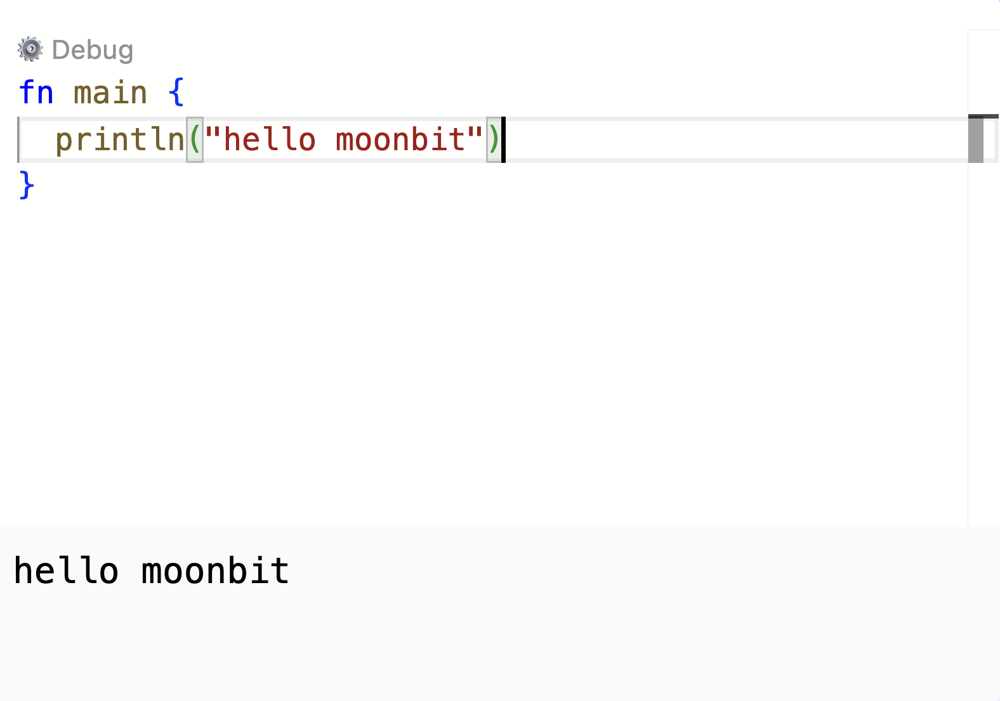
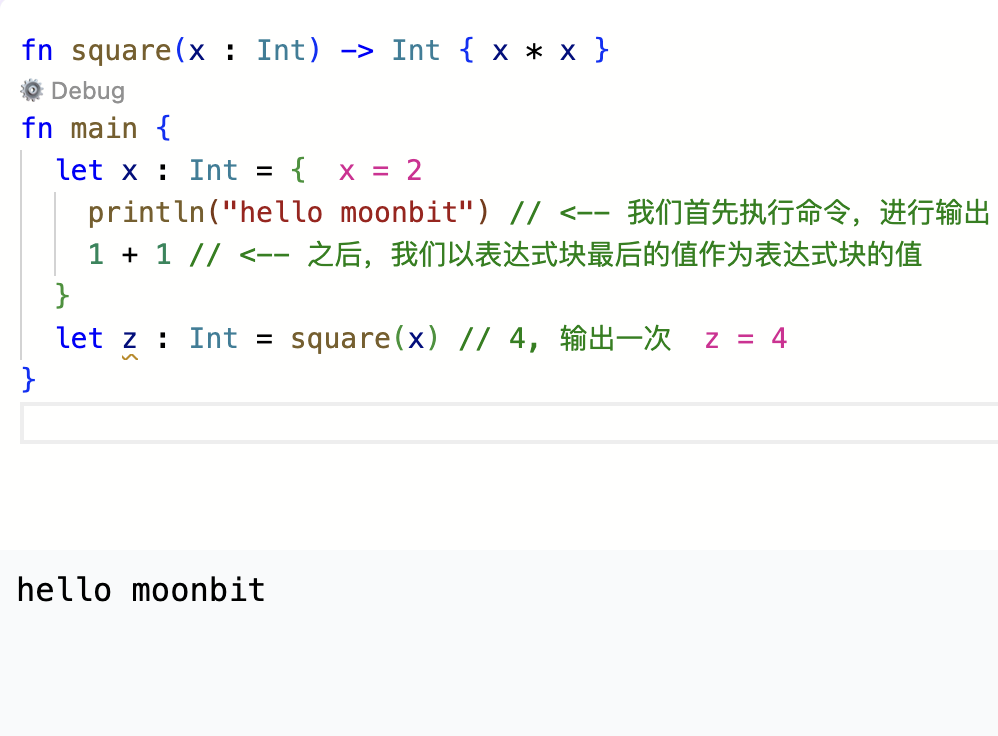
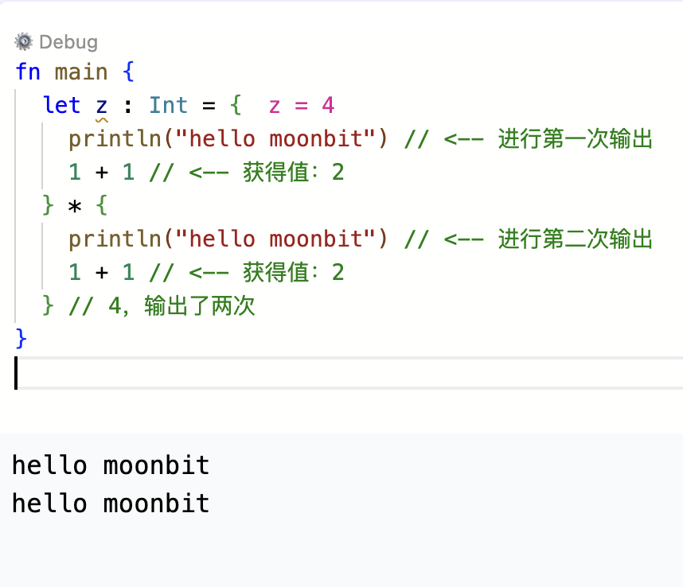
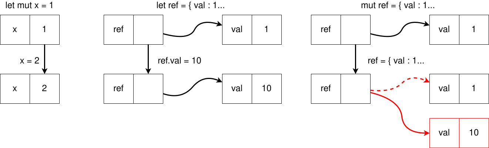
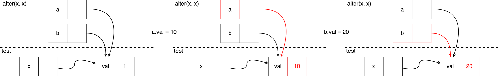

# 现代编程思想

## 命令式编程

### 月兔公开课课程组

<!-- ssml 
  大家好，欢迎来到由IDEA研究院基础软件中心为大家带来的现代编程思想公开课。
  今天是第七节课，主题是命令式编程。
  <break time="500ms" />
-->

# 函数式编程

- 到此为止，我们介绍的编程知识可以归类于函数式编程的范畴
  - 对每一个输入，有着固定的输出
  - 对于标识符，我们可以直接用它所对应的值进行替代——引用透明性
- 开发实用的程序，我们需要一些计算之外的“副作用”
  - 进行输入输出
  - 修改内存中的数据等
  - 这些副作用可能导致多次执行的结果不一致

<!-- ssml 
  到目前为止，我们介绍的编程知识都可以归类在函数式编程的范畴。
  那么什么是函数式编程呢？
  函数式编程，顾名思义，类似于数学中的函数，对于每一个输入，总是有着特定的输出。
  对于每个标识符，我们可以直接用定义的值进行替代，这个性质被称为引用透明性。
  不过，为了开发一些实用的程序，我们通常会需要计算以外的一些副作用。
  举例来说，我们可能需要进行输入输出，我们可能要修改内存中的数据等。
  这些副作用就有可能会破坏我们的引用透明性，使得多次执行的结果不一致。
  <break time="500ms" />
-->

# 引用透明性

- 我们可以定义如下数据绑定和函数
```moonbit expr
let x : Int = 1 + 1
fn square(x : Int) -> Int { x * x }
let z : Int = square(x) // 4
```
- 我们可以将 `square` 与 `x` 直接用对应的值替换而不改变结果
```moonbit expr
let z : Int = { 2 * 2 } // 4
```
- 引用透明性可以易于理解

<!-- ssml 
  让我们先来看一个简单的例子，重新回顾一下我们之前学习的化简规则。
  我们定义如下的数据绑定和函数：
  一个值为 2 的 x，以及一个计算整数平方的 square 函数。
  之后，我们应用 square 函数对 eks 进行运算。
  我们可以简单地将 square 与 eks 分别用它们的定义替换，运算的结果事实上是一样的。
  这也是我们一直以来介绍的运算规则：将标识符用定义的数据进行替换。
  这样的引用透明性规则十分简单，十分易于理解。
  而我们接下来要看到的就不一定了。
  <break time="500ms" />
-->

# 命令

- 函数 `println` 允许我们输出一个字符串，例如 `println("hello moonbit")`
- 月兔中 `main` 函数即为程序入口

```moonbit no-check
fn main {
  println("hello moonbit")
}
```



<!-- ssml
  我们首先来介绍一个简单的命令：函数 print line。
  在月兔中，print line 被用来输出一个字符串，并在结尾换行，例如 print line <lang xml:lang="en-US">Hello MoonBit!</lang> 就会输出字符串 <lang xml:lang="en-US">Hello MoonBit</lang>。
  月兔中，main 函数是程序的入口，也就是程序会从这里开始执行。
  main 函数没有任何参数，也不需要在函数名后写上括号。
  我们将两者组合起来，使用 print line 作为输出。
  在我们的语言导览网页环境运行这段代码，可以看到它在下方输出了我们所想要显示的字符。
  <break time="500ms" />
-->

# 命令与副作用
- 输出命令可能会破坏引用透明性



<!-- ssml 
  在这里，我们展示副作用对于程序理解的影响。
  我们在这里依然定义了我们的平方函数。
  与之前不同的是，我们的 eks 的定义变<phoneme alphabet="sapi" ph="wei 2">为</phoneme>了一个代码块，并且这个代码块中，除了 1 + 1 作为绑定的值，还有一个额外的命令，这个命令会输出 <lang xml:lang="en-US">hello moonbit</lang>。
  这个时候，我们不能简单地对标识符 eks 进行替换操作，而是要先对 eks 的定义进行求值，再用求得的值，替换 eks 出现过的地方。
  在这里，执行顺序从上到下。
  我们首先计算 eks 的值。计算 eks 的值的时候也是从上到下，先执行输出命令，因此我们在下方结果中可以看到一次输出。
  之后我们获得 2 作为整个代码块的值绑定到 eks 上。
  之后，再出现 eks 的时候，便会用 2 替代。
  例如之后的 z 的值，就会是 2 乘以 2 的结果，也就是 4。
  <break time="500ms" />
-->

# 命令与副作用
- 我们不一定可以放心替换，因此会增大程序理解难度



<!-- ssml 
  而如果我们按照之前的那样，直接将所有 eks 和 square 出现的地方替换为定义的话，便会如代码所示。
  我们再来捋一下这一个部分。
  首先，我们计算乘号左右两侧代码块的值，最后将两者相乘。
  求乘号左侧代码块的时候，我们从上到下依次执行，进行了一次输出，获得了值 2。
  之后我们对乘号右侧代码块进行求值，进行了一次输出，获得了值 2。
  因此，我们在下方的运行结果中可以看到，此时的运行结果是两次输出，而非一次输出。
  因此我们可以看到，命令带来的副作用会破坏引用透明性，让代码的理解难度加大。
  <break time="500ms" />
-->

# 单值类型

- 我们之前已经介绍过单值类型 `Unit`
  - 它仅有一个值：`()`
- 以 `Unit` 为运算结果类型的函数或命令一般有副作用
  - `fn println(String) -> Unit`
- 命令的类型也是单值类型
```moonbit
fn do_nothing() -> Unit {
  let _x = 0 // 结果为单值类型，符合函数定义
}
```

<!-- ssml
  大家可能会好奇，命令有没有值，以及输出函数的值是什么。
  通常情况下，我们在执行带有副作用的命令后，可能不关心它的具体运行状况，那么这种时候我们一般会用单值类型 Unit 来表示。
  它也可以看成是长度为零的多元组。
  我们可以声明如下函数的返回值类型为 Unit。
  可以看到，let 语句本身也是有值的，这个值就是单值类型，它符合整个函数的类型声明，因此可以正常编译。
  <break time="500ms" />
-->

# 变量

- 在月兔中，我们可以在代码块中用 `let mut` 定义临时变量

```moonbit
test {
  let mut x = 1
  x = 10 // 赋值操作是一个命令
}
```

- 在月兔中，结构体的字段默认不可变，我们也允许可变的字段，需要用 `mut` 标识
```moonbit
struct Ref[T] { mut val : T }

test {
  let ref : Ref[Int] = { val : 1 } // ref 本身只是一个数据绑定
  ref.val = 10 // 我们可以修改结构体的字段
  inspect(ref.val, content="10") // 输出 10
}
```

<!-- ssml
  接下来我们要介绍的是变量。
  在月兔中，我们可以通过 let <lang xml:lang="en-US"><phoneme alphabet="ipa" ph="mjuːt">mut</phoneme></lang> 在代码块中定义变量。
  我们通过 let <lang xml:lang="en-US"><phoneme alphabet="ipa" ph="mjuːt">mut</phoneme></lang> 定义一个标识符，给它赋予最初的值。
  之后，我们可以通过 eks 等于 10 的形式来更换其中的值。
  赋值操作是一个命令，因此它的值也是单值类型 Unit。
  <break time="500ms" />
  我们之前介绍过结构体。
  在月兔中，结构体的字段默认是不可变的。
  不过，我们也允许可变的字段。
  这样的字段需要通过 <lang xml:lang="en-US"><phoneme alphabet="ipa" ph="mjuːt">mut</phoneme></lang> 来标识。
  例如下面的例子中，<lang xml:lang="en-US">ref</lang> 的 val 字段是可变的。
  之后，我们可以通过 <lang xml:lang="en-US">ref</lang> 点 val 来访问这个值，也可以通过 <lang xml:lang="en-US">ref</lang> 点 val 等于 10 来对这个值进行修改。
  <break time="500ms" />
-->

# 变量

- 枚举类型带标签的负载值也可以标识为 `mut`

```moonbit
enum List[T] {
  Nil
  Cons(mut head~ : T, mut tail~ : List[T])
} derive(Show)

test {
  let a = Cons(head=1, tail=Nil)
  let b = Cons(head=2, tail=Nil)
  match b {
    Nil => panic()
    Cons(_) as cons => {
      cons.head = 2
      cons.tail = a
    }
  }
  inspect(b, content="Cons(head=2, tail=Cons(head=1, tail=Nil))")
}
```

<!-- ssml
  对于枚举类型，带标签的负载值也可以通过 <lang xml:lang="en-US"><phoneme alphabet="ipa" ph="mjuːt">mut</phoneme></lang> 来标识。
  我们看这个列表的例子。Cons 的两个负载值 head 和 tail 都是可变的。
  此时，我们可以用模式匹配，在匹配到 Cons 情形时，用 as 将它绑定到一个新的名字，然后借助这个名字就可以改变 head 和 tail 的值。
  <break time="500ms" />
-->

# 变量

- 我们可以将带有可变字段的结构体看作是引用




<!-- ssml
  我们可以把变量看做是一个放着值的盒子，当我们修改变量的时候，我们是在替换盒子中存放的值。
-->

# 变量

- 我们可以将带有可变字段的结构体看作是引用


<!-- ssml
  例如当我们定义 let <lang xml:lang="en-US"><phoneme alphabet="ipa" ph="mjuːt">mut</phoneme></lang> 为1的时候，我们创建了一个名称为 eks 的盒子，其中存放的值，是1.
-->

# 变量

- 我们可以将带有可变字段的结构体看作是引用


<!-- ssml
  我们执行 eks = 2 这个命令，替换了盒子中的值，为2.
-->

# 变量

- 我们可以将带有可变字段的结构体看作是引用


<!-- ssml
  当这个盒子装着结构体的时候，变量可以看成是指向这个结构体的引用。
-->

# 变量

- 我们可以将带有可变字段的结构体看作是引用


<!-- ssml
  我们用 let 将标识符 <lang xml:lang="en-US">ref</lang> 绑定到一个结构体。
-->

# 变量

- 我们可以将带有可变字段的结构体看作是引用


<!-- ssml
  当我们用 <lang xml:lang="en-US">ref</lang> 修改结构体中的值的时候，
-->

# 变量

- 我们可以将带有可变字段的结构体看作是引用


<!-- ssml
  我们修改的，是这个结构体中装的可变字段，
-->

# 变量

- 我们可以将带有可变字段的结构体看作是引用


<!-- ssml
  因此 <lang xml:lang="en-US">ref</lang> 本身并没有发生变化。
-->

# 变量

- 我们可以将带有可变字段的结构体看作是引用


<!-- ssml
  在最后一个例子中，我们定义了一个可变的 <lang xml:lang="en-US">ref</lang>，并对它进行修改，
-->

# 变量

- 我们可以将带有可变字段的结构体看作是引用


<!-- ssml
  我们其实创建了一个新的盒子，并将 ref 修改<phoneme alphabet="sapi" ph="wei 2">为</phoneme>了指向新的盒子的引用。
  <break time="500ms" /> 
-->

# 别名

- 指向相同的可变数据结构的两个标识符可以看作是别名

```moonbit
fn alter(a : Ref[Int], b : Ref[Int]) -> Unit {
  a.val = 10
  b.val = 20
}

test {
  let x : Ref[Int] = { val : 1 }
  alter(x, x)
  inspect(x.val, content="20") // x.val的值将会被改变两次
}
```

<!-- ssml
  那既然是引用，我们当然也可以有多个标识符，指向同一个结构体。
  这种情况我们可以把这些标识符看作是别名。
  例如我们首先定义了一个 alter 函数，它接受两个结构体，并且挨个修改这两个结构体中存放的值。
  之后我们在主程序中定义一个 x，存放了 1。
  我们将 eks 作为参数传给 alter。
  注意，这里的参数 a 和 b，我们都传了 x，因此实际上，x 会发生两次变化，最终变为 20。
  <break time="500ms" />
-->

# 别名

- 指向相同的可变数据结构的两个标识符可以看作是别名



- 可变变量需要小心处理


<!-- ssml 
  让我们看一下流程图。
-->

# 别名

- 指向相同的可变数据结构的两个标识符可以看作是别名


- 可变变量需要小心处理


<!-- ssml 
  当我们计算 alter x x 的时候，原本函数中定义的 a 和 b 都被替换<phoneme alphabet="sapi" ph="wei 2">为</phoneme>了 x，因为这是我们传进的参数。
-->

# 别名

- 指向相同的可变数据结构的两个标识符可以看作是别名


- 可变变量需要小心处理


<!-- ssml 
  而我们刚才解释过，当盒子装着结构体的时候，变量是一个指向结构体的引用，
-->

# 别名

- 指向相同的可变数据结构的两个标识符可以看作是别名


- 可变变量需要小心处理


<!-- ssml 
  因此 a 和 b 实质上是相同的引用，都在指向右下角的结构体。之后我们逐个执行指令。
-->

# 别名

- 指向相同的可变数据结构的两个标识符可以看作是别名


- 可变变量需要小心处理


<!-- ssml 
  首先，我们修改原来的 a，
-->

# 别名

- 指向相同的可变数据结构的两个标识符可以看作是别名


- 可变变量需要小心处理


<!-- ssml 
  于是，结构体的值按照我们的命令发生了变化。
-->

# 别名

- 指向相同的可变数据结构的两个标识符可以看作是别名


- 可变变量需要小心处理


<!-- ssml 
  之后我们修改 b。此时，结构体的值再次发生变化。
-->

# 别名

- 指向相同的可变数据结构的两个标识符可以看作是别名


- 可变变量需要小心处理


<!-- ssml 
  由于它们实质上指向的是同样的结构体，也就是最初 eks 指向的结构体，因此在程序结束之后，x 的值是 20。
  <break time="500ms" />
-->


# 别名

- 指向相同的可变数据结构的两个标识符可以看作是别名


- 可变变量需要小心处理


<!-- ssml 
  以上便是第一部分的内容，下节课我们介绍循环。
-->