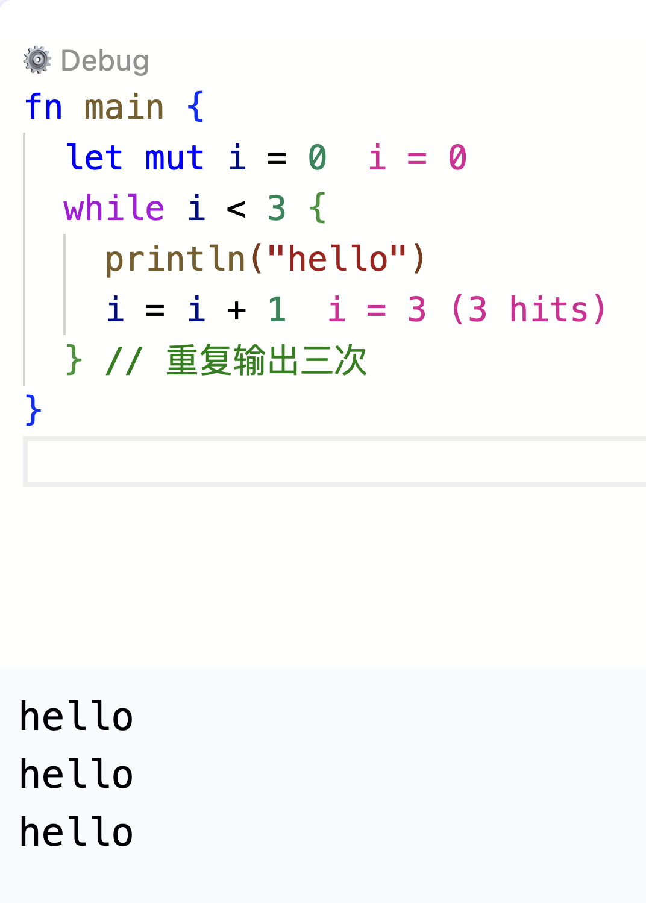
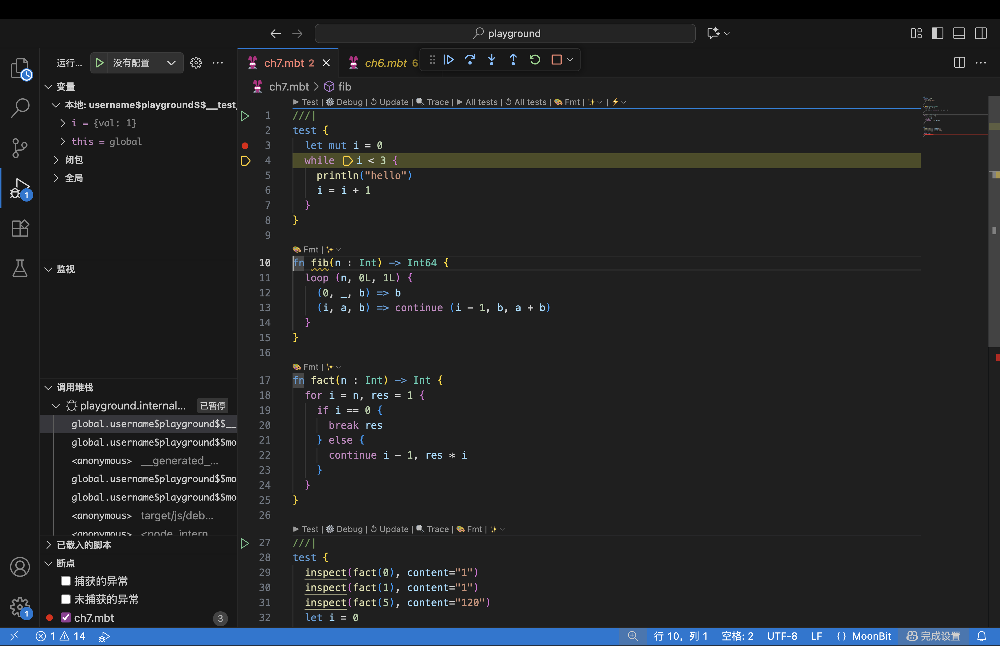
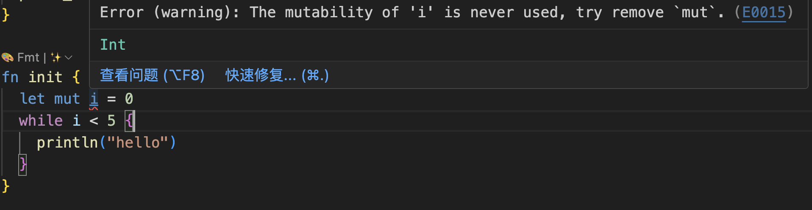
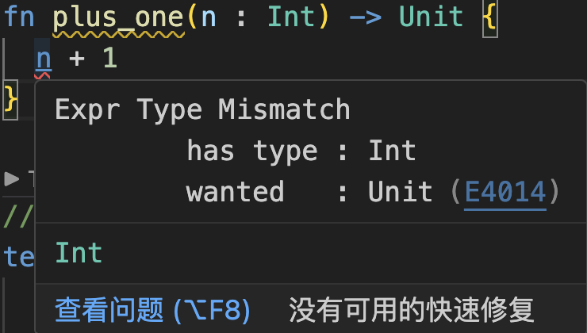

# 现代编程思想

## 命令式编程

### 月兔公开课课程组

<!-- ssml
  大家好，欢迎来到由IDEA研究院基础软件中心为大家带来的现代编程思想公开课。
  这节课我们介绍循环。
  <break time="500ms" />
-->

# 循环 

- 多次执行同一段代码
- `while`, `for`, `loop`
- 循环结构也是一个表达式

<!-- ssml 
  多次执行同一段代码是很常用的。我们曾经使用递归来多次进行同样的计算，现在让我们学习另一种方式，也就是循环。
  月兔提供了三种循环，while, <phoneme alphabet="sapi" ph="fo 4">for</phoneme> 和 loop。
  在月兔中，循环结构也是一个表达式，这意味着，它可以被化简为一个值。
  让我们从最简单的 while 循环开始。
  <break time="500ms" />
-->

# while 循环 

```moonbit expr 
let mut i = 0
while i < 3 {
  println("hello")
  i = i + 1
} // 重复输出三次
```



<!-- ssml 
  第一个例子，是将字符串打印3次。我们可以结合变量和 while 循环来做到这一点。
  在这段代码中，我们定义了一个变量 i，它的初始值是0. 
  当 i 小于 3 时，花括号内的代码会被反复执行。
  在导览网站，可以看到，这段代码打印了3次 hello。
  <break time="500ms" />
-->

# while 循环 

```moonbit no-check 
while <条件表达式> {
  <循环体>
}
```

- 当条件为真，执行循环体，并回到条件表达式进入下一次判断
- 当条件为假，退出循环体

<!-- ssml
  更准确地说，while 循环包含一个条件判断语句，和一个循环体。
  执行 while 循环时，会首先检查条件表达式是否满足，如果满足，就执行循环体，然后再回到条件表达式的开头；如果不满足，就退出整个循环。
  <break time="500ms" />
-->

# while 循环 

- 利用变量设定循环条件

```moonbit no-check 
<定义变量及初始值>
while <针对变量判断是否继续循环> {
  <需要重复执行的命令>
  <对变量进行更新>
}
```

- 例如，我们可以反复执行3次输出操作 

```moonbit expr 
let mut i = 0
while i < 3 {
  println("hello")
  i = i + 1
} // 重复输出三次
```

<!-- ssml
  利用变量，我们可以设定循环条件，在合适的时候跳出循环，以避免循环体无穷无尽地进行，陷入死循环。
  常见的做法是，在进入循环前定义一个变量，针对变量来判断是否要继续循环，然后在循环体的末尾对这个变量进行修改。
  如刚刚的例子，在进入循环前，我们定义了变量 i，在条件判断处，我们借助 i 的值判断循环进行了几次，并且，在循环体的末尾，将 i 的值更新为原来的值 加1.
  这样，我们可以保证，print line hello 这行代码，刚好会执行3次。
  <break time="500ms" />
-->

# 调试器

- 月兔的调试器允许我们在运行中看到实时的运行数据，更好理解运行过程


<!-- ssml
月兔提供了调试器。
利用调试器，可以更好地观察到程序的运行行为。
调试器可以逐步执行代码，并实时展示效果。
在导览网站和本地环境都可以使用调试器。
-->

<!-- video debug.mov ssml 
下面我们在本地环境展示调试器的使用。
我们逐步执行语句，可以看到我们首先进行了判定，之后则打印字符串，最后对变量进行修改。
我们可以在左侧看到我们的数据的变化。
由于 i 现在是 0，0 小于 3，所以进入循环体。
第一次进入循环时，打印了一次 hello，i 更新为 1.
第二次进入循环，再次打印 hello，i 更新为 2. 
第三次，打印 hello，i 更新为 3. 
此时，i 小于 3 这个条件不再被满足，因此退出循环，程序结束。
<break time="500ms" />
-->

# while 循环的 else 块

- 在 while 循环的末尾可以加上一个 else 块
- 循环条件为假时，会执行一次 else 块
- else 块的值即是整个 while 循环表达式的值
- 例子：
  ```moonbit expr 
  let mut i = 0
  let n = while i < 3 {
    println("hello")
    i = i + 1 
  } else {
    println("end")
    i
  }
  ```

<!-- ssml
  另外，while 循环的末尾还可以加上一个 else 块。
  当循环条件为假时，else 块的内容会被执行。
  并且，如果 else 块有返回值，这个值即为整个 while 语句的值。
  例如下方的代码，会在打印3次 hello 之后，打印一次 end。
  并且，最终会把 n 绑定为 else 块中变量 i 的值，也就是3.
  <break time="500ms" />
-->

# 循环与递归

- 事实上，循环与递归是等价的
```moonbit skip
let mut <变量> = <初始值>
while <判断是否继续循环> {
  <需要重复执行的命令>
  <对变量进行更新>
}
```
- 利用可变变量的情况下可以写成
```moonbit skip
fn recurse(<参数>) -> Unit {
  if <判断是否继续循环> {
    <需要重复执行的命令>
    recurse(<更新后的参数>)
  } else { () }
}
recurse(<初始值>)
```

<!-- ssml 
  循环事实上和递归是等价的。
  对于一个循环，我们可以将它写成递归的形式。
  我们定义一个函数 recurse，它的参数是循环的计数器。
  我们在函数中定义一个条件判断，如果无需继续循环，那么我们直接返回单值类型。
  如果需要继续循环，那么我们执行命令，并且将更新后的参数作为新的参数传进递归调用的 recurse 函数中去。
  而初始值则是在使用 recurse 函数的时候传入。
  <break time="500ms" />
-->

# 循环与递归

- 例如下述两段代码执行效果相同
```moonbit expr 
let mut i = 0
while i < 2 {
  println("Hello!")
  i = i + 1
}
```

```moonbit expr
fn recurse(i : Int) -> Unit {
  if i < 2 {
    println("Hello!")
    recurse(i + 1)
  } else { () }
}
recurse(0)
```

<!-- ssml
  例如，这里的两段代码的效果是完全相同的。
  <break time="500ms" />
-->

# 循环的控制

- 循环执行的时候，可以提前中止循环，或是跳过后续命令的执行
  - `break` 指令可以中止循环
  - `continue` 指令可以跳过后续运行，直接进入下一次循环
  ```moonbit
  fn print_first_3() -> Unit {
    let mut i = 0
    while i < 10 {
      if i == 3 {
        break // 跳过从3开始的情况
      } else {
        println(i)
      }
      i = i + 1
    }
  } // 打印 0, 1, 2
  ```

<!-- ssml
  我们有的时候并不希望循环一直进行下去。
  例如，如果我们在查找某个值，当我们找到之后，我们会提前中止循环。
  那么这个时候，我们就有其他的选项来改变我们的控制流。
  break 可以被用来提前中止我们的循环。
  例如在下面的例子中，我们可以跳过从 3 开始的情况。
  这个循环在计数器到达3时终止，因此会打印 0, 1, 2.
  <break time="500ms" /> 
-->

# 循环的控制

- 循环的时候，可以提前中止循环，或是跳过后续命令的执行
  - `break` 指令可以中止循环
  - `continue` 指令可以跳过后续运行，直接进入下一次循环
  ```moonbit
  fn print_skip_3() -> Unit {
    let mut i = 0
    while i < 10 {
      i = i + 1
      if i == 4 {
        continue // 跳过3
      }
      println(i - 1)
    }
  } // 打印 0, 1, 2, 4, 5, 6, 7, 8, 9
  ```

<!-- ssml
  continue 则可以被用来跳过当前循环中剩下的内容，在复杂的结构中会比较好用。
  例如在下面的例子中，我们在循环体开头更新了计数器 i，在循环体末尾打印 i 减 1.
  当计数器为 4 时，continue 会跳过 print line 语句，直接进入下一轮循环。
  这个循环会打印除了3以外的，剩下9个整数。
  <break time="500ms" /> 
-->

# for 循环 

```moonbit no-check 
for <定义变量及初始值>; <判断是否继续循环>; <对变量进行更新> {
  <需要重复执行的命令>
}
```

等价于

```moonbit no-check
<定义变量及初始值>
while <判断是否继续循环> {
  <需要重复执行的命令>
  <对变量进行更新>
}
```

<!-- ssml
  现在，我们来介绍不同于 while 的另一种循环，<phoneme alphabet="sapi" ph="fo 4">for</phoneme> 循环。
  刚刚介绍过，使用 while 循环时，我们经常会用一个变量来判断是否继续循环，并在循环体的末尾对变量进行更新。
  在这种情况下，<phoneme alphabet="sapi" ph="fo 4">for</phoneme> 循环非常方便。
  <phoneme alphabet="sapi" ph="fo 4">for</phoneme> 循环的语法，是在 <phoneme alphabet="sapi" ph="fo 4">for</phoneme> 后面写三个用分号分隔的语句或表达式。
  第一个语句用于定义变量及其初始值，第二个表达式用来判断是否继续循环，第三个语句对变量进行更新。
  然后用花括号包裹需要重复执行的命令。
  上面的 <phoneme alphabet="sapi" ph="fo 4">for</phoneme> 循环，和下面的 while 循环，含义是等价的。
  <break time="500ms" />
-->

# for 循环

- for 循环例子：
  ```moonbit expr 
  for i = 0; i < 3; i = i + 1 {
    println("hello")
  }
  ```

- for 循环的变量定义无需用 `let mut` 
- for 循环限制了对循环变量的修改
- 变量 `i` 在循环体外不可见
  ```moonbit expr 
  for i = 0; i < 3; i = i + 1 {
    println("hello")
    i = i + 1 // 不合法！循环变量不可在此处修改
  }
  ```

<!-- ssml
  例如，上面这段代码同样打印三次 hello。
  和 while 循环有三个不同点，
  第一，定义循环变量 i 的语句，不需要用 let <lang xml:lang="en-US"><phoneme alphabet="ipa" ph="mjuːt">mut</phoneme></lang>. 
  第二，循环变量无法在其它的位置进行更改，例如，我们无法在循环体内修改 i 的值。
  第三，变量 i 仅在循环体内可见，不会对循环体外的后续代码环境造成污染。
  因为通常情况下，我们仅仅应该在循环变量更新处，来修改循环变量，这个特性可以防止我们写出错误或者过于复杂的循环。
  <break time="500ms" />
-->

# for 循环

- 不使用变量更新语句，也可以更新变量。例如
  ```moonbit expr 
  for i = 0 {
    if i < 3 {
      println("hello")
      continue i + 1 
    } else {
      break 
    }
  }
  ```

- 这是**函数式循环**的典型用例

<!-- ssml
  结合刚刚介绍的 continue 和 break 指令，<phoneme alphabet="sapi" ph="fo 4">for</phoneme> 循环甚至允许我们不写循环条件和变量更新语句。
  例如此处，在 <phoneme alphabet="sapi" ph="fo 4">for</phoneme> 关键字后面，我们仅声明了循环变量 i 和初始值 0. 
  而在循环体内，我们通过条件判断和 break 指令，在 i 小于 3 不被满足时跳出循环。
  同时，我们引入了一个新的做法，在 continue 指令后面，用一个表达式，表示下一次进入循环时，循环变量的值。
  例如，第一次进入循环时，i 为 0.
  在执行 continue i 加 1 后，再次进入循环，此时 i 的值更新成了 1.
  其实，不仅 continue 可以带上表达式，break 也可以带上表达式，而这些，都是函数式循环的特征。
  <break time="500ms" />
-->

# 函数式循环 

- 函数式 loop 循环和函数式 for 循环
- 不显式为循环变量赋值
- 循环中使用 `break <表达式>` 退出循环，并得到一个值
- 循环中使用 `continue <表达式>` 带着一个值进入下一轮循环

<!-- ssml
  什么是函数式循环呢？
  函数式循环既可以重复执行一段代码，但又不会明显地使用变量。
  而是通过灵活使用 break 和 continue 指令来更新循环变量并获得计算结果。
  在 break 后的表达式意味着跳出循环时，会将表达式作为整个循环的返回值。
  在 continue 后的表达式意味着下一次进入循环时，循环变量更新后的值。
  <break time="500ms" />
-->

# 函数式 for 循环

```moonbit 
fn fact(n : Int) -> Int {
  for i = n, result = 1 {        // 初始化循环变量
    if i == 0 {
      break result               // 将 result 作为整个循环的值
    } else {
      continue i - 1, result * i // 带着更新后的循环变量进入下一轮循环
    }
  }
}

test {
  inspect(fact(5), content="120")
}
```

<!-- ssml
  下面我们看一个更复杂的例子。
  这个例子中，我们使用函数式的 <phoneme alphabet="sapi" ph="fo 4">for</phoneme> 循环来计算阶乘。
  在代码的第二行，我们定义了两个循环变量，i 和 <lang xml:lang="en-US">result</lang>。
  并分别为它们赋予初始值，n 和 1.
  其中，i 代表我们正在处理的数字，它会从 n 开始，反复减 1，直到为0. 
  而在这个过程中，我们不断更新计算的结果，每经历依次循环，计算结果 <lang xml:lang="en-US">result</lang> 就会乘上 i。
  当 i 等于 0 时，意味着我们的阶乘计算已经结束，这时使用 break <lang xml:lang="en-US">result</lang> 来退出循环，并把 <lang xml:lang="en-US">result</lang> 当做循环的返回值。
  由于这个循环是 fact 函数内唯一的表达式，所以 <lang xml:lang="en-US">result</lang> 同时也是 fact 函数的返回值。
  在测试代码中，我们验证 5 的阶乘，为一百二十。
  <break time="500ms" />
-->

# loop 循环 

- 函数式 for 循环结合模式匹配

```moonbit no-check 
loop <初始值> {
  <模式1> => <表达式1>
  <模式2> => <表达式2>
  ...
}
```

等价于 

```moonbit no-check 
for <变量> = <初始值> {
  match <变量> {
    <模式1> => break <表达式1>
    <模式2> => break <表达式2>
    ...
  }
}
```

<!-- ssml
  当我们在循环体内，需要对循环变量进行模式匹配时，可以使用 loop 循环。
  loop 循环无需定义循环变量，只需要定义初始值。在循环体内，直接对循环变量进行模式匹配。
  除非使用 continue，否则 loop 循环的默认行为是跳出循环。并 以模式匹配右侧的表达式 作为整个循环的返回值。
  loop 循环相当于用 <phoneme alphabet="sapi" ph="fo 4">for</phoneme> 循环定义一个循环变量，并且循环体内只有一个模式匹配语句，匹配的对象刚好也是循环变量。
  <break time="500ms" />
-->

# loop 循环

```moonbit 
fn fact_with_loop(n : Int) -> Int {
  loop (n, 1) { // 初始化循环变量
    // 将 result 作为整个循环的值
    (0, result) => result                 
    // 带着更新后的循环变量进入下一轮循环
    (i, result) => continue (i - 1, result * i) 
  }
}

test {
  inspect(fact_with_loop(5), content="120")
}
```

<!-- ssml
  仍然是阶乘函数的例子，这一次，我们使用 loop 循环来实现。
  我们把两个循环变量打包成一个二元组，分别赋予初始值 n 和 1.
  接下来对这个二元组进行模式匹配。
  我们之前学过，0 作为一个值，同时也是一个模式；而 result 是一个标识符，作为模式可以将任何值绑定到该标识符。
  因此，由这两个模式构成的二元组，也是一个可以用于匹配二元组的模式，这叫作嵌套模式匹配。
  在例子中，当第一个循环变量匹配到 0 时，第二个变量会被绑定到 result。
  此时，跳出循环，并返回 result 作为结果。
  否则，进入下一轮循环，并把循环变量更新为 i 减 1 和 <lang xml:lang="en-US">result</lang> 乘 i。
  <break time="500ms" />
-->

# 月兔的检查

- 月兔会检查一个变量是否被修改，可以避免出现循环忘记更新变量

- 月兔也会检查函数返回结果是否与类型声明相同，可以避免错误的返回类型声明


<!-- ssml
  关于循环的介绍就到这里了，最后，我们提一下月兔提供的代码检查。
  如果我们声明了一个变量，那么月兔会检查它是否被修改过。
  一种场景就是在写循环的时候可能会忘记对计数器进行更新。
  这种时候，我们就可以发现错误，尽早修正。
  月兔还会检查我们的返回值是否和类型声明相同，即便我们的返回类型声明的是单值类型，也不会自动舍弃运算结果，而是需要我们严格地保证函数返回值的类型和声明的类型一致。
  这也是为了避免我们可能会写错函数返回类型。
  当代码检查出现错误时，可以点击编程环境中的错误号码，比如这里的 E0015 和 E4014。可以跳转到详细描述该错误和修正建议的网页。
  <break time="500ms" />
-->

# 可变数据

- 使用场景广泛
  - 直接操作程序外环境，如硬件等
  - 一些情况下性能更好，如随机访问数组等
  - 可以构建部分复杂数据结构
  - 重复利用空间（原地修改）
- 可变数据并不总是与引用透明性冲突
  ```moonbit
  fn fib_mut(n : Int) -> Int { // 对于相同输入，总是有相同输出
    let mut acc1 = 0; let mut acc2 = 1; let mut i = 0
    while i < n {
      let t = acc1 + acc2; acc1 = acc2; acc2 = t
      i = i + 1
    }
    acc1
  }
  ```

<!-- ssml
  可变数据虽然在理解计算模型上会比函数式的替换化简更加困难，并且可能会引入很多潜在的问题，但是应用场景更广泛。
  举例来说，我们直接操作程序外环境，例如硬件的时候，就很可能用到可变数据。
  可变数据在一些时候性能会更好，例如在随机访问数据的时候，数组这一数据结构会比我们一直使用的列表性能更好。
  可变数据允许我们构建某些复杂的数据结构。
  而可变数据的原地修改也可以让我们更好地利用内存空间，因为原地修改不会引入额外的空间消耗。
  当然，为了排除可变数据带来的负面影响，我们应当优先考虑使用不可变数据，或者使用函数式循环，来代替普通的循环。
  同时，可变数据也并不总是与引用透明性冲突。
  例如在这里，我们定义了一个简单的利用了可变数据的斐波那契数列。
  我们利用动态规划，从 0 开始向上更新计算我们所寻找的项数。
  在这个过程中，和递归版本不同的是，我们通过循环和修改变量来进行数据的更新。
  但不论如何，对于每一处使用了 fib<lang xml:lang="en-US"><phoneme alphabet="ipa" ph="mjuːt">mut</phoneme></lang> 进行计算的地方，我们可以直接把 fib <lang xml:lang="en-US"><phoneme alphabet="ipa" ph="mjuːt">mut</phoneme></lang> 给替换为最终的计算结果，例如 fib <lang xml:lang="en-US"><phoneme alphabet="ipa" ph="mjuːt">mut</phoneme></lang><phoneme alphabet="sapi" ph="yi 1">1</phoneme> 可以替换为 1，而运行的结果都是相同的，因为可变性全部被封装到了 fib<lang xml:lang="en-US"><phoneme alphabet="ipa" ph="mjuːt">mut</phoneme></lang> 函数内部，并没有改变外部环境。
  <break time="500ms" />
-->

# 总结

本章节初步接触了命令式编程，包括
  - 如何使用命令
  - 如何使用变量
  - 如何使用循环

<!-- ssml
  总结一下，本章节初步接触了命令式编程，了解了如何使用一些命令，如何使用变量，以及如何使用循环等。
  以上便是本节课的全部内容，感谢大家的观看。
  <break time="500ms" />
-->