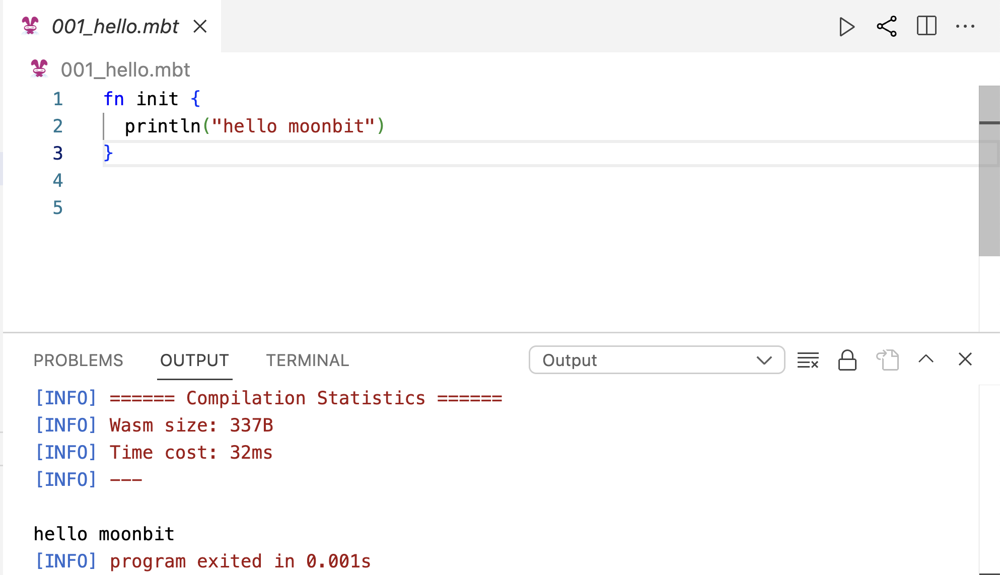
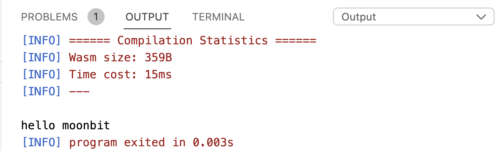
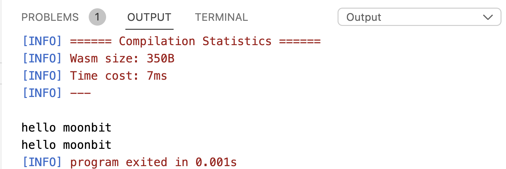
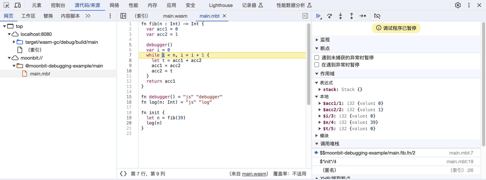
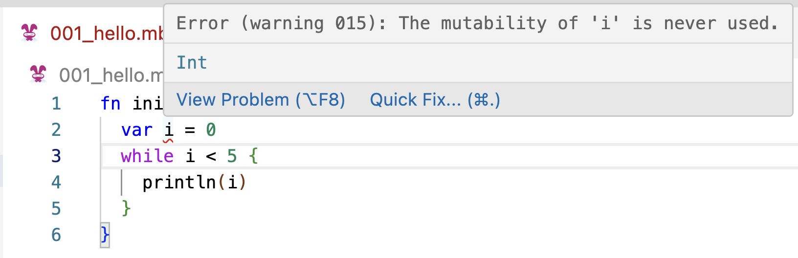
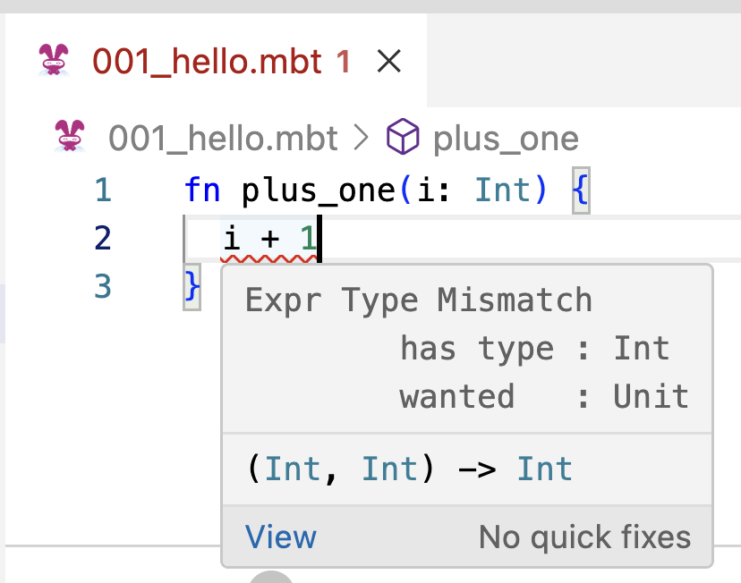

# Modern Programming Concepts

## Imperative Programming

### MoonBit Open Course Team

# Functional Programming

- Up to this point, what we have introduced can be categorized under functional programming.
  - For each input, there is a fixed output.
  - For identifiers, we can directly substitute them with their corresponding values—referential transparency.
- To develop practical programs, we need some "side effects" beyond computation.
  - Perform input and output.
  - Modify data in memory, etc.
  - These side effects can lead to inconsistent results upon multiple executions.

# Referential Transparency

- We can define data bindings and functions as follows:

```moonbit
fn init {
  let x: Int = 1 + 1
  fn square(x: Int) -> Int { x * x }
  let z: Int = square(x) // 4
}
```

- We can directly replace `square` and `x` with their corresponding values without changing the result:

```moonbit
let z: Int = { 2 * 2 } // 4
```

- Referential transparency makes understanding easier.

# Commands

- The function `print` allows us to output a string, for example, `print("hello moonbit")`.
- In MoonBit, we can define initialization instructions through an `init` code block.
- This can be simply understood as the main entry point of the program.

```moonbit
fn init {
  println("hello moonbit") // The 'ln' in the function name represents a newline.
}
```



# Commands and Side Effects

- Output commands may break referential transparency.

```moonbit
fn square(x: Int) -> Int { x * x }
fn init {
  let x: Int = {
    println("hello moonbit") // <-- We first execute the command, perform output
    1 + 1 // <-- Then, we take the last value of the expression block as the value of the block
  }
  let z: Int = square(x) // 4, output once
}
```



# Commands and Side Effects

- We may not be able to safely replace, thus increasing the difficulty of understanding the program.

```moonbit
fn init {
  let z: Int = {
    println("hello moonbit"); // <-- First output
    1 + 1 // <-- Value obtained: 2
  } * {
    println("hello moonbit"); // <-- Second output
    1 + 1 // <-- Value obtained: 2
  } // 4, output twice
}
```



# Single-Value Types

- We have previously introduced the single-value type `Unit`.
  - It has only one value: `()`.
- Functions or commands that have `Unit` as the result type generally have side effects.
  - `fn print(String) -> Unit`
  - `fn println(String) -> Unit`
- The type of a command is also a single-value type.

```moonbit
fn do_nothing() -> Unit { // When the return value is a single-value type, the return type declaration can be omitted
  let _x = 0 // The result is of single-value type, which is consistent with the function definition
}
```

# Variables

- In MoonBit, we can define temporary variables within a code block using `let mut`.

```moonbit
fn init {
  let mut x = 1
  x = 10 // The assignment operation is a command.
}
```

- In MoonBit, the fields of a struct are immutable by default, and we also allow mutable fields, which need to be marked with `mut`.

```moonbit
struct Ref[T] { mut val : T }

fn init {
  let ref: Ref[Int] = { val: 1 } // ref itself is just a data binding
  ref.val = 10 // We can modify the fields of the struct
  println(ref.val.to_string()) // Output 10
}
```

# Variables

- We can consider a struct with mutable fields as a reference.



# Aliases

- Two identifiers pointing to the same mutable data structure can be considered aliases.

```moonbit no-check
fn alter(a: Ref[Int], b: Ref[Int]) -> Unit {
  a.val = 10
  b.val = 20
}

fn init {
  let x: Ref[Int] = { val : 1 }
  alter(x, x)
  println(x.val.to_string()) // The value of x.val will be changed twice.
}
```

# Aliases

- Two identifiers pointing to the same mutable data structure can be considered aliases.



- Mutable variables need to be handled carefully.

# Loops

- Using variables, we can define loops.

```moonbit no-check
<Define variables and initial values>
while <Check if the condition for continuing the loop is met>, <Iterate the variable> {
  <Commands to be repeated>
}
```

- For example, we can perform n output operations repeatedly.

```moonbit
fn init {
  let mut i = 0
  while i < 2 {
    println("Output") // Repeat the output twice.
    i = i + 1
  }
}
```

# Loops

- When we enter the loop,
  - We check if the condition for continuing the loop is met.
  - Execute commands.
  - Iterate the variable.
  - Repeat the above process.
- For example:

```moonbit
fn init {
  let mut i = 0 // <-- At this point, i is equal to 0
  while i < 2 { // <-- Here, we check if i < 2 is true.
    println("Output") // <-- 0 < 2, so continue execution, output the first time.
    i = i + 1
  } // <-- At this point, we execute i = i + 2.
}
```

# Loops

When we enter the loop,

- We check if the condition for continuing the loop is met.
- Execute commands.
- Iterate the variable.
- Repeat the above process.

For example:

```moonbit
fn init {
  let mut i = 0
  // At this point, i is equal to 1
  while i < 2 { // <-- Here, we check if i < 2 is true.
    println("Output") // <-- 1 < 2, so continue execution, output the second time.
    i = i + 1
  } // <-- At this point, we execute i = i + 2.
}
```

# Loops

- When we enter the loop,
  - We check if the condition for continuing the loop is met.
  - Execute commands.
  - Iterate the variable.
  - Repeat the above process.
- For example:

```moonbit no-check
fn init {
  let mut i : Int = 0
  // At this point, i is equal to 2
  while i < 2 { // <-- Here, we check if i < 2 is true, which is false.
    i = i + 1
  } // <-- Skip.
  // <-- Continue with subsequent execution.
}
```

# Debugger

- MoonBit's debugger allows us to see real-time runtime data during execution, better understanding the process.
  

# Loops and Recursion

- In fact, loops and recursion are equivalent.

```moonbit no-check
let mut <variable> = <initial value>
while <Check if the loop should continue>, <Iterate the variable> {
  <Commands to be repeated>
}
```

- With mutable variables, it can be written as:

```moonbit no-check
fn loop_(<parameter>) {
  if <Check if the loop should continue> {
    <Commands to be repeated>
    loop_(<Parameter after iteration>)
  } else { () }
}
loop_(<initial value>)
```

# Loops and Recursion

- For example, the following two pieces of code have the same effect.

```moonbit
fn init {
  let mut i = 0
  while i < 2 {
    println("Hello!")
    i = i + 1
  }
}
```

```moonbit
fn init {
  fn loop_(i: Int) {
    if i < 2 {
      println("Hello!")
      loop_(i + 1)
    } else { () }
  }
  loop_(0)
}
```

# Control of Loop Flow

- During a loop, you can prematurely terminate the loop or skip the execution of subsequent commands.
  - The `break` instruction can terminate the loop.
  - The `continue` instruction can skip the rest of the execution and go directly to the next loop.

```moonbit
fn print_first_3() -> Unit {
  let mut i = 0
  while i < 10 {
    i = i + 1
    if i == 3 {
      break // Skip from 3 onwards.
    } else {
      println(i.to_string())
    }
  }
}
```

# Control of Loop Flow

- During a loop, you can prematurely terminate the loop or skip the execution of subsequent commands.
  - The `break` instruction can terminate the loop.
  - The `continue` instruction can skip the rest of the execution and go directly to the next loop.

```moonbit
fn print_skip_3() -> Unit {
  let mut i = 0
  while i < 10 {
    i = i + 1
    if i == 3 {
        continue // Skip 3.
    } else { () }
    println(i.to_string())
  }
}
```

# MoonBit's Checks

- MoonBit checks whether a variable has been modified, which can help avoid infinite loops caused by forgetting to increment a condition.
  
- MoonBit also checks if the function's return result matches the type declaration, which can help avoid incorrect return type declarations.
  

# Mutable Data

- Widely used in various scenarios.
  - Directly manipulate the external environment of the program, such as hardware, etc.
  - Sometimes better performance, like random access arrays.
  - Can construct some complex data structures, like graphs.
  - Reuse space (modify in place).
- Mutable data does not always conflict with referential transparency.

```moonbit
fn fib_mut(n: Int) -> Int { // Always the same output for the same input
  let mut acc1 = 0; let mut acc2 = 1; let mut i = 0
  while i < n {
    let t = acc1 + acc2
    acc1 = acc2; acc2 = t
    i = i + 1
  }
  acc1
}
```

# Summary

This chapter has introduced imperative programming, including:

- How to use commands.
- How to use variables.
- How to use loops, etc.
