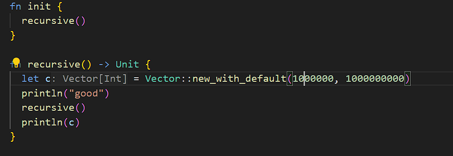

# Modern Programming Ideology: Implementing Queues with Mutable Data Structures

## Overview

In modern programming, a queue is an important data structure that follows the First-In-First-Out (FIFO) principle. This course will show you how to use mutable data structures to implement queues, focusing on two implementation methods: circular queues and singly linked lists, and exploring the concepts of tail call and tail recursion.

## Basic Operations of Queues

A queue supports the following basic operations:

- `make()`: Creates an empty queue.
- `push(t: Int)`: Adds an integer element to the queue.
- `pop()`: Removes an element from the queue.
- `peek()`: Views the front element of the queue.
- `length()`: Obtains the length of the queue.

## Implementation of Circular Queues

Circular queues implement queues using arrays, which provide a continuous storage space where each position can be modified. Once an array is allocated, its length remains fixed.

### Creating an Array

```moonbit expr
let a: Array[Int] = Array::make(5, 0)
```

### Adding Elements

```moonbit expr
let a: Array[Int] = Array::make(5, 0)
a[0] = 1
a[1] = 2
println(a) // Output: [1, 2, 0, 0, 0]
```

### Simple Implementation of Circular Queues

```moonbit no-check
struct Queue {
  mut array: Array[Int]
  mut start: Int
  mut end: Int // end points to the empty position at the end of the queue
  mut length: Int
}

fn push(self: Queue, t: Int) -> Queue {
  self.array[self.end] = t
  self.end = (self.end + 1) % self.array.length() // wrap around to the start of the array if beyond the end
  self.length = self.length + 1
  self
}
```

### Expanding the Queue

When the number of elements exceeds the length of the array, an expansion operation is required:

```moonbit no-check
fn push(self: Queue, t: Int) -> Queue {
  if self.length == self.array.length() {
    let new_array: Array[Int] = Array::make(self.array.length() * 2, 0)
    let mut i = 0
    while i < self.array.length() {
      new_array[i] = self.array[(self.start + i) % self.array.length()]
      i = i + 1
    }
    self.start = 0
    self.end = self.array.length()
    self.array = new_array
  }
  self.push(t) // Recursive call to complete the element addition
}
```

### Removing Elements

```moonbit no-check
fn pop(self: Queue) -> Queue {
  self.array[self.start] = 0
  self.start = (self.start + 1) % self.array.length()
  self.length = self.length - 1
  self
}
```

### Maintaining the Length of the Queue

```moonbit no-check
fn length(self: Queue) -> Int {
  self.length
}
```

### Generic Version of Circular Queues

```moonbit no-check
fn make[T]() -> Queue[T] {
  {
    array: Array::make(5, T::default()), // Initialize the array with the default value of the type
    start: 0,
    end: 0,
    length: 0
  }
}
```

## Implementation of Singly Linked Lists

A singly linked list consists of a series of nodes, each containing data and a reference to the next node.

### Definition of Nodes and Linked Lists

```moonbit
struct Node[T] {
  val : T
  mut next : Option[Node[T]]
}

struct LinkedList[T] {
  mut head : Option[Node[T]]
  mut tail : Option[Node[T]]
}
```

`Node[T]` is a generic struct that represents a node in a linked list. It has two fields: `val` and `next`. The `val` field is used to store the value of the node, and its type is `T`, which can be any valid data type. The `next` field represents the reference to the next node in the linked list. It is an optional field that can either hold a reference to the next node or be empty (`None`), indicating the end of the linked list.

`LinkedList[T]` is a generic struct that represents a linked list. It has two mutable fields: `head` and `tail`. The `head` field represents the reference to the first node (head) of the linked list and is initially set to `None` when the linked list is empty. The `tail` field represents the reference to the last node (tail) of the linked list and is also initially set to `None`. The presence of the `tail` field allows for efficient appending of new nodes to the end of the linked list.


### Adding Elements

```moonbit
fn push[T](self: LinkedList[T], value: T) -> LinkedList[T] {
  let node = { val: value, next: None }
  match self.tail {
    None => {
      self.head = Some(node)
      self.tail = Some(node)
    }
    Some(n) => {
      n.next = Some(node)
      self.tail = Some(node)
    }
  }
  self
}
```

### Calculating the Length of the Linked List

A simple recursive function is used to calculate the length of the linked list:

```moonbit
fn length[T](self : LinkedList[T]) -> Int {
  fn aux(node : Option[Node[T]]) -> Int {
    match node {
      None => 0
      Some(node) => 1 + aux(node.next)
    }
  }

  aux(self.head)
}
```

### Stack Overflow Problem

When the linked list is too long, the recursive calculation of the length can cause a stack overflow. To solve this problem, we can use tail call optimization.




### Tail Calls and Tail Recursion

A tail call is when the last operation of a function is a function call, and tail recursion is when the last operation is a recursive call to the function itself. Using tail calls can prevent stack overflow problems. Cause when a function reaches tail call, then the resources hold by the function had already been released, so the resource will not be keep until the next function calling, so even there is a infinity function calling chain, the program will not be crashed.

The optimized function for calculating the length of the linked list:

```moonbit
fn length_[T](self: LinkedList[T]) -> Int {
  fn aux2(node: Option[Node[T]], cumul: Int) -> Int {
    match node {
      None => cumul
      Some(node) => aux2(node.next, 1 + cumul)
    }
  }
  aux2(self.head, 0)
}
```

## Summary

This course introduced how to define queues using mutable data structures, including the implementation of circular queues and singly linked lists. We also learned about tail calls and tail recursion, and how to optimize with tail calls to avoid stack overflow problems. With this knowledge, we can more effectively manage and manipulate data, improving the performance and stability of our programs.
