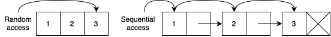
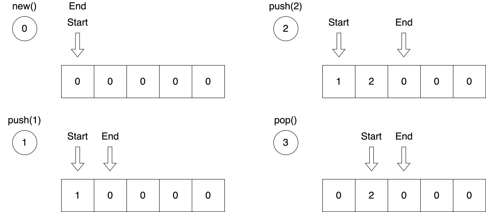
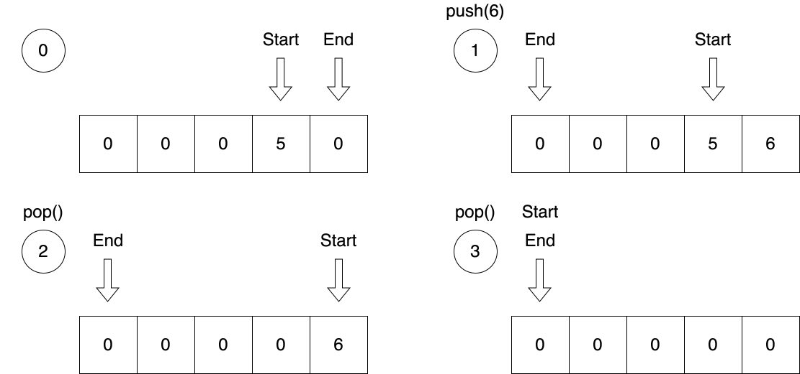
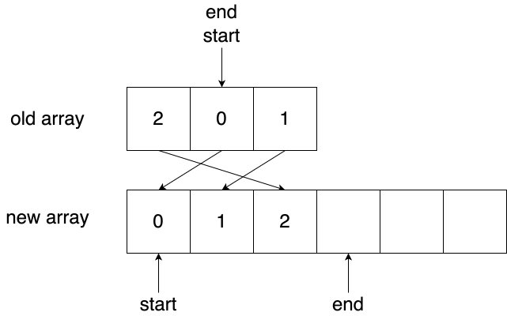
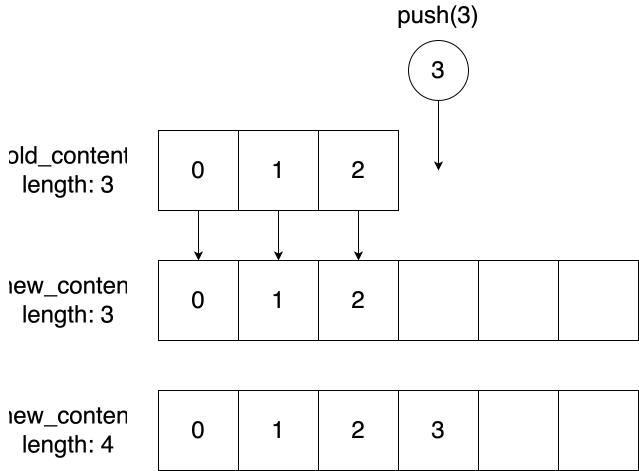
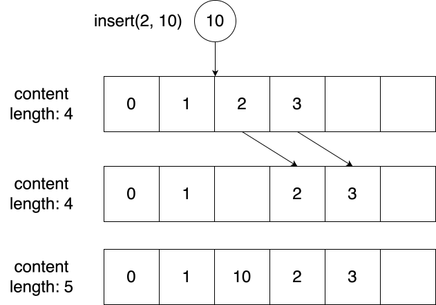

# 现代编程思想

## 数据结构实现：队列和变长数组

### 月兔公开课课程组

<!-- ssml 
大家好，欢迎来到由IDEA研究院基础软件中心为大家带来的现代编程思想公开课。
上节课我们学习了命令式编程，了解了可变数据结构、循环语句、循环与递归的关系。
这节课，我们学习如何实现可变数据结构：队列和变长数组。
<break time="500ms" />
-->

# 队列和变长数组

- 队列
  - 先进先出
  - 曾利用两个堆栈进行实现
  - 基于定长数组
- 变长数组
  - 随机存取
  - 可改变长度
  - 基于定长数组

<!-- ssml 
我们之前介绍过队列这一数据结构，它是一个先进先出的数据结构，也就是先放入队列的最先被取出。
我们曾经演示过如何利用两个堆栈来实现一个队列。
那个实现是函数式的实现，数据都不可发生变化，每一次修改都是在创建新的数据。
而这次，我们将要展示如何利用可变数据结构，定长数组，来实现队列，直接在原有的数据基础上进行修改。
然后，我们同样利用定长数组，实现变长数组，这一更加通用的数据结构。
<break time="500ms" />
-->

# 定长数组



- 长度在创建时固定
- 可随机存取
  ```moonbit skip
  fn[T] FixedArray::make(len : Int, init : T) -> Self[T]
  fn[T] FixedArray::set(self : FixedArray[T], idx : Int, val : T) -> Unit
  fn[T] FixedArray::get(self : FixedArray[T], idx : Int) -> T?
  fn[T] FixedArray::length(self : FixedArraylf[T]) -> Int
  ```
- 例子：
  ```moonbit 
  test {
    let a : FixedArray[Int] = FixedArray::make(5, 0)
    a.set(0, 1)
    a.set(1, 2)
    inspect(a, content="[1, 2, 0, 0, 0]")
  }
  ```

<!-- ssml 
首先了解一下我们将会使用到的最基本的可变数据结构，定长数组。
定长数组是一种长度在创建时固定，且可以随机存取的数据结构。
在月兔中，定长数组即为 Fixed Array 这一泛型类型。
什么叫作随机存取呢？
随机存取指的是可以通过任何一个合法的索引，直接获取或存放对应位置的值，并且该操作的时间和存取目标的位置无关。
例如左图中，定长数组内的数字<phoneme alphabet="sapi" ph="yi 1">1</phoneme>、2、3连续存放在一起，可以直接访问数字3，
这与访问数字<phoneme alphabet="sapi" ph="yi 1">1</phoneme>或者数字<phoneme alphabet="sapi" ph="er 4">2</phoneme>所需的时间是一样的。
与之相对的，是顺序存取，例如右图是我们之前学过的列表，
三个数字被存放在三个不同的地方，要想访问数字3，必须先访问数字<phoneme alphabet="sapi" ph="yi 1">1</phoneme>和数字<phoneme alphabet="sapi" ph="er 4">2</phoneme>. 
访问数字3的时间明显<phoneme alphabet="sapi" ph="chang 2">长</phoneme>于访问数字<phoneme alphabet="sapi" ph="yi 1">1</phoneme>的时间。
也就是接口中的 set 函数。
举个例子，我们定义了一个元素为整数的定长数组，其长度为 5. 
每个元素的初始值为0.
接下来，我们将第 0 个元素设置为 <phoneme alphabet="sapi" ph="yi 1">1</phoneme>，
将第一个元素设置为 2.
于是我们得到了前两个元素分别为 <phoneme alphabet="sapi" ph="yi 1">1</phoneme> 和 2，剩下三个元素都为 0 的定长数组。
<break time="500ms" />
-->

# 队列

- 队列接口定义：

  ```moonbit skip 
  fn[T] Queue::new() -> Queue[T]                     // 创建空列表
  fn[T] Queue::push(self : Queue[T], val: T) -> Unit // 队尾添加元素
  fn[T] Queue::pop(self : Queue[T]) -> T?            // 头部取出元素
  fn[T] Queue::peek(self : Queue[T]) -> T?           // 查看当前头元素
  fn[T] Queue::length(self : Queue[T]) -> Int        // 查看队列长度
  ```

- 其中 `push` 和 `pop` 会修改 `self`，为了进行链式<phoneme alphabet="sapi" ph="diao 4">调</phoneme>用，我们可以使用级联语法：
  ```moonbit
  test {
    inspect(Queue::new()..push(1)..push(2).length(), content="2")
  }
  ```
- `x..f().g()` 等价于 `{ x.f(); x.g(); }`

<!-- ssml
在实现队列之前，我们定义队列的接口。
由于队列是先进先出的结构，因此只能在尾部添加元素，并在头部取出元素。
除了这两个基本操作，我们可能还需要一个 peek 操作，它可以让我们在不取出元素的情况下查看当前头部元素。
最后，我们还有一个 <lang xml:lang="en-US">length</lang> 函数，用于返回队列中元素的个数。
注意到，push 和 pop 是用 Queue 类型加上双冒号定义的，属于 Queue 类型的方法，
并且第一个参数的类型刚好是 Queue，这种情况下，我们可以使用 级联运算符 进行链式<phoneme alphabet="sapi" ph="diao 4">调</phoneme>用。
例如，在创建完队列后，使用两个点加上 push, <phoneme alphabet="sapi" ph="yi 1">1</phoneme> 的方式，我们向队列中添加了一个新元素，忽略 push 操作的返回值，并获得 self，接下来就可以利用这个 self 继续后面的操作。
再次用两个点加上 push 2，最后<phoneme alphabet="sapi" ph="diao 4">调</phoneme>用 <lang xml:lang="en-US">length</lang>，得到队列的长度。
由于我们向队列中添加了两个元素，因此队列的长度为2.
也就是说，级联运算表达式相当于<phoneme alphabet="sapi" ph="diao 4">调</phoneme>用一个方法并返回原来的值，以用于下一次<phoneme alphabet="sapi" ph="diao 4">调</phoneme>用。
<break time="500ms" />
-->

# 使用定长数组实现循环队列




<!-- ssml
用定长数组实现队列的时候，我们记录当前列表的开始和结束的下标。
之后，每当添加新的元素时，我们将代表结束的坐标向后移动，如果超出数组的尾部，则再绕回开头。形成一个环状。
-->

# 使用定长数组实现循环队列


<!-- ssml
现在大家看到的就是添加的演示。首先，我们创建一个空的队列。此时，列表的开始和结束都指向第一个元素。
-->

# 使用定长数组实现循环队列


<!-- ssml
之后，我们进行添加操作。我们将元素添加到 end 所指向的位置，也就是第一个元素处，并且修改列表的结束位置。
-->

# 使用定长数组实现循环队列


<!-- ssml
之后，我们重复同样的操作。
-->

# 使用定长数组实现循环队列


<!-- ssml
而取出操作则是将`start`所在的元素清零，并且将`start`向后移一位。
<break time="500ms" />
-->

# 使用定长数组实现循环队列




<!-- ssml
我们再看一下「接近」数组尾部位置时的情形。`end`此时指向最后一个元素的位置。
-->

# 使用定长数组实现循环队列


<!-- ssml
当我们添加元素后，`end`无法向后移动，因此我们将它移动到最前方，这也是为什么它叫循环队列。
-->

# 使用定长数组实现循环队列


<!-- ssml
之后，我们进行两次取出操作。
-->

# 使用定长数组实现循环队列


<!-- ssml
同样地，`start`在超出列表长度之后，也再次回到列表的最初。
<break time="500ms" />
-->

# 循环队列

- 结构体定义
```moonbit
struct Queue[T] {
  mut array : FixedArray[T]
  mut start : Int
  mut end : Int // end 指向队尾的后一个空块
  mut length : Int
}

fn[T] Queue::length(self : Queue[T]) -> Int {
  self.length
}
```

<!-- ssml
下面是一个简易的实现。
我们记录了定长数组、列表的起始与结束以及列表的长度。
<lang xml:lang="en-US">length</lang> 函数的实现最容易，直接返回结构体内保存的 <lang xml:lang="en-US">length</lang> 信息即可。
<break time="500ms" />
-->

# 循环队列：泛型和默认值


- 使用 `Default` 特征为类型提供默认值
```moonbit
fn[T : Default] Queue::new() -> Queue[T] {
  { 
    array: FixedArray::make(8, T::default()), 
    start: 0, 
    end: 0, 
    length: 0,
  }
}
```
- `Int`、`String`、`Bool` 等都实现了 `Default` 特征
- 队列的长度此时为 0，而非 8

<!-- ssml
当使用 make 来创建空的定长数组时，我们需要<phoneme alphabet="sapi" ph="wei 4">为</phoneme>数组的每一个格子放一个初始值。
一种常见的方式是使用一个叫作 default 的特征。
当某个类型实现了 default 特征，就意味着这个类型有一个用于创建默认值的 default 方法。
可以看到，在红线标注之处，我们使用类型、冒号、特征名的方式，约束类型 T 必须实现 default 特征。
在蓝线标注之处，我们使用了 T 类型的 default 方法，创建了该类型的默认值。
并在 make 函数<phoneme alphabet="sapi" ph="diao 4 yong 4">调用</phoneme>处 <phoneme alphabet="sapi" ph="diao 4 yong 4">调用</phoneme>了 T 类型的 default 方法，用于创建默认值。
关于特征和特征约束，我们将在下个章节详细介绍。
月兔的大多数内置类型都实现了 default 特征，例如整数类型的默认值就是 0.
这里还有一处需要注意，虽然我们为空队列创建了一个长度为 8 的定长数组用来保存数据，但不意味着队列的长度就是8. 
队列的长度指的是队列内目前有意义的元素数量，对于空数组来说，应当是0.
<break time="500ms" />
-->

# 循环队列：添加元素

```moonbit
fn[T] Queue::naive_push(self : Queue[T], val : T) -> Unit {
  self.array.set(self.end, val)
  self.end = (self.end + 1) % self.array.length() // 超出队尾则转回队首
  self.length = self.length + 1
}
```

- 问题：如果元素数量超出了数组长度

<!-- ssml
我们向队列中添加元素时，将元素添加到 end 指向的位置。
之后我们利用取模操作将 end 指向队首，并且维护队列长度。
问题是，数组的长度是固定的。
如果添加元素的数量超出数组的长度该怎么办呢？
<break time="500ms" />
-->

# 循环队列：扩容

```moonbit
fn[T : Default] Queue::push(self : Queue[T], val : T) -> Unit {
  if self.length == self.array.length() { // 判断是否需要扩容
    let new_array = FixedArray::make(self.length * 2, T::default())
    for i = 0; i < self.array.length(); i = i + 1 {
      new_array[i] = 
        self.array[(self.start + i) % self.array.length()]
    } // 将原数组的元素逐个复制到新的数组
    self.start = 0
    self.end = self.array.length()
    self.array = new_array
  }
  self.naive_push(val)
}
```

<!-- ssml
答案是对数组进行扩容操作。
我们首先判断是否需要扩容，也就是列表的长度是否已经等于数组的长度。
当需要扩容时，我们创建新的更长的数组，并将原有的数据复制过去，如代码所示。
这里我们创建了一个新的定长数组，它的容量为旧数组的两倍。
其中，在遍历数组的时候，我们同样利用取模操作保证指向数组范围内的元素。
在代码的第五行，我们用了方括号加上等号的方式，在定长数组的适当位置写入一个值，它和 set 函数是一样的，只是看起来更简洁。
在代码的第六行，还用了方括号取出定长数组中的元素，相比于返回可选值的 get 函数，方括号会在索引值非法时让程序产生崩溃，而不是返回 None。
最后，我们用新的数组替换原来结构体中的数组。在此之后，我们再次利用常规的添加操作。
<break time="500ms" />
-->

# 循环队列：扩容



<!-- ssml 
例如，当队列容量为3，且长度也为3时，start 和 end 重叠。
此时我们对队列进行扩容。新的定长数组容量为旧数组的两倍。
我们从 start 开始，利用循环将旧数组的数据逐个复制到新的数组。
复制完成后，让 start 重新指向数组开头，而 end 指向数组末尾。
这便是一次完整的扩容操作。
<break time="500ms" />
-->

# 循环队列：取出元素

- `peek` 操作返回 `start` 指向的元素
- 队列为空时，返回 `None` 
- `pop` 操作在 `peek` 操作的基础上将 `start` 后移
```moonbit
fn[T] Queue::peek(self : Queue[T]) -> T? {
  if self.length() == 0 { None } 
  else { self.array.get(self.start) }
}

fn[T : Default] Queue::pop(self : Queue[T]) -> T? {
  let val = self.peek()
  if val is Some(_) {
    self.array[self.start] = T::default()
    self.start = (self.start + 1) % self.array.length()
    self.length = self.length - 1
  }
  val
}
``` 

<!-- ssml
查看头部元素只需检查队列是否为空，如果为空，直接返回 None 即可。
当我们取出元素的时候，在查看元素的基础上，移除 start 所指向的元素，并将 start 向后移，同时更新队列的长度。
<break time="500ms" />
-->

# 变长数组

- 变长数组在定长数组的基础上增添 `push` 和 `insert` 操作 

```moonbit skip 
fn[T] MyArray::make(len : Int, init : T) -> MyArray[T]
fn[T] MyArray::length(self : MyArray[T]) -> Int
fn[T] MyArray::set(self : MyArray[T], idx : Int, val : T) -> Unit 
fn[T] MyArray::get(self : MyArray[T], idx : Int) -> T?
fn[T] MyArray::push(self : MyArray[T], val : T) -> Unit
fn[T] MyArray::insert(self : MyArray[T], idx : Int, val : T) -> Unit
fn[T] MyArray::each(self : MyArray[T], f : (T) -> Unit) -> Unit
```

<!-- ssml
下面我们继续学习变长数组。
变长数组和定长数组的不同之处在于，变长数组支持在末尾添加元素的 push 操作，以及在任意索引处插入元素的 insert 操作。
对于其他部分，它的构造函数和长度计算，与定长数组是相同的。
在最后，我们还要为变长数组定义一个遍历操作 each。
<break time="500ms" />
-->

# 变长数组：初始化

```moonbit 
struct MyArray[T] {
  mut content : FixedArray[T]
  mut length : Int
}

fn[T] MyArray::make(len : Int, init : T) -> MyArray[T] {
  { 
    content: FixedArray::make(len, init), 
    length: len 
  }
}

fn[T] MyArray::length(self : MyArray[T]) -> Int {
  self.length
}
```

<!-- ssml
和循环队列一样，我们用一个定长数组来保存数据，用整数 <lang xml:lang="en-US">length</lang> 来维护数组长度。
在构建一个变长数组时，需要传入初始长度和初始值。
值得注意的是，变长数组的初始长度并不一定是0，而是传入的预设长度。
<break time="500ms" />
-->

# 变长数组：随机存取

- 在 `[0, length)` 区间外的写入是非法的
```moonbit 
fn[T] MyArray::set(self : MyArray[T], idx : Int, val : T) -> Unit {
  guard idx >= 0 && idx < self.length
  self.content.set(idx, val)
}

fn[T] MyArray::get(self : MyArray[T], idx : Int) -> T? {
  guard idx >= 0 && idx < self.length else { None }
  self.content.get(idx)
}
```

<!-- ssml
数组最重要的特性是随机存取。这个特性在介绍定长数组时已经说过。
要为变长数组实现随机存取非常容易，因为定长数组的内容就是连续排布的，我们只需保证变长数组的元素实际上存放在一个定长数组即可。
我们定义 set 和 get，在方法中对索引值进行区间判断，当确认索引值在区间内时，<phoneme alphabet="sapi" ph="diao 4">调</phoneme>用内部定长数组的 set 和 get 方法即可。
<break time="500ms" />
-->

# 变长数组：扩容



<!-- ssml
和队列的扩容操作类似，变长数组在长度达到容量时，如果继续添加元素，也需要扩容。
变长数组的扩容相对容易，只需从头到尾挨个把内容复制到新的定长数组即可。
扩容完成后，就可以把新的元素追加到末尾了。
<break time="500ms" />
-->

# 变长数组：扩容

- 扩容可以单独抽取成一个函数
- 扩容后也不可访问 `[0, length)` 之外的元素
  ```moonbit
  fn[T : Default] MyArray::realloc(self : MyArray[T]) -> Unit {
    let old_cap = self.length()
    let new_cap = if old_cap == 0 { 8 } else { old_cap * 2 }
    let new_content = FixedArray::make(new_cap, T::default())
    for i = 0; i < old_cap; i = i + 1 {
      new_content.set(i, self.content[i])
    }
    self.content = new_content
  }
  ```

<!-- ssml
代码实现如下，我们仍然借助 default 特征来<phoneme alphabet="sapi" ph="wei 4">为</phoneme>新的数组创建默认值。
生成新的定长数组后，将旧数组的内容复制过去，并且更新定长数组的字段。
要注意的是，尽管新的定长数组比旧的容量大，但此时变长数组的长度仍然没有发生变化，也就是说，此时越界访问超过 <lang xml:lang="en-US">length</lang> 的元素仍然是非法的。
<break time="500ms" />
-->

# 变长数组：尾部添加元素

- `push` 操作和循环队列类似：
  ```moonbit
  fn[T : Default] MyArray::push(self : MyArray[T], val : T) -> Unit {
    if self.length == self.content.length() {
      self.realloc()
    }
    self.content.set(self.length, val)
    self.length = self.length + 1
  }
  ```

<!-- ssml
有了扩容操作，我们就可以简单地实现 push 操作了。
将 <lang xml:lang="en-US">length</lang> 所指向的元素修改为给定值，并更新数组长度即可。
<break time="500ms" />
-->

# 变长数组：插入元素



<!-- ssml
对于插入元素的操作，在插入前，我们需要对被插入位置往后的所有元素进行集体迁移。
例如，这里要在 1 和 2 之间插入一个 10。
我们需要把 2 和 3 都向右移动一格，然后把原来 2 所在的位置修改为 10。
从这里可以看出，对于变长数组来说，在任意位置插入元素这一操作 是相当昂贵的。
<break time="500ms" />
-->

# 变长数组：插入元素

- 将原定长数组的部分元素集体后移一位
  ```moonbit 
  fn[T : Default] MyArray::insert(self : MyArray[T], idx : Int, val : T) -> Unit {
    if self.length == self.content.length() {
      self.realloc()
    }
    for i = self.length - 1; i >= idx; i = i - 1 {
      self.content.set(i + 1, self.content[i])
    }
    self.content.set(idx, val)
    self.length = self.length + 1
  }
  ```

<!-- ssml
代码实现并不复杂，但值得注意的是，
使用循环语句进行元素迁移时，要从后往前，而不能从前往后。
否则前面的值会直接覆盖后面的值。
<break time="500ms" />
-->

# 变长数组：遍历访问

```moonbit 
fn[T] MyArray::each(self : MyArray[T], f : (T) -> Unit) -> Unit {
  for i = 0; i < self.length; i = i + 1 {
    let elem = self.get(i)
    guard elem is Some(elem)
    f(elem)
  }
}

test {
  let arr1 = MyArray::make(5, 0)
  let arr2 = MyArray::make(5, 0)
  arr1..push(1)..push(2).push(3)
  arr1.each(fn(elem) { arr2.insert(0, elem)} )
  inspect(arr2.get(0), content="Some(3)")
  inspect(arr2.get(1), content="Some(2)")
  inspect(arr2.get(2), content="Some(1)")
}
```

<!-- ssml 
最后我们实现一个高阶函数：遍历访问 each。
each 接收一个参数为元素类型 T，返回单值类型的函数，
接下来，需要在变长数组的每一个元素上都<phoneme alphabet="sapi" ph="diao 4">调</phoneme>用这个函数。
在下面的测试代码中，我们为第一个变长数组的末尾添加了1、2、3三个数字。
并对其进行从前往后的遍历，每遍历到一个元素，就将这个元素添加到第二个数组的头部。
因此，第二个数组的前三个元素刚好是倒过来的三个数字，3、2、1.
<break time="500ms" />
-->

# 变长数组：课后练习 

- 标准库的 `Array` 类型提供了非常丰富的操作，包括：
  - `remove` 移除某一个位置的元素
  - `append/add` 合并两个数组
  - `map` 将原来数组的元素一一映射到新的数组
- 以上功能可以自行实现

<!-- ssml
事实上，我们几乎实现了月兔标准库提供的 Array 这个变长数组类型。
不同的是，Array 还支持更多其它的操作，比如 remove 可以移除某一位置的元素，append 和 add 可以合并两个数组，map 可以将数组元素一一映射得到一个新的数组。
这些功能都可以很容易地实现，留作课后练习。
<break time="500ms" />
-->

# 总结 

- 本章节我们介绍了使用可变数据结构
  - 定长数组
  - 基于定长数组实现循环队列
  - 基于定长数组实现变长数组

<!-- ssml
总结一下，今天我们学习了定长数组这一经典的可变数据结构，
并学会如何使用它来构建更复杂的可变数组结构：队列和变长数组。
我们下节课再见。
-->