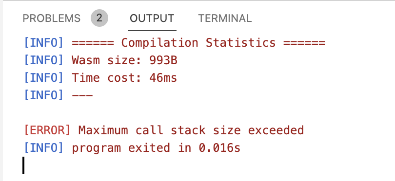

# Modern Programming Ideology

## Queues: Implementing with Mutable Data Structures

### MoonBit Open Course Team

# Queues

- We have previously introduced the data structure known as a queue
  - First In, First Out (FIFO)
  - Implemented using two stacks
- We implement it using mutable data structures
  - Array-based circular queue
  - Singly linked list

# Queues

- We implement the following functions, taking an integer queue as an example

```moonbit no-check
struct Queue { .. }

fn make() -> Queue // Create an empty queue
fn push(self: Queue, t: Int) -> Queue // Add an element
fn pop(self: Queue) -> Queue // Remove an element
fn peek(self: Queue) -> Int // View the current head element
fn length(self: Queue) -> Int // View the length of the queue
```

- Here, both `push` and `pop` modify `self`. For convenience, we return the modified instance itself

```moonbit no-check
make().push(1).push(2).push(3).pop().pop().length() // 1
```

# Circular Queue

- We can use an array to represent a queue
  - An array is a contiguous block of memory where each field can be modified
  - Once allocated, the length of the array remains constant

```moonbit expr
let a: Array[Int] = Array::make(5, 0)
a[0] = 1
a[1] = 2
println(a) // [1, 2, 0, 0, 0]
```

- We keep track of the current start and end positions; when adding a new element, the end position moves forward
  - If it exceeds the array length, it wraps around to the beginning

# Circular Queue



# Circular Queue


# Circular Queue

- A simple implementation

```moonbit
struct Queue {
  mut array: Array[Int]
  mut start: Int
  mut end: Int // `end` points to the empty slot at the tail of the queue
  mut length: Int
}

// Add an element to the queue
fn push(self: Queue, t: Int) -> Queue {
  self.array[self.end] = t
  self.end = (self.end + 1) % self.array.length() // Wrap around to the head if beyond the tail
  self.length = self.length + 1
  self   
}
```

- Issue: What if the number of elements exceeds the array length?

# Circular Queue

- The queue's resizing operation
  - We first check if resizing is necessary
  - We create a new, longer array and copy the existing data

```moonbit no-check
fn push(self: Queue, t: Int) -> Queue {
  if self.length == self.array.length() {
    let new_array: Array[Int] = Array::make(self.array.length() * 2, 0)
    let mut i = 0
    while i < self.array.length() {
      new_array[i] = self.array[(self.start + i) % self.array.length()]
      i = i + 1
    }
    self.start = 0
    self.end = self.array.length()
    self.array = new_array
    self.push(t)
  } else { .. }
}
```

# Circular Queue

- To remove an element, simply remove the element pointed to by `start` and move `start` forward

```moonbit
fn pop(self: Queue) -> Queue {
  self.array[self.start] = 0
  self.start = (self.start + 1) % self.array.length()
  self.length = self.length - 1
  self
}
```

- The list length is dynamically maintained

```moonbit
fn length(self: Queue) -> Int {
  self.length
}
```

# Generic Circular Queue

- We want to store more than just integers

```moonbit no-check
fn make[T]() -> Queue[T] {
  {
    array: Array::make(5, ???),
    start: 0, end: 0, length: 0
  }
}
```

- What should the default value be?
  - `Option::None`
  - `T::default()`

# Singly Linked List

- Each data structure points to the next one
  - Connected like a chain

```moonbit
struct Node[T] {
  val: T
  mut next: Option[Node[T]] // Points to the next node
}

struct LinkedList[T] {
  mut head: Option[Node[T]]
  mut tail: Option[Node[T]]
}
```

# Singly Linked List



# Singly Linked List



# Singly Linked List

- When adding, we check if the list is non-empty
  - If not empty, we add to the tail and maintain the list relationship

```moonbit no-check
fn push[T](self: LinkedList[T], value: T) -> LinkedList[T] {
  let node = { value, next: None }
  match self.tail {
    None => {
      self.head = Some(node)
      self.tail = Some(node)
    }
    Some(n) => {
      n.next = Some(node)
      self.tail = Some(node)
    }
  }
  self
}
```

# Length of Singly Linked List

- We write a simple recursive function to determine the length
  - We use recursion to visit all nodes along the reference chain starting from the head

```moonbit
fn length[T](self: LinkedList[T]) -> Int {
  fn aux(node: Option[Node[T]]) -> Int {
    match node {
      None => 0
      Some(node) => 1 + aux(node.next)
    }
  }
  aux(self.head)
}
```

# Length of Singly Linked List

- When the list is too long, we observe a "stack overflow" message

```moonbit no-check
fn init {
  let list = make()
  let mut i = 0
  while i < 100000 {
    let _ = list.push(i)
     i = i + 1
  }
  println(list.length())
}  
```



# Function Call Stack

- When we call a function, we enter a new computation environment
  - The new environment defines the binding of parameters
  - The old environment is preserved on the stack and continues to operate after the function returns
- When we call the linked list length function, the stack height increases continuously until it exceeds memory limits
  - If we could ensure that the old environment does not need to be preserved, the problem could be solved

# Tail Call

- We ensure that the last operation of a function is a function call
  - If it is the function itself, it is called tail recursion
- The result of the function call is the final result of the operation
  - Thus, there is no need to preserve the current computation environment

```moonbit no-check
fn length[T](self: LinkedList[T]) -> Int {
  fn aux2(node: Option[Node[T]], cumul) -> Int {
    match node {
      None => cumul
      Some(node) => aux2(node.next, 1 + cumul)
    }
  }
  aux2(self.head, 0)
}
```

# Summary

- In this chapter, we introduced the definition of queues using mutable data structures
  - Implementation of circular queues and singly linked lists
  - Tail calls and tail recursion
