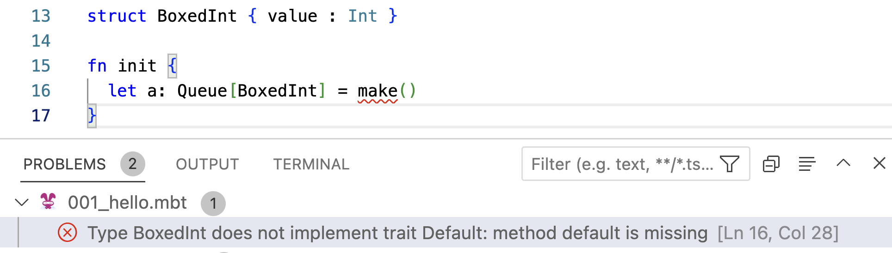

# Traits

<!--
```moonbit
enum Tree[T] {
  Empty
  Node(T, Tree[T], Tree[T])
}

struct Queue[T] {
  mut array: Array[T]
  mut start: Int
  mut end: Int
  mut length: Int
}
```
-->

## Methods

In Chapter 8, while studying mutable data structures, we discussed the need for providing a default value when constructing the array for implementing a generic circular queue.

```moonbit no-check
fn make[T]() -> Queue[T] {
  { array: Array::make(5, T::default()), start: 0, end: 0, length: 0 }
}
```

In fact, we have already encountered a similar situation in Chapter 6. When implementing a generic binary search tree, we need a comparison function to determine the order of values. As illustrated in the code below, we can pass the comparison function as a parameter. While this approach is effective, it can become cumbersome when dealing with more intricate type requirements.


```moonbit no-check
enum Tree[T] {
  Empty
  Node(T, Tree[T], Tree[T])
}

// We need a comparison function to determine the order of values
// -1: less than; 0: equal to; 1: greater than
fn insert[T](self: Tree[T], value: T, compare: (T, T) -> Int) -> Tree[T]
fn delete[T](self: Tree[T], value: T, compare: (T, T) -> Int) -> Tree[T]
```

The above examples share a common characteristic, that is, the functions are associated with the type `T`. For instance, we might require the following functions for `T`:
- Compare two `T` values: `fn T::compare(self: T, other: T) -> Int`
- Get the default value of `T`: `fn T::default() -> T`
- Get the string representation of a `T` value: `fn T::to_string(self: T) -> String`
- ...

Such functions are called the **methods** of `T`.

## Traits

In MoonBit, a trait declare a list of methods to be supplied if a type wants to implement it. When defining a method's signature, we can use `Self` to refer to the type itself. For example,

```moonbit
trait Compare {
  compare(Self, Self) -> Int
}
trait Default {
  default() -> Self
}
```

The trait system in MoonBit is structural. That is, there is no need to implement a trait explicitly, and types with the required methods automatically implements a trait.

## Bounded Generics

In generic functions, we use traits as bounds to specify what methods a type supports. In MoonBit, `<type>: <trait>` requires `<type>` to be bound by `<trait>`. Inside the function body, the methods of a trait can then be called via `<type>::<method>()`. In this way, we can rewrite the `make` method of type `Queue` as follows:

```moonbit no-check
fn make[T: Default]() -> Queue[T] { // `T` should support the `default` method.
  { 
    array: Array::make(5, T::default()), // The return type of `default` is `T`.
    start: 0,  end: 0,  length: 0 
  } 
}
```

With bounds, we can timely detect errors caused by calling missing methods. In the following example, we are trying to build a queue of `BoxedInt`, which however, does not support the `default` method. Consequently, the compiler notifies us of this error.



Using the same approach, we can reimplement the `insert` method for `Tree`. In particular, we need to demand that the type parameter `T` is bound by `Compare`. This enables us to compare two `T` values by calling `T::compare` directly, without requiring an additional parameter. The `compare` method must have been provided by `T`, as it is bound by `Compare`.

```moonbit
fn insert[T : Compare](tree : Tree[T], value : T) -> Tree[T] {
  // Since `T` is bound by `Compare`, it should support the `compare` method.
  match tree {
    Empty => Node(value, Empty, Empty) 
    Node(v, left, right) =>  
      if T::compare(value, v) == 0 { // We can call `compare` here.
        tree
      } else if T::compare(value, v) < 0 { // We can call `compare` here.
        Node(v, insert(left, value), right)
      } else {
        Node(v, left, insert(right, value))
      }
  }
}
```

## Implementation of Traits

### Implicit Implementation

Since the trait system of MoonBit is structured, to implement a trait, all we need to do is to define the corresponding methods using the syntax `fn <type>::<method>(...) -> ...`.

In the following example, we define the `default` method for the `BoxedInt` type.

```moonbit
struct BoxedInt { value : Int }

fn BoxedInt::default() -> BoxedInt {
  { value : Int::default() }
  // The default value can be defined by boxing the default value of `Int`.
}
```

By defining the `default` method, the `Default` trait is now implemented. Therefore, we can construct a queue of `BoxedInt` using the `make` function, which internally invokes the `default` method of `BoxedInt`.

```moonbit no-check
fn init {
  let array: Queue[BoxedInt] = make()
}
```

### Explicit Implementation

Alternatively, we can implement a trait explicitly with the following syntax:

```moonbit no-check
// Provide a default implementation for method `method` of trait `Trait`
impl Trait with method(...) { ... }

// Implement method method of trait `Trait` for type `Type`
impl Trait for Type with method(...) { ... }

// With type parameters
impl[X] Trait for Array[X] with method(...) { ... }
```

Compared to the previous syntax `fn Trait::method(...)`, the new syntax allows explicit specification of the implementing type, providing richer and clearer signature information. Since the type is specified, the compiler can automatically infer the method's parameter and return types, eliminating the need for manual annotations:

```moonbit
trait MyTrait {
  f(Self) -> Option[Int]
}

// No need to annotate `self` and the return type
impl MyTrait for Int with f(self) {
  // Compiler can automatically infer that the return type is `Option[Int]`
  Some(self)
}
```

## Method Chaining

In addition to `<type>::<method>(<expr>, ...)`, we can as well call the method using `<expr>.<method>(...)`, given `<expr>` is of type `<type>`. When defining such methods, `<type>::` can also be omitted when the first parameter is named `self`.

In this way, when we need to call such functions sequentially, we can avoid multiple nesting of method calls, thereby enhancing the readability of the code.

```moonbit
fn BoxedInt::plus_one(b: BoxedInt) -> BoxedInt {
  { value : b.value + 1 }
}
// `<type>::` can be omitted when the first parameter is named `self`.
fn plus_two(self: BoxedInt) -> BoxedInt {  
  { value : self.value + 2}
}

fn init {
  let _five = { value: 1 }.plus_one().plus_one().plus_two()
  // This avoids multiple nesting of method calls.
  let _five = plus_two(plus_one(plus_one({value: 1})))
}
```

## Automatic Derivation of Builtin Traits

In MoonBit, it is possible to automatically derive certain basic traits by adding `derive(<traits>)` after the type declaration. If the type is composed of other types, those member types must have already implemented the same traits.

In the given example, we derive the `Default`, `Eq`, `Compare`, and `Debug` traits for `BoxedInt`. These traits can be successfully derived because `Int` already implements them. However, if the required traits are not implemented by the member types, the compiler will generate an error message.

```moonbit no-check
struct BoxedInt { value : Int } derive(Default, Eq, Compare, Debug)
```

## Example: Using Traits to Implement a Map

Now, let's proceed to implement a generic map using traits.

A map is a collection of key-value pairs, where each key is associated with a value. It is possible for different keys to correspond to the same value. For instance, in the map `{ 0 -> "a", 5 -> "Hello", 7 -> "a"}`, the key `5` corresponds to the value `"Hello"`, while both keys `0` and `7` correspond to the value `"a"`.

```moonbit no-check
type Map[Key, Value]
```

A map should support the following methods:
- Create a map.
  ```moonbit no-check
  fn make[Key, Value]() -> Map[Key, Value]
  ```
- Add a key-value pair, or update the corresponding value of a key.
  ```moonbit no-check
  fn put[Key, Value](map: Map[Key, Value], key: Key, value: Value) -> Map[Key, Value]
  ```
- Get the corresponding value of a key.
  ```moonbit no-check
  fn get[Key, Value](map: Map[Key, Value], key: Key) -> Option[Value]
  ```
  Since such a key-value pair may not exist in the map, the return value is wrapped in `Option`.

The map can be implemented using a list of pairs.

```moonbit
type Map[Key, Value] List[(Key, Value)]
```

The first two basic methods, `make` and `put`, can be easily implemented as follows:
- Create a map by creating an empty list.
  ```moonbit
  fn make[Key, Value]() -> Map[Key, Value] { 
    Map(Nil)
  }
  ```
- Add/update a key-value pair by inserting the pair to the beginning of the list.
  ```moonbit
  fn put[Key, Value](map: Map[Key, Value], key: Key, value: Value) -> Map[Key, Value] { 
    let Map(original_map) = map
    Map( Cons( (key, value), original_map ) )
  }
  ```

The third method, `get`, is also easy to describe in prose:
- Search the list from the beginning until the first matching key is found.

In such an implementation of the `get` function, we need to compare the key we are searching for with the keys stored in the map to determine if they are equal. As a result, the `Key` type must implement the `Eq` trait. That is, we need to modify the previous declaration of `get` so that `Key` is bound by `Eq`.

The complete implementation of `get` is as follows:

```moonbit
fn get[Key: Eq, Value](map : Map[Key, Value], key : Key) -> Option[Value] {
  loop map.0 {
    Nil => None
    Cons((k, v), tl) => if k == key {
      // `Key` is bound by `Eq`, so we can call `==` directly.
      Some(v)
    } else {
      continue tl
    }
  }
}
```

In the above implementation, we loop through the list and use the `==` operator to determine whether the current key matches the one we are looking for. It can be shown that when there are multiple identical keys, we will always retrieve the latest value associated with that key.

## Custom Operators

In MoonBit, operators can be customized by defining methods with specific names and types. For instance, by defining the `op_equal` and `op_add` methods, we can use the `==` operator to compare two `BoxedInt` values and use the `+` operator to add two `BoxedInt` values.

```moonbit
fn BoxedInt::op_equal(i: BoxedInt, j: BoxedInt) -> Bool {
  i.value == j.value
}
fn BoxedInt::op_add(i: BoxedInt, j: BoxedInt) -> BoxedInt {
  { value: i.value + j.value }
}

fn init {
  let _ = { value: 10 } == { value: 100 } // false
  let _ = { value: 10 } + { value: 100 } // { value: 110 }
}
```

In the previous example, we used the `get` and `set` functions to access and update data in the map. However, it is also possible to use custom operators to achieve the same functionality. By defining the `op_get` and `op_set` methods for the `Map` type, we can use the `map[k]` syntax to retrieve the value corresponding to `k`, and use `map[k] = v` to update the value associated with `k` to `v`.

```moonbit
fn Map::op_get[Key: Eq, Value](map: Map[Key, Value], key: Key) -> Option[Value] {
  get(map, key)
}
fn Map::op_set[Key: Eq, Value](map: Map[Key, Value], key: Key, value: Value) -> Map[Key, Value] {
  put(map, key, value)
}

fn init {
  let empty: Map[Int, Int] = make()
  let one = { empty[1] = 1 } // let one = Map::op_set(empty, 1, 1)
  let _ = one[1] // let _ = Map::op_get(one, 1)
}
```

In the previous example, the assignment statement is essentially an expression, and the return value is determined by the `op_get` method. We can use this method to retrieve the updated value. For mutable data structures, we also have the option to modify them in place without returning any value.

# Summary

In this chapter, we learned how to
- Define traits and use them to bound type parameters
- Implement traits implicitly or explicitly
- Implement custom operators
- Implement a simple map using traits in MoonBit